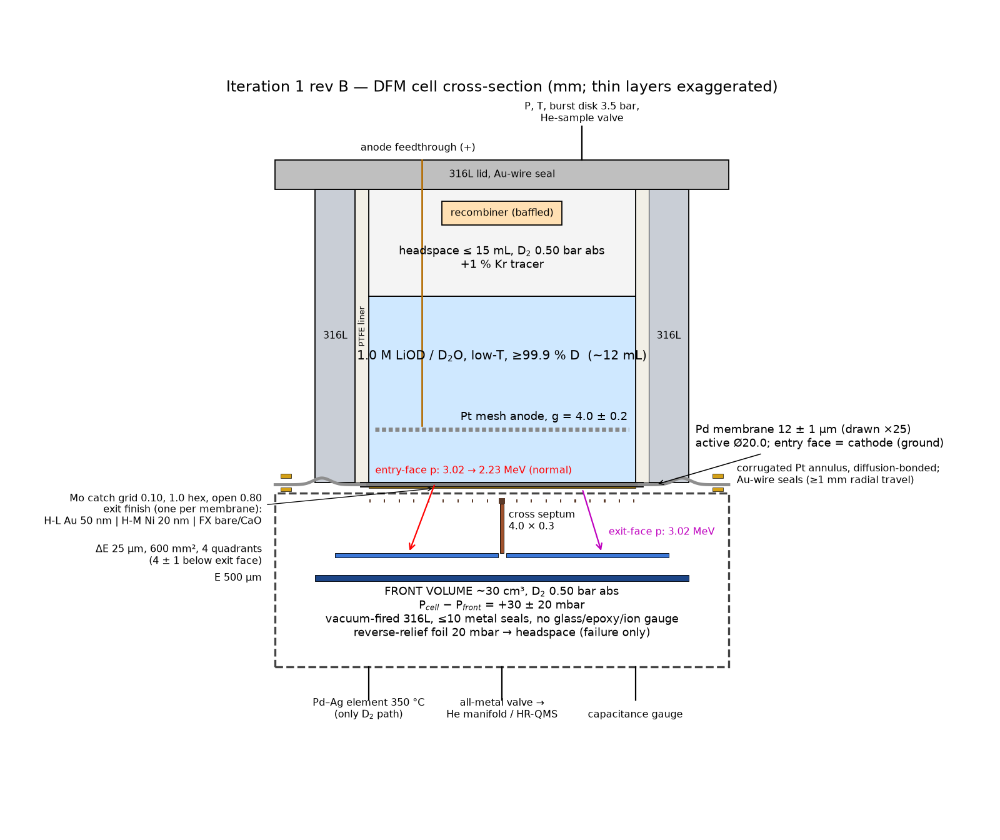
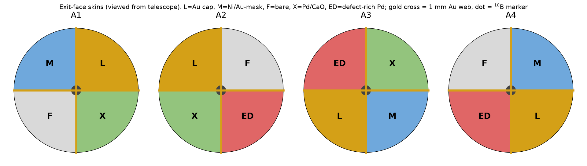

# Iteration 1 (rev B) — Detector-Facing Membrane Array "DFM-8" and claim arms

**Status:** revision B, after red-team-1A/1C/1D (decisions in [ADR-005](../decisions/ADR-005-iteration1-revB.md)). Red-team-1B (engineering/safety) is being re-run on this revision.
**Date:** 2026-09-29
**Frozen analysis plan:** [preregistration-v1.md](preregistration-v1.md)
**Earlier version:** rev A (git `77887a6`) used quadrant skins on one membrane. The reviews showed that geometry cannot hold the claimed regimes (ADR-005 §1).
**Lead designer:** Claude. Every parameter cites its source in §14.

---

## 0. The configuration in one paragraph

- **The membrane.** A **12 µm annealed palladium membrane, 20 mm active diameter**, forms the wall between two chambers.
  - It is diffusion-bonded to a corrugated **platinum** annulus. Platinum does not absorb hydrogen, so the membrane can swell freely while an all-metal seal holds it.
  - Both chambers hold D₂ at 0.5 bar, so the membrane carries no significant pressure load.
- **The entry face (top)** is the cathode of a small **sealed, all-metal, PTFE-lined electrolytic cell**: 1.0 M LiOD in low-tritium D₂O, with a Pt mesh anode 4 mm above. The cell loads the membrane to D/Pd ≥ 0.9.
- **The exit face (bottom)** gets **one of three finishes per membrane**. Each finish sets the loading state of the *whole* foil:
  - **H-L:** 50 nm Au cap. High loading, no through-flux. It behaves like SRI's closed cathode, with deuterium movement driven by current steps.
  - **H-M:** 20 nm Ni. High loading with a small through-flux.
  - **FX:** half bare Pd, half Pd/CaO multilayer. Maximal flux at moderate loading.
- **Charged-particle detection.** A **quadrant silicon ΔE–E telescope** sits 4 mm below the exit face. Because the foil is thinner than the range of a 3 MeV proton, the telescope sees fusion protons from **anywhere in the foil**, including the electrolyte-facing surface. The proton energy tells roughly how deep they were born.
- **Helium-4.** Every cell accumulates ⁴He statically in two sealed, polymer-free volumes: the ~30 cm³ front and the headspace. Post-run melts recover retained helium.
- **The array.** **Eight such membranes from two screened Pd lots** run in two stages of four. Each stage shares a low-background house with four controls:
  - a Pt-membrane D₂O twin;
  - two light-water twins;
  - a blank telescope.
  - The house also contains a ³He neutron bank, a 511 keV coincidence pair and a muon veto.
- **Parallel Tier-1 arms.** Two further arms run alongside and test the best-graded claims at their original conditions:
  - Iwamura-type gas-permeation transmutation cells (**C3-G**, Cs→Pr);
  - four SRI-type closed wire cathodes (**C1**).



**3D model:** STEP/STL/glTF files and an interactive viewer are in [`cad/`](cad/README.md) (generated by `sim/cad_dfm.py`).

## 1. Objective and honest odds

- **Objective (ADR-003).** Reproduce the claimed conditions at a detector-visible location, in enough independent samples, with detectors reaching ≲ 1 % of each claimed magnitude, and with controls that make a detection credible.
- **Physics prior (M0).** The gap to a detectable rate under standard physics is 89–115 e-folds. Static screening gives about 9–13 eV at every lattice site (M1).
- **P(claim-rule positive).** P(any claim-rule positive that survives controls) ≲ 3 %.
- **What a null buys.** An all-null outcome sets **magnitude limits conditional on reaching the claimed regime**, per claim, normalised per area and per volume. Its Bayes factor against existence is only ~1.4–1.6 (red-team-1C S-7). It is *not* a refutation, and the write-up will say so (pre-registration §5).

## 2. Programme architecture

| Tier | Arm | What it tests | ADR-003 score (1D §4, revised) |
|---|---|---|---|
| **1** | **DFM-8** (§3–§6) | H1a (charged particles at every depth), H2 (⁴He, the most sensitive accounting), H1c (511), SRI loading at a visible location, flux regime, desorption | ≈ 0.53 for SRI plus Lipson/NTT/Czerski terms; the only arm that makes H1 nulls informative |
| **1** | **C3-G ×5** (§7.1) | Iwamura permeation transmutation, primary Cs→Pr | ≈ 1.1 |
| **1** | **C1 ×4 + H₂O twin** (§7.2) | SRI/ENEA heat + ⁴He in closed wire cathodes | ≈ 0.7 |
| 2 | Nanocomposite / Ni–Cu furnace (§8.2) | Kitamura / Clean Planet | promoted when claimant-lineage material is secured |
| 3 | Co-deposition on a PSD scintillator (§8.1) | SPAWAR chemistry | low credibility, cheap |

## 3. The DFM cell

### 3.1 Cross-section

Dimensions in mm unless noted; not to scale.

```
                 anode feedthrough (alumina-brazed, +)      P, T, burst disk (3.5 bar), He-sample valve
                          |                                        |
        +=================|========================================|=============+  316L lid, Au-wire seal
        |  headspace <=15 mL, D2 0.50 bar abs (+1 % Kr tracer)                   |
        |  recombiner (hydrophobic Pt/Al2O3, >=20 above liquid, baffle, arrestor) |
        |  +-- 316L body, PTFE liner 1.0 (baked 150 C, D2-purged), bore 20.00 --+ |
        |  |  1.0 M LiOD / D2O (low-T, >=99.9 % D), ~12 mL                        | |
        |  |  ======== Pt mesh anode (>=50 % open, pitch <=1) ========  g = 4.0   | |
        |  |  ~~~~~~~~ ENTRY FACE = cathode (ground), etched annealed Pd ~~~~~~~~ | |
        +--+=====================================================================+-+
           |  Pd MEMBRANE 12 +/- 1 um, active dia 20.0                           |
           |  diffusion-bonded (850 C) to corrugated Pt annulus 0.10, OD 34      |<-- Au-wire seals both sides
           |  EXIT FACE: one finish per membrane (Au 50 nm | Ni 20 nm | F/X)     |    4-pt vdP on Pd rim (dia 21)
        +--o---------------------------------------------------------------------o--+
        |  Mo catch grid 0.10, 1.0 hex holes, open 0.80 (on 0.5 ribs, 5 pitch)       |
        |  cross septum 4.0 x 0.3 (grounded)                                         |
        |  [dE 25 um, 600 mm2, 4 quadrants]  4.0 +/- 1.0 below exit face            |
        |  [E 500 um, >=700 mm2]             1.5 below dE                           |
        |  FRONT VOLUME ~30 cm3, D2 0.50 bar abs; dp(cell-front) = +30 +/- 20 mbar  |
        |  vacuum-fired 316L(N); <=10 metal seals; no glass, elastomer, epoxy, ion gauge
        |  reverse-relief burst foil (20 mbar) front -> cell headspace (failure only) |
        +-----+-----------------------+----------------+-----------------------------+
              |                       |                |
     Pd-Ag element (350 C)     all-metal valve to   capacitance gauge
     = only D2 in/out path     He manifold/HR-QMS
```

### 3.2 Dimensions and materials

| Item | Specification | Source |
|---|---|---|
| Membrane | Pd ≥ 99.95 %, **12 ± 1 µm** unloaded, measured per foil to ± 0.3 µm; Ø20.0 wetted/active | ADR-005 §2.2; M2 rec. 6 |
| Lots | ≥ 2 lots, screened on sibling coupons before admission: loading ≥ 0.95 in D₂O at ≤ 300 mA cm⁻²; swelling; EBSD texture and grain/thickness ratio; ICP-MS impurities. ENEA/SRI archival material requested | ADR-005 §2.4; 1D-D3 |
| Heat treatment and bond | Vacuum anneal 850 °C, 1 h, ≤ 10⁻⁵ mbar, **with simultaneous diffusion bond** to the Pt annulus under a light dead-weight; entry face lightly etched afterwards | M3 rec. 5; ADR-005 §2.3 |
| Annulus | Pt, 0.10 mm, ID 20.5 / OD 34, one convolution, **≥ 1 mm radial travel** (the loaded disk grows ≈ 0.45 mm in radius) | ADR-005 §2.3; M3 |
| Seals | Au-wire on both sides of the annulus. No elastomer or polymer on any gas boundary | 1A-P1; M8 |
| Cell body | 316L, PTFE liner 1.0 mm on all wetted surfaces (no path to air), baked 150 °C, D₂-purged; headspace ≤ 15 mL | 1A-P1; R6 |
| Anode | Planar Pt mesh (≥ 50 % open, pitch ≤ 1 mm), g = 4.0 ± 0.2 mm, parallel within 0.2 mm | M2 rec. 7 |
| Electrolyte | 1.0 M LiOD in D₂O, ~12 mL. D₂O ≥ 99.9 % D, certified low-tritium, LSC assay per lot. ²²⁸Th/²²⁶Ra assay of LiOD. Rn-free by sparging with Pd–Ag-purified D₂ | M2; 1A-P8, P9; 1D-D15 |
| Cell gas | D₂ 0.50 ± 0.05 bar abs (1.0 bar in P4); trip at ΔP ≥ 10 % of fill | R6; 1D-D12 |
| Recombiner | Hydrophobic Pt/Al₂O₃, ≥ 20 mm above the liquid, baffle, flame arrestor, thermocouple | R6 |
| Exit finishes | H-L: Au 50 nm (pinholes ≤ 3×10⁴ cm⁻², checked per sputter batch by an H-permeation witness and Cu decoration). H-M: Ni 20 nm (final value from P0b). FX: diagonal quadrant pairs F (bare) and X (Pd 40 nm / [CaO 2 nm / Pd 18 nm]×5), separated by a 1 mm bare web | ADR-005 §2.1; 1A-P7 |
| Grid | Photo-etched Mo 0.10 mm, 1.0 mm hex holes, 0.10 mm webs (open 0.80), 0.5 mm ribs under the septum and at 5 mm pitch; hole edges radiused ≥ 50 µm | M3 rec. 4 |
| Pressure | P_cell − P_front = +30 ± 20 mbar (membrane on grid, σ ≈ 6 MPa). Front loss at 0.5 bar: 28 MPa. At 1.0 bar (P4): 44 MPa. Interlock at ± 40 mbar; reverse-relief foil at 20 mbar (lifted 12 µm membrane at 50 mbar ≈ 54 MPa) | ADR-005 §2.3; M3 scaling σ ∝ ΔP^(2/3) t^(−2/3) |
| Telescope | ΔE 25 ± 2 µm, 600 mm², 4 quadrants; E 500 µm; ΔE at 4 ± 1 mm; ceramic, epoxy-free, low-α; bias ≤ 150 V | M5 rec. 1 |
| Septum | Cross, 4.0 × 0.3 mm, grounded. Its (n,xp) contribution (~0.01 d⁻¹) is included in the background; B carries an identical septum and grid on one quadrant | 1A-P11 |
| Front volume | ~30 cm³, vacuum-fired 316L(N), ≤ 10 metal seals; D₂ only through the hot Pd–23Ag element | M8 |
| Loading gauge | 4-point van der Pauw on the Pd rim at Ø21, valid because each membrane is single-regime. R(x) calibrated on sibling coupons for D and H, both branches; logged at ≥ 1 Hz | ADR-005 §2.4 |
| Other sensors | ≥ 2 acoustic-emission sensors per cell (to localise events); flange RTD; cell and front pressure; Δp transducer | 1A-P3 |
| Electrical | Membrane is the hard ground; floating linear galvanostat; dummy Si on the same electronics; waveforms digitised at ≥ 100 MS/s; V·I at ≥ 100 kS/s | red-team-0 §3.4; M4 |

### 3.3 Membrane types and allocation

| Type | Exit finish | Whole-foil state (M2/M3) | Primary role | Claim terms |
|---|---|---|---|---|
| **H-L** | Au 50 nm | x ≈ x_in = 0.915–0.924 (good surface), J ≈ 0; \|dx/dt\| from cathodic steps | SRI/ENEA loading at a detector-visible location; the exit face is also in-regime (visible at 3.0 MeV, ε = 0.22) | SRI/ENEA, NTT-like (P6a) |
| **H-M** | Ni 20 nm | x ≈ 0.91–0.92, J ~ 10 mA cm⁻² | McKubre's (x − x₀)²·flux product. **Pre-registered fallback: built as H-L if P0b shows no loaded-flux window** | SRI flux term |
| **FX** | F / X diagonal pairs | x ≈ 0.65 throughout, J supply-limited (50–150 mA cm⁻² equivalent) | Flux-regime H1, F vs X within one membrane, lock-in, desorption | Lipson-like (P6a), Czerski, generic interface |

**Allocation.** Two stages of four active cells; lots a and b; positions rotated between stages.

| Stage | A1 | A2 | A3 | A4 |
|---|---|---|---|---|
| 1 | H-L (a) | H-L (b) | H-M (a) | FX (b) |
| 2 | FX (a) | H-M (b) | H-L (a) + **Al additive** | H-L (b) |

- **Totals:** H-L 4, H-M 2, FX 2.
- **Controls in both stages:** T-Pt, T-H(L) and T-H(FX), plus B.
- **Stage-2 freeze:** the stage-2 allocation is frozen as pre-registration amendment A1 before stage 1 is unblinded.
- **Replication odds.** With 8 membranes, P(≥ 2 active) = 0.50 at p = 0.2 and 0.19 at p = 0.1 (1C §C.4). Lot correlation lowers both.



Drawings are generated by `sim/design_iter1_drawing.py`.

### 3.4 What the telescope sees

Proton energies at the ΔE, through 12.46 µm (loaded) PdD₀.₉ plus 4 mm of 0.5 bar D₂, over the real acceptance (`m5_si_telescope`):

| Proton origin | Normal incidence | Acceptance median, 10–90 % | ε_PID (δ source) |
|---|---|---|---|
| Exit face | 3.02 MeV | 3.01 [3.01, 3.02] | 0.220 |
| 4 µm | 2.78 | 2.66 [2.33, 2.76] | 0.214 |
| Mid-foil | 2.64 | 2.45 [1.90, 2.61] | 0.209 |
| **Entry face** | 2.23 | 1.80 [0.00, 2.17] | **0.162** |

- **Energy is not a one-to-one depth map.** Depth is recovered by a pre-registered response-matrix unfold ε(z, E), calibrated with ⁶LiF tritons (34 % emerge at 12 µm). One ⁶LiF calibration membrane is made per lot.
- **Tritons** escape from the top ~4 µm, **³He** from ≤ 1 µm.
- **Radon progeny.** ²¹⁴Po α leave the foil at ≤ 2.8 MeV and stop in the ΔE, so PID rejects them.
- **Grid and septum** multiply efficiency by ≈ 0.80 × 0.9.

## 4. Array and house

### 4.1 Positions (per stage)

| Position | Cell | Role |
|---|---|---|
| A1–A4 | DFM, D₂O, per §3.3 | Active |
| T-Pt | DFM geometry with a Pt membrane (flux-blocked), identical D₂O volume and current waveform | **Primary T1 control**: D₂O cosmic recoils (n–d, D(n,np)), EMI/current artifacts, cell→front leaks; neutron control |
| T-H(L) | H₂O/LiOH, H-L type | Isotope-specificity check. Two blocks: current-matched and x-matched, under a deterministic controller frozen after P0b |
| T-H(FX) | H₂O/LiOH, FX type | Isotope-specificity check (current-matched and J-matched blocks) |
| B | Blank telescope under 100 µm Al; one quadrant carries septum and grid | Internal, cosmic and EMI background |

Telescopes are characterised in P0a and P6 (≥ 10× live time each). There is no mid-run swap, because swapping would break the He windows (1C-S12).

### 4.2 House (plan view)

```
 +----------------------------------------------------------------------+  20 cm borated HDPE + 1 mm Cd
 |  3He bank: 24 x 1" x 40 cm tubes (4 atm) in HDPE, lining 4 walls     |
 |   +------------------------------------------------------------+     |
 |   |  5 cm OFHC Cu inner shield (no Pb near the bank)            |     |
 |   |    [A1]   [A2]   [A3]   [A4]         <- 90 mm pitch         |     |
 |   |    [T-Pt] [T-H(L)] [T-H(FX)] [B]                             |     |
 |   |  LaBr3/CeBr3 2"x2" pair, back-to-back, on a rail (511-511)  |     |
 |   +------------------------------------------------------------+     |
 |  plastic-scintillator muon veto on top and two sides                 |
 +----------------------------------------------------------------------+
 Inner cavity ~ 45 x 30 x 30 cm; 3He-bank efficiency ~0.12-0.18 (M5 scaling)
```

**γ / e± layout** stays provisional until M7 is merged. It comprises:
- the LaBr₃ pair (target ε ≥ 2 %, background ≤ 2×10⁻³ cps);
- a 3–25 MeV sum window;
- an inner Cu (not Pb) shield;
- ²²Na calibration.

T2 enters the primary family only if it is frozen before P1.

## 5. Helium system

- **Two channels per cell:**
  - **Front** (exit-face reactions). Release fraction by finish (M8, 1A-P12): F ≈ 0.85; H-M (20 nm Ni) ≈ 0.6; X 0.02–1; H-L ≈ 0 (the Au cap retains He, so melts are needed).
  - **Headspace** (entry-face reactions). Release into the front is 0.
- **Manifold** (0.1–0.2 L, 250 °C bakeable):
  - getter;
  - **HR-QMS (R ≥ 500)**;
  - ⁴He and ³He pipettes;
  - capacitance gauge;
  - ports for external magnetic-sector MS with ³He isotope dilution (primary). The ³He spike is ≥ 100× the tritium ³He ingrowth.
- **Windows.** 1 d and 7 d static windows. During P2 the FX membranes permeate 50–150 mA cm⁻² equivalent, so windows rely on the Pd–Ag exhaust, not on getter capacity (1A-P10).
- **Floors (5σ, full release, M8):** 0.39 nW (1 d) and 0.16 nW (7–30 d), i.e. 43–100 He s⁻¹. These hold only because the cell is now polymer-free (1A-P1). Each cell's floor is measured in P0a, with ≥ 2 blank windows after build.
- **T3 statistic.** Each cell's excess over its **own** blank series, with the between-cell variance and D₂-matrix spikes included (pre-registration §2).
- **Post-run.**
  - Quadrant melts (laser-cut).
  - Sibling-coupon melts per lot.
  - ³He implanted off-site into a sibling membrane, to measure release fractions (sample preparation only, not a device beam).
- **Hygiene.**
  - Vent only with LN₂ boil-off N₂.
  - Use Ar/Kr for leak checks, never He after the final bake.
  - No He cylinders in the room; log room He.
  - Weekly H/D in headspace aliquots.

## 6. Calorimetry

- **Instrumented cells.** One H-L cell per stage and T-H(L) sit in SEEB1\* Seebeck envelopes, with a ≥ 10 mm Cu shell and a ceramic break to the front (5σ ≈ 4–20 mW, M4).
- **Power metrology.** V·I is sampled at ≥ 100 kS/s. Permeation and loading enthalpies are pre-registered.
- **Status.** Heat is **partially tested**: 4–20 mW, volume-scaled, is 2–100 % of SRI-scale claims (1C-S6). It is descriptive only.

## 7. Tier-1 claim arms

### 7.1 C3-G ×5: Iwamura gas-permeation transmutation

- **Substrate.** Pd 25 × 25 × 0.1 mm, prepared by the MHI recipe (anneal, etch).
- **Entry face.** Pd 40 nm / [CaO 2 nm / Pd 18 nm]×5, then **Cs** as the primary target: ¹³³Cs → ¹⁴¹Pr, the Toyota-replicated channel. Both isotopes are monoisotopic, and the Pr background is surveyed pre-run. ⁸⁶Sr is a secondary target on separate cells (⁸⁶Sr → ⁹⁴Mo). Targets are applied off-site as sample preparation.
- **Conditions.** D₂ 1 atm upstream, 70 °C, vacuum downstream with an RGA logging J (target 3–7×10¹⁷ D cm⁻² s⁻¹), 2 weeks per sample.
- **Cells.** 3 D₂ (Cs), 1 H₂ (Cs), 1 no-CaO (Cs). **No Mo anywhere in C3-G.** Zr survey (⁹⁴Zr isobar).
- **Analysis.** Coded samples; blinded pre/post ICP-MS and ToF-SIMS at two labs. Reach is quoted as isotope-ratio precision. Separately registered (T4).

### 7.2 C1 ×4 + H₂O twin: SRI/ENEA closed cathodes

- **Cathode and anode.** Pd wire Ø1.00 × 30 mm between PTFE end plates, Pt helix at R = 10 mm (M2 §6.1).
- **Electrolyte.** **1.0 M LiOD** (SRI lineage), 60 mL, in an all-metal 316L cell.
- **Lots and variants.** 2 screened lots (2 cells each). Variants, each descriptive: one cell with **Al additive** (LiAlO₂, ~200 ppm); one cell with a **SuperWave-type** waveform.
- **Protocol.** ≥ 6 weeks at x ≥ 0.9; cathodic current steps; excursions to 0.5 A cm⁻².
- **Channels.**
  - SEEB1\* twin calorimetry (M4).
  - Headspace ⁴He on the shared manifold; post-run melts.
  - An 8-tube ³He bank around the bath.
  - CR-39 channel C against the wire (M5 rec. 9).

## 8. Tier-2/3 arms (outline)

- **8.1 Co-deposition** on EJ-276 PSD plastic under 50 nm Au. PdCl₂ + LiCl in D₂O, open vented cell, with an H₂O twin. Descriptive.
- **8.2 Nanocomposite furnace.**
  - 100 g CNZ/PNZ at 200–300 °C in an all-metal reactor, with a flow calorimeter (± 0.1–0.2 %) and an inert-bed twin, plus ⁴He/³He on the shared manifold.
  - Ni/Cu multilayer variant: 6×[Cu 2 / Ni 14 nm] on Ni, H₂-loaded at 250 °C, then desorbed with a ramp to 900 °C.
  - Promoted to Tier 1 once claimant-lineage material is secured.

## 9. Protocol (per stage)

The full inference rules are in [preregistration-v1.md](preregistration-v1.md).

| Phase | Duration | Action | Notes |
|---|---|---|---|
| P0a Commissioning | 3–4 wk (stage 1), 2 wk (stage 2) | ²⁴¹Am + pulser, ²²Na, ⁴He/³He spikes; per-cell He blanks (≥ 3 × 1 d, ≥ 2 × 7 d); calorimeter calibration; backgrounds ≥ 10× live time; lot screening in parallel | Freeze DQ cuts and controller targets |
| P0b Witness | 1 wk | Bare-Pd and H-L witness DFMs **at 0.5 bar D₂**: measure J(i), x, the Au pinhole leak, and the thermal limit at 0.5 A cm⁻². Choose the Ni thickness for H-M, or trigger the H-M → H-L fallback | 1A-P7 |
| P1 Loading | 1 d | α→β transit at 5 mA cm⁻², then 20 → 50 → 100 → 300 mA cm⁻² | M3 Protocol A |
| **P2 Hold** | **42 d fixed** | 200–300 mA cm⁻², 22 ± 1 °C, keep-alive ≥ 20 mA cm⁻² on UPS. FX: ≥ 25 % current-off blocks. He windows | Primary T1/T3 data; in-regime hours logged |
| P3 Modulation | 14 d | H cells: cathodic steps 100 ↔ 500 mA cm⁻² (≤ 2 h at 500). FX: square wave +300/−100 mA cm⁻², 240 s, plus constant-current front-pressure steps 0.2 ↔ 1.0 bar (x_exit 0.629 ↔ 0.670) | Frozen period and lag |
| P4 Warm | 14 d | Fill 1.0 bar (balanced), 60 °C | 1D-D12 |
| P6a Desorption | 2 d | Current off; front pumped through the HR-QMS line; telescopes on; dynamic He logged | Lipson/NTT-like; 1D-D13 |
| P6 End | 1 wk | Final He windows (before P6a); section and melt; SIMS/ICP-MS; XPS for Pt on the entry face; AFM/EBSD | Ash and covariates |

**Descoped from rev A:** α/β cycling site factory (P5). Misfit cracking is a confound, so it is moved to iteration 2.

## 10. Sensitivity versus claims

Per claim, normalised as stated; live time 0.8; P2 42 d.

| Channel / claim | Reach | Claimed magnitude | Ratio | Status |
|---|---|---|---|---|
| Si T1, pooled 8 membranes (per membrane) | 1.0–2.2×10⁻⁵ fusions s⁻¹ (`design_iter1_reach.py`, background 0.03–0.09 d⁻¹) | Lipson 4×10⁻³ p s⁻¹ (4π, M5) | ~0.5 % | tested |
| Si, single membrane | 4.7–7.5×10⁻⁵ | same | ~1–2 % | tested (descriptive) |
| Si vs the Tohoku-static prediction (M1) | ~2 events/day threshold | ~130/day | ~1.7 % | partially tested |
| ⁴He front (F/H-M) | 0.16–0.39 nW | SRI 0.1–1 W, volume-scaled to 3.1 cm² × 12 µm: ~15–150 mW | ~10⁻⁸ | tested |
| ⁴He headspace + melts | ~0.4–1.6 nW-equivalent | same | ~10⁻⁸ | tested |
| Heat (H-L, T-H(L); C1) | 4–20 mW; 7–27 mW | volume-scaled SRI | 2–100 % | partially tested |
| 511–511 | M7 pending | not stated | — | — |
| Neutrons | ~2×10⁻² fusions s⁻¹ | — | — | descriptive |
| C3-G Pr (T4) | isotope-ratio precision ~1 % on ~10¹⁰ cm⁻² | Toyota Pr 2×10¹¹ → 1.6×10¹² cm⁻² | ≲ 10⁻¹ | tested |

## 11. Safety envelope (R6 constraints → design)

| Constraint | Implementation |
|---|---|
| Headspace ≤ 50 mL | ≤ 15 mL per DFM cell |
| O₂ control | D₂ prefill; ΔP ≥ 10 % trip; recombiner thermocouple |
| Recombiner placement | ≥ 20 mm above liquid, baffle, flame arrestor |
| O₂-clean parts | PTFE, Pt, Pd, 316L, Mo, Cu, Au, alumina; no oils |
| Stored D | membrane 3.8×10⁻³ cm³ (≈ 0.06 kJ) |
| SELV | ≤ 3.2 V at 200 mA cm⁻²; ≤ ~5 V at 500 mA cm⁻² excursions |
| Trips | pressure; Δp (± 40 mbar: close valves, Si bias off); temperature; level; room H₂ 1 %; neutron bank at 10× background; front pressure-rise; m/z 20 leak |
| Mechanical | reverse-relief foil (20 mbar); burst disk (3.5 bar) |
| Radiation | exempt check sources only; licensed neutron sources only at a partner facility |

## 12. Budget

Estimates; vendor quotes required.

| Block | Tier 1 |
|---|---|
| Pd (2+ lots, coupons, witnesses, calibration membranes), Pt annuli, bonding, finishes, grids, septa | $30k |
| Si telescopes, 8 × $6k (reused in stage 2) | $48k |
| Digitisers, HV | $35k |
| All-metal lined DFM cells and fronts ×8 | $40k |
| Gas and He system | $30k |
| HR-QMS | $55k |
| ³He neutron bank (24 tubes) and moderator | $65k |
| LaBr₃/CeBr₃ pair, Cu shield, veto | $30k |
| Galvanostats ×8, UPS | $14k |
| Seebeck calorimetry (DFM) | $15k |
| Consumables (low-T D₂O, LiOD, ⁶LiF, ¹⁰B) | $8k |
| External analyses (sector-MS melts, SIMS, EBSD/ICP-MS screening, LSC) | $45k |
| **DFM-8 subtotal** | **≈ $415k** |
| C3-G ×5 (cells, multilayers, off-site targets, two-lab analyses) | $80k |
| C1 ×4 + twin (cells, SEEB1\*, 8-tube bank) | $67k |
| **Tier 1 total (excluding labour)** | **≈ $560k** |
| **Minimum claim-weighted subset**: C3-G ×5 + C1 ×2 + twin + one DFM stage (2 H-L + T-Pt + T-H(L) + B, external He analysis) | **≈ $0.28M** |

## 13. Go / no-go for iteration 2

| Outcome | Iteration 2 |
|---|---|
| Claim-rule positive on T1 or T3 | Blind replication at an independent site with the same drawings; a ≥ 3-level J/x ladder; an unloaded-Pd dummy in the same cell; DSSD localisation |
| Evidence-level (≥ 3σ global) only | Frozen repeat with more membranes of the implicated type; independent analysis team |
| C3-G positive, DFM null | Pivot to gas permeation; vary target isotopes and multilayer period; add telescopes on the C3-G entry side |
| C1 positive (heat + ⁴He), DFM null | Move the C1 lot and waveform into H-L DFMs (same lot, same waveform) to test at a detector-visible location |
| All null | Publish in-regime limits (§10) as magnitude limits, not a refutation. Continue only with claimant-lineage materials (nanocomposite) or new claims |
| Hardware failure | Fix per §11; fallback is a vacuum front with 25 µm Pd on a finer grid (M3 baseline), accepting that the entry face becomes invisible |

## 14. Traceability

| Parameter | Value | Source |
|---|---|---|
| Objective | claim-conditioned, multi-sample | ADR-003 |
| Platform | DFM + C3-G + C1 | ADR-002 rev 2; ADR-005 §2.5 |
| Thickness | 12 ± 1 µm | ADR-005 §2.2 (1A-P4, P6) |
| Single-regime membranes | H-L, H-M, FX | ADR-005 §2.1 (1A-P2, P3; 1D-D1, D2) |
| All-metal cell, Pt annulus, Au seals | — | ADR-005 §2.3 (1A-P1) |
| 8 membranes, 2 lots, staging | — | ADR-005 §2.4 (1C-S2; 1D-D3) |
| T1/T3 inference, blinding | pre-registration v1 | ADR-005 §2.6 (1C-S1 to S16) |
| Controls | T-Pt primary; T-H isotope check | 1A-P5; 1C-S3, S4, S9 |
| Protocol changes | cathodic steps, 42 d, P4, P6a | ADR-005 §2.7 (1D-D6 to D13) |
| Anode gap, electrolyte | 4.0 mm, 1.0 M LiOD | M2 rec. 7 |
| Telescope | 25/500 µm at 4 mm, quadrants | M5 rec. 1 |
| He | two channels, HR-QMS, melts | M8 |
| Calorimetry | SEEB1\* | M4 |
| Positive controls | ⁶LiF calibration membranes, ¹⁰B on B, exempt sources | ADR-004; 1A-P4, P8 |

## 15. Open risks (for red-team-1B re-run)

1. **The H-L loading ceiling.** A "typical" surface gives x ≈ 0.87 at 300 mA cm⁻² (M2). Lot screening and the P0b witness are the gates. A recombination poison is held as a pre-registered iteration-2 variant.
2. **Diffusion bond and corrugated-annulus fatigue** under P3 cycling; the misfit at the bond line is not yet modelled in 2-D.
3. **Si in 0.5 bar D₂ for ~16 weeks** (leakage, noise, H effects). Fallback: vacuum front for H-L membranes, where J ≈ 0 makes that feasible.
4. **Thermal limit of the lined cell at 0.5 A cm⁻²** (~8 W into 12 mL through a 1 mm PTFE liner).
5. **γ/e± layout** pending M7.
6. **Cost:** ≈ $0.56M for Tier 1.
