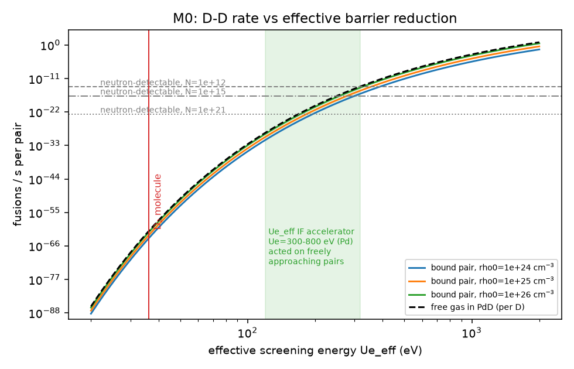

# M0 — First-Principles Rate Budget

Code: [`sim/m0_rate_budget.py`](../../sim/m0_rate_budget.py) · Raw output: [`figs/m0_output.txt`](figs/m0_output.txt)

> **Revision 2 (2026-09-29).** Corrected after the audit in [`red-team-0`](../design/red-team-0-plan.md) §1:
> - D₂ pair density uses the radial-shell form (it was 196× too high).
> - The WKB integral now starts at r = 0.
> - S-factors are the Bosch–Hale S(0) values.
> - Detection thresholds assume an equal-time matched control and 30-day runs.
> - The gap bookkeeping is now in ln(rate) rather than exponent.
> - A ⁴He channel is added.
> - The accelerator-screening wording is corrected.
>
> No conclusion changed. The gap became 5 e-folds smaller, and the H2 channel is now properly represented.

This model answers one question before any geometry is drawn: **how large an effect has to exist for any detector to see it, and which geometric levers actually move the rate?**

## 1. Framework

For two deuterons the fusion rate is set by Coulomb-barrier penetration.

- Gamow energy: $E_G = 2\mu c^2(\pi\alpha Z_1Z_2)^2 = 985.8$ keV for D+D.
- Cross-section: $\sigma(E) = \frac{S}{E}\,e^{-\sqrt{E_G/E}}$ with $S_{dd,n}\approx55$, $S_{dd,p}\approx57$ keV·b.
- Bound pair (molecule, lattice pair): $\lambda = A\,\rho_0\,P$, where $A = \dfrac{S\,c}{\pi\alpha\,\mu c^2} = 1.52\times10^{-16}$ cm³/s, $\rho_0$ is the pair probability density where tunnelling starts, and $P$ is the barrier penetration.
- We express every environment through one lumped number, the **effective screening energy** $U_{e,\mathrm{eff}}$, defined by $P \equiv \exp(-\sqrt{E_G/U_{e,\mathrm{eff}}})$. It absorbs electron screening *and* how close the lattice lets the pair sit.

**Anchor (not a validation).** The D₂ molecule (Koonin & Nauenberg 1989: λ ≈ 3×10⁻⁶⁴ s⁻¹) corresponds to $U_{e,\mathrm{eff}} = 36.3$ eV (exponent X = 164.9). This uses $\rho_0 = 7.7\times10^{23}$ cm⁻³ for a radial shell at R_e = 0.741 Å with the zero-point width x₀ = 0.106 Å. This is a one-parameter mapping of a known rate, not an independent test.

**Caution: $U_{e,\mathrm{eff}}$ is not the accelerator $U_e$.** Accelerator experiments measure screening at keV energies (turning points ~100 fm). For a thermal pair, a Yukawa-shaped screening of accelerator strength $U_e$ gives a much weaker effective value (exact WKB):

| Accelerator-style $U_e$ (eV) | 100 | 300 | 500 | 800 | 1000 | 2000 |
|---|---|---|---|---|---|---|
| $U_{e,\mathrm{eff}}$ for a freely-approaching thermal pair (eV) | 41 | 120 | 199 | 318 | 397 | 792 |

## 2. What each detector needs (30-day run, 5σ, equal-time matched control)

| Channel | Assumptions | Reactions/s needed |
|---|---|---|
| Neutrons (2.45 MeV) | ³He bank, ε = 10 %, bkg 0.05 cps; systematic floor 0.05–0.1 s⁻¹ from 1–2 % background drift | **2×10⁻²** (statistics) |
| Protons (3.02 MeV), Si in vacuum | 5 % solid angle × 30 % escape, bkg 2×10⁻⁵ cps in window | **3×10⁻³** |
| Heat, standard D+D branching | 10 mW resolution | **1.7×10¹⁰** |
| Heat, D+D→⁴He (H2) | 10 mW resolution | **2.6×10⁹** |
| **⁴He collected** (H2) | 10¹⁰ atoms extracted or accumulated in 30 d, full release | **3.9×10³** (= 15 nW; 7×10⁵× better than calorimetry) |

- For standard D+D, **heat is ~10¹² times less sensitive than particle detection.** A heat-first design is the wrong optimisation for H1.
- 1 W of standard D+D means 8.4×10¹¹ n/s, or **~10 Sv/h at 1 m**. Watt-level heat claims without lethal neutrons are only possible through a non-standard channel (H2). That is why H2 needs its own signature: heat correlated with ⁴He.
- **For H2, ⁴He is the particle detector.** It beats calorimetry by ~10⁶, provided the ⁴He is released or extracted (see M8).

## 3. Required enhancement

Required $U_{e,\mathrm{eff}}$ (eV) to reach the neutron threshold, as a function of the number $N$ of active pairs:

| N pairs | ρ₀=10²⁴ | ρ₀=10²⁵ | ρ₀=10²⁶ |
|---|---|---|---|
| 10⁹ | 521 | 470 | 426 |
| 10¹² | 388 | 355 | 326 |
| 10¹⁵ | 300 | 277 | 257 |
| 10¹⁸ | 239 | 223 | 208 |
| 10²¹ (≈ whole 0.5 g cathode) | 195 | 183 | 172 |

**Rate budget (revision 2).** Measured as ln(required rate per pair ÷ molecular-D₂ rate):

| Case | Gap |
|---|---|
| All 10²¹ pairs of a 0.5 g cathode active | 94 e-folds |
| Only 10¹² special sites active | 115 e-folds |
| All 10²¹ pairs active **and** 100× better detection | 89 e-folds |

The "number of sites" lever is already inside the N column, so it must not be counted twice.

**Null-limit constraint.** Bulk PdD is known not to fuse at ≳10⁻²⁵ /pair/s (1989–90 null searches). In the free-gas picture (S/E convention) this forces $U_{e,\mathrm{eff}}(\text{thermal}) \lesssim 147$ eV in bulk. That corresponds to a Yukawa-shaped accelerator-style $U_e \lesssim 368$ eV. Tohoku's Pd value (~310 eV) is compatible with the nulls; Bochum-class 500–800 eV cannot act on freely-approaching thermal pairs in bulk PdD.

## 4. Steepness and tail dominance

$\dfrac{d\ln\lambda}{d\ln U_{e,\mathrm{eff}}} = \tfrac12\sqrt{E_G/U_{e,\mathrm{eff}}}$, which is **35–50** in the relevant range. Locally the rate scales as $U^{35\text{–}50}$, so +10 % enhancement gives 28–113× the rate.

If enhancement varies from site to site (Gaussian, mean 100 eV):

| σ (eV) | share of all reactions from the top 0.1 % of sites |
|---|---|
| 5 | 16 % |
| 10 | 59 % |
| 20 | 90 % |

**Reframing (red-team-0).** Steepness means **site quality beats site count**. Raising the mean U_eff of a site class by 10 % multiplies the rate by ~100×. Geometry would need ~100× more visible area to match that. Processing (defects, loading, surface chemistry) is therefore the dominant engineering lever, and visible area comes second. For the same reason, 100× better detector sensitivity is worth only 10–14 % in reachable U_eff. **Reproducing the conditions where anomalies are claimed, and running many samples, are the order-unity levers** (ADR-003).

**Consequence for geometry.** The rate is set by the rarest, most extreme sites (defects, crack faces, vacancy clusters, interfaces, surface asperities, nanoparticles), not by bulk averages. The design objective is therefore:

1. **Multiply** candidate extreme sites: high interface/defect density and high-loading nanostructure.
2. **Place them within the escape depth** of charged products (tens of µm in Pd for 3 MeV protons) facing the detectors.
3. **Load them to the highest possible deuterium chemical potential**, with flux and cycling (non-equilibrium widens the site distribution).
4. **Keep everything else identical in a light-hydrogen control.**

## 5. What this rules in and out

- **Out:** designs whose only observable is bulk excess heat (insensitive under H1, artifact-prone under H2).
- **Out:** very thick bulk cathodes as the primary sensor (sites deep in the metal are invisible to charged-particle detectors, and loading is slow).
- **In:** thin, interface-rich, high-loading active layers directly facing low-background charged-particle spectrometers, surrounded by neutron detection; plus a calorimetric/⁴He channel to test H2.

## 6. Limitations

- ρ₀ and the potential shape are uncertain by orders of magnitude. The exponent dominates, and conclusions change by less than ±15 % in required $U_{e,\mathrm{eff}}$ across ρ₀ = 10²⁴–10²⁶.
- The model ignores resonances (for example Czerski's proposed near-threshold 0⁺ state in ⁴He). A resonance would multiply $S$, and so λ, linearly by the enhancement factor. Even 10⁴× equals only 9 e-folds, so it does not change the conclusion but does raise the value of charged-particle and e⁺e⁻ (511 keV) detection. R3 will quantify this.
- Non-thermal local energies (fracto-emission fields at crack tips, desorption transients) could raise the relative energy $E$ from 0.03 eV to eV–keV. This is the one "cold" lever that acts directly on the exponent. It is modelled in M1.

