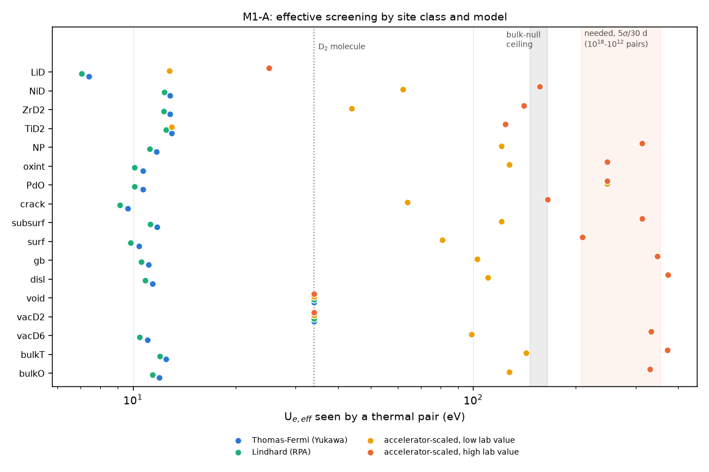
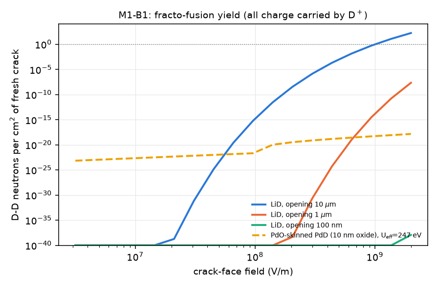
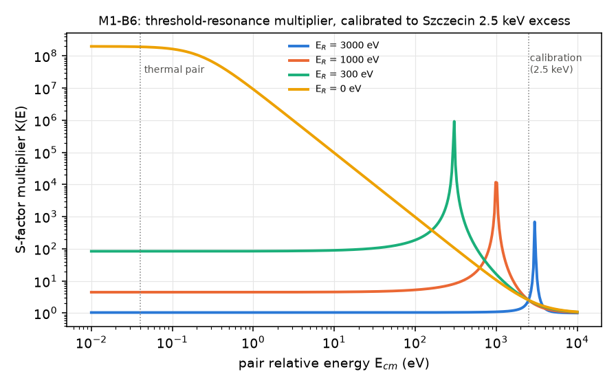
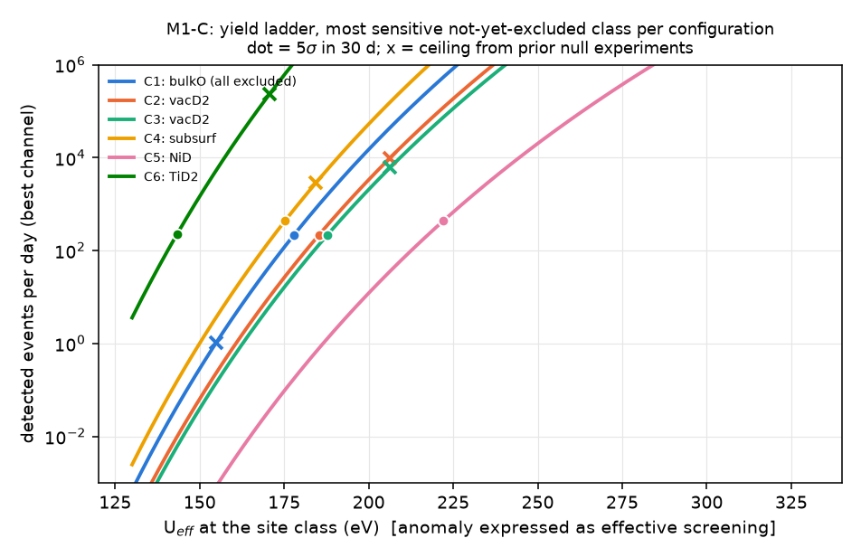
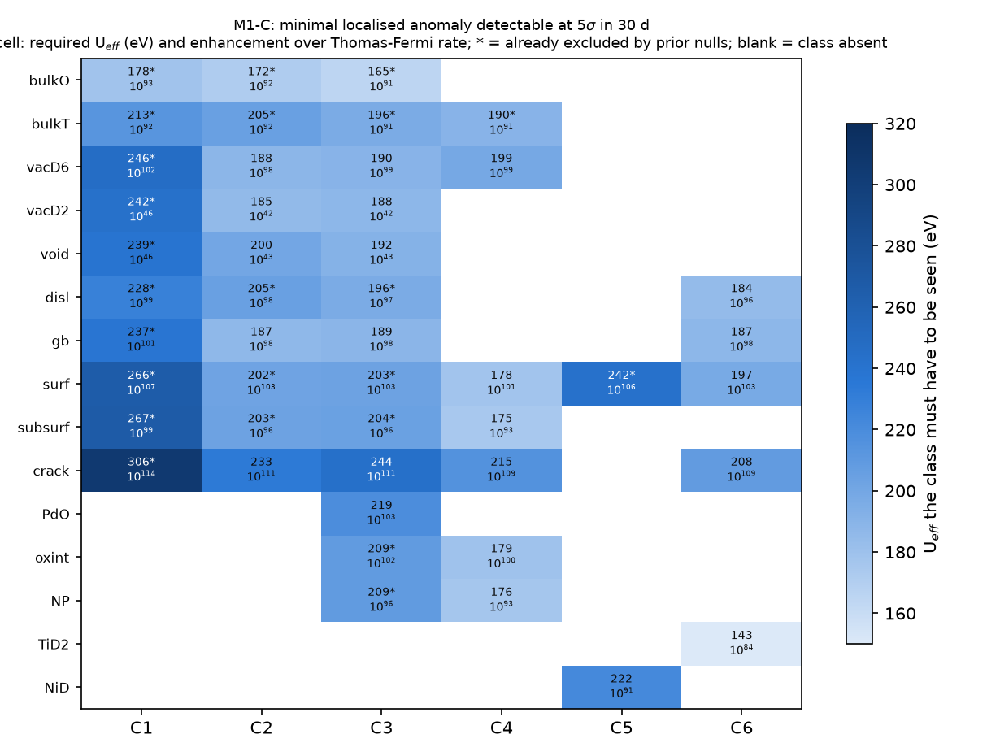
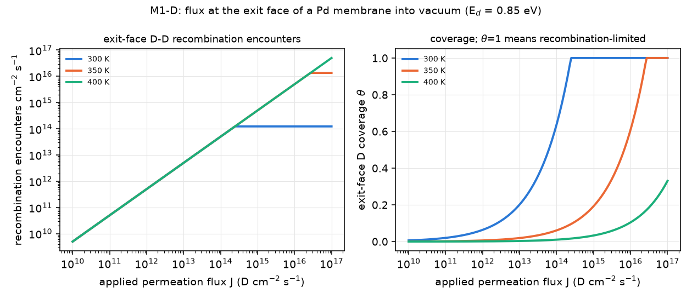

# M1 — Site physics, non-thermal energy sources, and per-configuration yield ladder

Code: [`sim/m1_physics.py`](../../sim/m1_physics.py) (library), [`m1_sites.py`](../../sim/m1_sites.py) (Part A), [`m1_nonthermal.py`](../../sim/m1_nonthermal.py) (B), [`m1_ladder.py`](../../sim/m1_ladder.py) (C), [`m1_flux.py`](../../sim/m1_flux.py) (D). `python3 sim/m1_run_all.py` regenerates every number and figure (~25 s, deterministic). Raw outputs: `figs/m1_sites.txt`, `m1_nonthermal.txt`, `m1_ladder.txt`, `m1_flux.txt`.

**Source tags.** Web access was blocked in this session (proxy 403 on arXiv, Wikipedia and publishers). Values tagged **[BK]** are standard values from background knowledge, with the reference to check. **[R3]**, **[R5]** etc. come from the project digests (including their own [m]/[v]/† tags). **[calc]** is computed here. **[guess]** is an engineering estimate with no direct source. Every [guess] that can flip a recommendation is listed in §7.

---

## Summary for lead

1. **Static screening theory is closed.** Thomas–Fermi and Lindhard screening give a thermal U_e,eff of 9–13 eV at *every* lattice site, below the D₂ molecule (34 eV). Geometry moves rates ~10¹⁰; the gap is ~10⁹⁰.
2. **Most classes are already excluded by prior nulls** if accelerator screening acts statically: bulk, T-site, vacancy, dislocation, grain boundary, surface, subsurface, NP and oxide contacts. **The PdO/Pd interface is untested.** Tohoku's 600 eV maps to U_eff = 248 eV, which gives **~130 events/day in C3 against a 5σ/30-day threshold of 2.2/day.** It is the most decisive test open to a beam-free device.
3. **Non-thermal energy is dead in metal hydrides.**
   - Crack fields relax in about 10⁻¹⁸ s, so deuterons get ≤10 eV.
   - Desorption, double-layer and optical fields give ≤1 eV.
   - Only fracture of insulating LiD reaches keV.
   - The thermal-spike plateau needs ~5 µA of keV D⁺; beam-free it gives ≤10⁻¹⁹/s.
4. **The cosmic floor has no measurable fusion** (2×10⁻⁶/s). It does carry **2.6×10⁻³ n/s of D-specific non-fusion neutrons** (D(n,2n) and D(γ,n) in 50 mL D₂O). An H₂O control does not cancel these; a D₂O/Pt twin does.
5. **Matrix (5σ, 30 days).**
   - C3 and C2 need U_eff ≈ 185–245 eV at vacancy, grain-boundary, void, crack and PdO classes.
   - C1 is excluded by prior nulls in every class.
   - C5 is insensitive.
   - C6 is best for bulk TiD₂ (143 eV).
6. **Flux does not act in the bulk** (a 10⁻⁸ perturbation). A 300 K Pd exit face saturates near 10¹⁴ D/cm²/s. For M7, the exit face must run at 350–400 K, and the target per recombination encounter is ≥10⁻²¹–10⁻¹⁷.

**Recommendation:** build C3 with a 15 ± 3 µm membrane. Give it a PdO segment (5 ± 3 nm, ≥2 cm²) beside bare and nanostructured segments, all in the top 1 µm. Add a 511–511 keV pair, and use a D₂O/Pt control.

---

## 1. Questions answered

1. **Part A.** For each site class, what are the D–D geometry, electron density, vibrational energy, binding energy and achievable density? What effective screening U_e,eff does a thermal pair see under (a) static Thomas–Fermi/Lindhard screening and (b) accelerator-calibrated screening? What are the rates per pair and per cm³, and which of these are already excluded by earlier null experiments?
2. **Part B.** Can any cold-compatible process give a D–D pair non-thermal energy? The candidates are fracture, desorption, double layers, optical fields, cosmic rays and the Czerski resonance. How much energy, how many deuterons, and what in-flight yield? What is the irreducible cosmic floor in 1 cm³ PdD + 50 mL D₂O?
3. **Part C.** For C1–C6, how many events per day under (i) standard physics, (ii) accelerator screening, and (iii) a localised ×10ⁿ anomaly? What is the minimal anomaly at site class k that configuration C detects at 5σ in 30 days (the ADR-001 matrix)?
4. **Part D.** What does D permeation flux change at the site level? What is the encounter rate at the exit face as a function of flux, and what must M7's flux lock-in reach?

## 2. Model and equations

**Rate per pair (M0 framework, reused by import).** λ = A·ρ₀·exp(−√(E_G/U_eff)), with:
- A = 1.56×10⁻¹⁶ cm³/s;
- E_G = 985.8 keV;
- ρ₀ = relative-coordinate density at the start of tunnelling (cm⁻³).

For atomic pairs, ρ₀ = (2πσ_rel²)^(−3/2) with σ_rel = √2·√(ħ/2m_Dω) from the site's vibrational quantum ħω. Values fall in 4×10²⁴–2×10²⁵ cm⁻³. For molecular pairs (D₂ in voids), ρ₀ = 1.5×10²⁶ and U_eff = 34 eV, the Koonin–Nauenberg calibration of M0.

**Screening model 1a — Thomas–Fermi (Yukawa).** V(r) = (e²/r)e^(−r/λ_TF), with λ_TF = a₀[4k_F/π]^(−1/2) and k_F = (3π²n_loc)^(1/3) (atomic units). The exact WKB exponent is computed from the nuclear radius to the turning point at the site's relative energy E_rel = (ħω/2)coth(ħω/2kT) (30–52 meV). This uses `m0.wkb_yukawa`. The result is expressed as U_eff ≡ E_G/[ln P]².

**Screening model 1b — Lindhard (RPA).** V(r) = e²/r − (e²/r)(2/π)∫₀^∞ dq sin(qr)/q·[1 − 1/ε_L(q)], where ε_L = 1 + (k_TF/q)²F(q/2k_F) and F is the Lindhard function. The integral is evaluated numerically (Fourier-sine quadrature) and solved by WKB.

**Screening model 2 — empirical, accelerator-calibrated.** U_e(site) = U_e,acc(host) × (n_loc/n_bulk)^(1/2) × f_def.
- The square-root scaling is the Debye-type form the Bochum group used to fit its data.
- f_def = 1.3 on vacancy, dislocation and grain-boundary sites in the "high" variant (Szczecin's "defects raise U_e", grade C).
- For oxide interfaces, U_e,acc is the oxide value itself.
- The result is mapped to thermal energy with the M0 Yukawa-WKB method at E_rel.
- "lo" and "hi" use the lowest and highest credible lab values (§3).

**Prior-null ceiling per class.** If class k was present at density N_k/cm³ in earlier null samples with limit L (fusions per D per s), then λ_k ≤ L·n_D/N_k. Where several nulls apply, the tightest is used. The three families are:
- 1989–90 electrolytic Pd nulls, L = 10⁻²⁵;
- Pd/ZrO₂ powder runs, ~0.1 n/s [guess];
- Ti–D nulls, L = 10⁻²³.

**Cross-sections and stopping.**
- σ(E) = S(E)/E·exp(−√(E_G/(E+U))), with Bosch–Hale S-factors for both branches.
- Stopping uses Lindhard–Scharff electronic stopping (×1.2–1.4 empirical correction) joined harmonically to Bethe, plus ZBL nuclear stopping and Bragg additivity for the D atoms.
- Thick-target yield: Y(E₀) = ∫₀^E₀ x·σ(E/2)/S(E) dE.

**Fracto-emission.**
- Surface charge σ = ε₀E_f, giving N_D⁺ = η·ε₀E_f/e per unit area.
- Maximum ion energy eV_max = eE_f·w_max for a vacuum gap. The spectrum is uniform on [0, eV_max], because ions leave while the gap opens.
- A gas-filled gap gives an exponential spectrum with mean eE_fλ_mfp.
- Yield per cm² = N·⟨Y_TT⟩.

**Threshold resonance.** The S-factor multiplier is K(E) = 1 + C/[(E−E_R)² + Γ²/4].
- This follows from a Breit–Wigner with Γ_d(E) = 2θ²γ_W²(2πR/a)e^(4√(2R/a))e^(−2πη(E)). The Gamow factors cancel against the non-resonant S-factor.
- Γ = Γ_p(1 + 10) = 0.44 eV.
- C is calibrated so that K(2.5 keV) = 2.54. That is the excess between Szczecin's U_e = 340 eV fit and their resonance-inclusive 105 eV fit at E_cm = 2.5 keV.
- The unitarity-style ceiling is θ² ≤ 1.

**Detection (M0/R5 assumptions; M5 not yet available).**
- Minimal signal s_min = max(s_Asimov(5σ; b), 5·δ_sys·b, 3) counts in T = 30 days, where b is the expected background.
- Charged products escape from depth z if z/cos θ < R_useful, with R_useful = 18.8 µm for p (3.02→1.5 MeV), 4.0 µm for t (1.01→0.3 MeV) and 0.8 µm for ³He, all in PdD₀.₉. Efficiency per fusion is ε = ½[f_p + f_t] + ½f_He3, with f = (1 − max(cos θ_det, z/R))/2.
- Neutrons: ε_n × ½. The background includes D-specific non-fusion neutrons, with a 30% systematic on them.
- The minimal per-pair rate is λ_min,k = s_min/(T·N_k·ε_k), taking the best channel.

**Flux (Part D).** Steady state at the exit face: J = 2ν₂(θN_s)²e^(−E_d/kT). Coverage θ ≤ 1 gives J_max(T). Encounters are counted three ways:
- recombination encounters = J/2;
- nearest-neighbour pair formation = N_sθ²(1−θ)·3·ν_h e^(−E_h/kT);
- the per-encounter fusion probability, p = λ_mol(U_eff)·τ_TS with τ_TS = 10⁻¹⁴ s.

## 3. Parameters

| Parameter | Value | Units | Source | Uncertainty |
|---|---|---|---|---|
| E_G, A, D₂ calibration (U_eff = 34 eV, ρ₀ = 1.5×10²⁶) | 985.8 keV; 1.56×10⁻¹⁶ | cm³/s | M0; Koonin & Nauenberg, https://doi.org/10.1038/339690a0 | calibration ±1 eV |
| Bosch–Hale S(0), p / n | 55.6 / 53.7 | keV·b | https://doi.org/10.1088/0029-5515/32/4/I07 [BK] | ±2% |
| PdD lattice, O–O distance | a = 4.03–4.07; 2.85 | Å | Fukai, *The Metal–Hydrogen System* (2005) [BK] | ±1% |
| D vibrational quantum, PdD (O-site) | 37 | meV | Rowe et al. PRL 29, 1250 (1972) [BK]; R4 (35–40) | ±10% |
| Local valence density at D sites (bulk Pd) | 0.020 | e/bohr³ | Puska & Nieminen PRB 29, 5382 (1984) / EMT [BK] | ×2 |
| Same at vacancy / GB / surface / nanogap / oxide contact | 0.012 / 0.013 / 0.008 / 0.005 / 0.010 | e/bohr³ | scaled from bulk [guess] | ×2 |
| H(D)–vacancy trap energy (Pd) | 0.23 | eV | Besenbacher et al. J. Less-Common Met. 130, 475 (1987) [BK] | ±0.05 |
| D–D in VD₆ cluster | 2.5–2.6 | Å | R2; DFT (Nazarov PRB 89, 144108, 2014) [BK] | ±0.1 |
| Superabundant vacancy fraction | 10⁻³ (cathodic, top µm), 10⁻² (codeposit), 0.1–0.25 (GPa) | site frac. | Fukai & Okuma PRL 73, 1640 (1994) [R2] | ×3 |
| Dislocation density after α/β cycling | 10¹¹–10¹² | cm⁻² | Flanagan & Oates, Annu. Rev. Mater. Sci. 21, 269 (1991) [BK] | ×3 |
| D₂ fluid density at ~1 GPa (voids) | 4.3×10²² | cm⁻³ | H₂ EOS, Loubeyre 1996 [BK] | ±20% |
| Crack area S_v; fraction with 0.3–1 nm gap | 10–10⁵ cm⁻¹; 10% | — | [guess] (M3 to supply) | ×10 |
| Accelerator U_e lo/hi: Pd | 310 / 800 | eV | Kasagi JPSJ 71, 2881 https://doi.org/10.1143/JPSJ.71.2881 ; Raiola EPJA 19, 283 https://doi.org/10.1140/epja/i2003-10125-0 [R3] | lab-to-lab ×2.6 |
| PdO; Ti (hydride); Zr; Ni; Cu; insulators | 600; 30/300; 105/340; 150/380; 180/470; 30/60 | eV | R3 Table 2.1; Ni/Cu "lo" = [guess] | as R3 |
| Bulk Pd null | ≤10⁻²⁵ | fusions/D/s | M0; Gai et al. Nature 340, 29 (1989) [BK] | ×10 |
| Pd/ZrO₂ powder null | ~0.1 n/s for 3 g Pd, 10 nm | n/s | [guess from R2 lineage] | ×10 |
| Ti–D null | ≤10⁻²³ | fusions/D/s | [BK] | ×10 |
| Sea-level neutrons: 1–10 / 10–100 / >100 MeV | 3.5 / 2.5 / 1.1 ×10⁻³ | cm⁻²s⁻¹ | split [guess] of Gordon et al. 2004 totals [R5] | ±30% |
| σ(n,d) elastic; σ(n,2n) | 2.0 / 0.6 / 0.1; 0.10 / 0.15 / 0.05 | b | ENDF/B-VIII shapes [BK] | ±30% |
| ²⁰⁸Tl 2.614 MeV γ flux; σ(γ,n) at 2.614 MeV | 0.2 γ/cm²/s; 1.0 mb | — | [BK] (building-dependent 0.05–0.5) | ×3; ±30% |
| Stopped-muon rate at sea level; μ⁻ fraction | 1.5×10⁻⁵ g⁻¹s⁻¹; 0.44 | — | [calc] from the PDG spectrum [BK] | ×2 |
| Czerski resonance Γ_p; Γ_ee/Γ_p | 40 meV; ≥10 | — | R3 [v]; Dubey PRX https://doi.org/10.1103/chlp-b215 | E_R unknown |
| Crack-face fields (insulators); PdD⁺–D₂ cross-section | 10⁷–10⁹ V/m; 10⁻¹⁵ cm² | — | brief; Phelps compilation [BK] | ×3 |
| Si background (p, t, ³He windows) | 6×10⁻⁵ | cps | M0 (2×10⁻⁵ per window); R5 PIPS spec | ×3 |
| ³He bank: ε, background, systematic | 0.10–0.30; 0.05 cps; 1% | — | R5 §3.3–3.4 | — |
| CR-39 background, systematic | 30 tracks/cm²/month; 30% | — | R5 §4.3 | — |
| Exit-face desorption barrier, prefactor, N_s | 0.80–0.90 eV; 10⁻² cm²/s; 1.53×10¹⁵ cm⁻² | — | Christmann, Surf. Sci. Rep. 9, 1 (1988) [BK] | E_d ±0.05 → J_max ×7 |
| D diffusivity in Pd, 300 K | 2×10⁻⁷ | cm²/s | Völkl & Alefeld [BK] | ±50% |

URLs for [BK] items without a verified DOI: search `https://scholar.google.com/scholar?q=<first author + title words>`, following the R3/R4 convention.

## 4. Verification

- **Thick-target yields reproduce R3 Table C.** For 1 mA on PdD₀.₇, the n-branch gives 2.2×10⁻¹⁰, 1.0×10⁻⁴, 0.034 and 11 n/s at 1, 2, 3 and 5 keV with U_e = 0. With U_e = 300/800 eV at 2 keV it gives 7.4×10⁻³ and 0.82 n/s, against R3's 7.5×10⁻³ and 0.83. After the Bethe join the 5–20 keV values run +18–23% above R3, inside R3's stated ±30%.
- **Ranges.** A 3.02 MeV proton travels 148 µm in water (NIST PSTAR: 146 µm [BK]) and 30 µm in PdD₀.₉ (R3: 33). A 1.01 MeV triton travels 6.1 µm (R3: 7) and 0.82 MeV ³He 1.8 µm (R3: 2).
- **Screening limits.**
  - TF constant shift at n = 0.02 a.u. is 28 eV, matching R3's 25–30 eV hand estimate.
  - Lindhard U(r→0) is 12–22 eV, below TF, as it must be since Lindhard is weaker than TF at q ≳ 2k_F.
  - The Yukawa mapping reproduces M0's table: U_e = 800 → U_eff = 331 eV.
  - Reaching U = 300 eV by TF would need an electron density of 2.9×10⁴ a.u., more than 10⁴× any metal.
- **Cross-checks against M0/R3.** Scenario (ii-hi) for bulk PdD gives 10⁸·⁸ fusions/s/cm³. R3 quotes about 2×10⁹ n/s/cm³ for U_eff = 331 eV, free gas. That is consistent once the bound-pair ρ₀ is taken into account.
- **Resonance.** For E ≪ E_R, K is energy independent, as required by the cancellation of the Coulomb penetrabilities. θ² ≤ 0.29 is needed for every E_R tested, so the calibration is physically allowed.
- **Statistics.** s_min reproduces the M0 order of magnitude. The Asimov solver uses log1p to stay stable at b ~ 10⁵ counts.
- **Numerical convergence.** WKB uses 59 log-spaced segments; doubling them changes U_eff by <0.1 eV. The Lindhard table uses 260 radii, and tabulation error on U_eff is <0.2 eV. Quadrature round-off warnings in the Lindhard tail are suppressed; the effect is <1% on V(r) for r < 3 Å.

## 5. Results

### 5A. Site catalogue ([`figs/m1_sites.txt`](figs/m1_sites.txt), )

U_eff (eV) for a thermal pair, rate per pair, and the prior-null ceiling. "Excl." means the (ii-hi) rate is already excluded.

| Class | d_min (Å) | n_loc (a.u.) | ħω (meV) | Pairs per cm³ (typ..hi) | U_eff TF / Lind | U_eff emp. lo / hi | log λ TF / lo / hi | Null ceiling U_eff |
|---|---|---|---|---|---|---|---|---|
| Pd bulk O | 2.85 | 0.020 | 37 | 3.7–4.1×10²³ | 11.9 / 11.4 | 127 / 331 | −116 / −29.3 / −14.8 | 155 (excl.) |
| Pd T-site | 1.75 | 0.025 | 70 | 2.4×10²⁰–10²¹ | 12.5 / 12.0 | 143 / 371 | −113 / −26.8 / −13.1 | 183 (excl.) |
| Vacancy–D₆ (SAV) | 2.55 | 0.012 | 50 | 8×10²⁰–8×10²² | 11.0 / 10.5 | 99 / 334 | −121 / −34.3 / −14.5 | 209 (excl.) |
| D₂ in monovacancy (conjecture) | 0.80 | — | 371 | 7×10¹⁹–7×10²¹ | 34 | 34 | −63.6 | 206 |
| Void D₂ at ~1 GPa | 0.74 | — | 371 | 4×10¹⁷–4×10¹⁹ | 34 | 34 | −63.6 | 204 |
| Dislocation core | 2.80 | 0.015 | 35 | 7×10¹⁹–7×10²⁰ | 11.4 / 10.8 | 110 / 373 | −119 / −32.2 / −13.5 | 195 (excl.) |
| Grain boundary | 2.70 | 0.013 | 35 | 2×10¹⁹–2×10²² | 11.1 / 10.6 | 103 / 347 | −121 / −33.7 / −14.3 | 202 (excl.) |
| Free surface (per cm²) | 2.75 | 0.008 | 70 | 4.5×10¹⁵ | 10.4 / 9.8 | 81 / 209 | −124 / −38.6 / −20.5 | 187 (excl.; powder [guess]) |
| Subsurface (per cm²) | 2.85 | 0.018 | 40 | 9×10¹⁵ | 11.7 / 11.2 | 121 / 314 | −117 / −30.3 / −15.4 | 184 (excl.) |
| Crack/nanogap 0.3–1 nm | 1.2 | 0.005 | 70 | 3×10¹⁵–3×10¹⁹ | 9.6 / 9.2 | 64 / 165 | −130 / −44.6 / −24.3 | 255 |
| **PdO/Pd interface (per cm²)** | 2.85 | 0.010 | 40 | 7.8×10¹⁵ | 10.7 / 10.1 | **248 / 248** | −123 / **−18.5** / −18.5 | **none (untested)** |
| CaO/Pd, ZrO₂/Pd (per cm²) | 2.85 | 0.010 | 40 | 7.8×10¹⁵ | 10.7 / 10.1 | 127 / 248 | −123 / −29.3 / −18.5 | 189 (excl.; powder [guess]) |
| Pd NP 2–10 nm core | 2.85 | 0.018 | 38 | 1.6–2×10²³ | 11.7 / 11.2 | 121 / 314 | −117 / −30.3 / −15.5 | 182 (excl.; powder [guess]) |
| TiD₂ | 2.22 | 0.030 | 100 | 3.3×10²³ | 13.0 / 12.5 | 13 / 124 | −110 / −110 / −29.2 | 171 |
| ZrD₂ | 2.40 | 0.028 | 95 | 2.6×10²³ | 12.8 / 12.3 | 44 / 141 | −111 / −55.6 / −26.9 | none |
| Ni(D) / Ni–Cu trap | 2.64 | 0.030 | 62 | 6×10¹⁸–6×10²⁰ | 12.8 / 12.3 | 62 / 157 | −111 / −45.6 / −25.2 | none |
| LiD (insulator) | 2.88 | (n/a) | 60 | 3.3×10²³ | 7.4 / 7.1 | 13 / 25 | −149 / −111 / −77 | none |

**Findings.**

1. **Static linear screening is closed.** TF and Lindhard agree within 0.6 eV, and both give 9–13 eV for every metallic site. A 2× change in local electron density moves U_eff by only ~1 eV (U ∝ n^(1/6) inside the log). All atomic lattice pairs fuse more slowly than the D₂ molecule. **Under standard physics, geometry cannot select a "hot" site class.** The spread across classes is ~10²⁰ in rate, against a gap of ~10⁹⁰.
2. **The only way any class reaches detectability is if keV-measured screening acts on thermal pairs** (the empirical model). Even then the Yukawa softening cuts 310–800 eV to 127–331 eV.
3. **Prior nulls already exclude the "Bochum-high, static" reading for bulk, T-site, SAV, dislocation, GB, subsurface, NP and ZrO₂-contact classes, and for free surfaces (via the [guess] powder null).** They do *not* exclude the "Tohoku-low" reading for any class, nor anything at all for PdO/Pd, ZrD₂ or Ni–D.
4. **Molecular sites (voids, the D₂-in-vacancy conjecture) sit at 3×10⁻⁶⁴ /pair/s regardless of host screening.** More D₂ in voids buys nothing but pair count.

### 5B. Non-thermal energy sources ([`figs/m1_nonthermal.txt`](figs/m1_nonthermal.txt))

**B0. Value of energy.** One eV of relative energy is worth 13.6 e-folds at U_eff = 11 eV but only 0.35 at 127 eV. In the regime that matters (U_eff ≥ 120 eV), +1 eV gives ×1.4, +10 eV ×26, and +100 eV ×4×10⁹. **Only ≥100 eV sources matter.**

**B1. Fracto-emission** (). Neutrons per cm² of fresh crack, with all neutralising charge carried by D⁺:

| Case | Field (V/m) | Max opening | D⁺/cm² | ⟨E⟩ (eV) | n/cm², U=0 | n/cm², site U_eff |
|---|---|---|---|---|---|---|
| PdD metal (contact potential; D₂ at 10³–10⁴ bar in gap, λ_mfp 0.5 nm) | 10⁸ | 10 nm | 5.5×10¹¹ | 1 | 0 | 4×10⁻³³ |
| PdO-skinned PdD (oxide breakdown ≤10 V) | 10⁹ | 10 nm | 5.5×10¹² | 5.5 | 10⁻¹⁸⁹ | 5×10⁻¹⁹ |
| TiO₂-skinned TiD₂ | 10⁹ | 5 nm | 5.5×10¹² | 3 | 10⁻²⁶⁹ | 3×10⁻³⁰ |
| LiD, 10⁸ V/m | 10⁸ | 10 µm | 5.5×10¹¹ | 500 | 1.6×10⁻¹⁵ | 5×10⁻¹⁵ |
| LiD, 10⁹ V/m | 10⁹ | 10 µm | 5.5×10¹² | 5000 | **1.0** | 1.0 |

- **Metals cannot hold crack fields.** The charge relaxes in ~ε₀/σ_el ≈ 10⁻¹⁸ s, and at 10³–10⁴ bar D₂ the mean free path is 0.5 nm. **Fracto-fusion in PdD or TiD₂ yields nothing**, per cycle or per anything.
- **Menlove-type Ti bursts.** A 300-neutron burst would need 10²⁷¹ cm² of fresh TiD₂ face, so these bursts are not conventional fracto-fusion. They match cosmic spallation multiplets (R5 #8).
- **LiD fracture (Klyuev/Derjaguin) is physically possible,** at ~1 n/cm² at the most extreme field and opening. A 300-n burst would need ~300 cm² of fresh face. It is real *hot* fusion and a potential artifact; it is not LENR.
- **LiOD electrolyte caveat.** Li/LiD surface films on cathodes cannot open to 10 µm: at 1 µm opening the yield is ≤10⁻¹³ n/cm².

**B2. Desorption and phase-transition transients.**
- Available energies: Schottky potential ≤0.8 eV, recombination ≤1 eV, Heyrovsky step ≤1 eV, β→α strain energy 0.05 eV. These give **×1.3–1.4 at U_eff = 127 eV.**
- Recombinative desorption from Pd is *endothermic* (~0.9 eV/D₂), so no hot D is produced.
- **Lipson's claim** of ~0.1 p/s/cm² [BK] needs a static U_eff ≥ 286 eV at the PdO/Pd interface layer, or ≥218 eV throughout the top 1 µm. Static Tohoku PdO screening gives 1.3×10⁻³ p/s/cm², 78× below the claim.

**B3. Double layer.** The Helmholtz field is 3.3×10⁹ V/m, with a gradient of 10¹⁹ V/m². The relative-energy shift is 0.03 eV for a 0.74 Å pair and ≤0.45 eV for a 2.85 Å pair straddling the layer. Ion energy between collisions is 0.03 eV. **Negligible.**

**B4. Optical near fields.** At 10⁹ W/m² with ×1000 field enhancement, E_loc = 8.7×10⁸ V/m. The ponderomotive energy of a D is 1.6×10⁻⁶ eV, and the pair gradient shift is 3.5×10⁻³ eV. **Negligible.** Reaching eV scale needs ≥10¹⁰ V/m, which is the damage regime and not cold.

**B5. Cosmic floor at sea level** (1 cm³ PdD₀.₉ + 50 mL D₂O).

| Process | PdD | D₂O | Cancelled by an H₂O control? |
|---|---|---|---|
| Knock-on d–d fusion in flight | 8.9×10⁻⁹ /s | 2.4×10⁻⁶ /s | no (D-specific), but negligible |
| **D(n,2n) breakup neutrons** | 3.5×10⁻⁵ n/s | **1.9×10⁻³ n/s** | **no** |
| **D(γ,n) from ²⁰⁸Tl 2.614 MeV** (0.2 MeV n) | 1.2×10⁻⁵ n/s | **6.7×10⁻⁴ n/s** | **no** |
| Muon-catalysed fusion | 8×10⁻¹⁴ /s | 1.1×10⁻¹⁰ /s | — |
| μ⁻ capture neutrons | 1.2×10⁻⁴ n/s | 6.6×10⁻⁵ n/s | yes |

- **The real d–d floor is 2.4×10⁻⁶ /s (0.2/day) and undetectable.** The irreducible "cold floor" is not fusion.
- **D-specific non-fusion neutrons total 2.6×10⁻³ n/s (226/day).** That is the same order as the neutron 5σ threshold. The light-water twin does not cancel it; it *produces* it as a D−H difference. A D₂O/Pt (or D₂O/Au) twin cancels it.

**B6. Czerski resonance** (). The model is calibrated to the ×2.54 excess at E_cm = 2.5 keV.

| E_R above threshold | 5 keV | 3 keV | 1 keV | 300 eV | 30 eV | ≤1 eV |
|---|---|---|---|---|---|---|
| K(thermal) | 1.39 | 1.04 | 4.5 | 84 | 1.0×10⁴ | **1.9×10⁸** |
| Equivalent ΔU_eff at 127 eV | +1 | 0 | +4 | +14 | +32 | +80 eV |

- The data do not fix E_R. If E_R lies within ~1 eV of threshold, thermal rates rise ×2×10⁸ (+19 e-folds). That still leaves the D₂ molecule at 6×10⁻⁵⁶ /s.
- **Products if real:** 91% e⁺e⁻ pairs (22.8 MeV shared), giving back-to-back 511 keV photons and bremsstrahlung, with only 4.5% p and 4.5% n. A p-only or n-only design under-counts ×11.

**B7. Thermal-spike plateau.**
- The plateau yield per keV deuteron is taken as the thick-target yield at 2.5 keV with U = 340 eV: 7.9×10⁻¹⁷.
- Reaching C3's threshold would need 3.4×10¹³ keV D/s, i.e. 5.5 µA of beam.
- The beam-free keV sources are cosmic recoils (5×10⁻⁴ /s per cm³ PdD) and one-off LiD fracture. **Beam-free contribution: ≤8×10⁻²⁰ fusions/s.** As instructed, the plateau is treated as unavailable, and this quantifies why.

### 5C. Yield ladder and sensitivity matrix ([`figs/m1_ladder.txt`](figs/m1_ladder.txt))

**Configurations as modelled.** These are M1 estimates; M3 and M5 were absent.
- **C1:** Pd wire 1 mm × 5 cm, 50 mL D₂O. Neutrons at ε = 0.10 plus 511 keV. No charged-particle channel.
- **C2:** 5 µm codeposit on 2 cm², with CR-39 behind ~20 µm of electrolyte. f_Ω = 0.5, 30% systematic.
- **C3:** 25 µm × 2 cm² membrane. Front: 1 µm nanocrystalline layer at 10⁻² SAV, 5 nm PdO, CaO/Pd ×5, and a 5 nm NP layer. Si in vacuum at f_Ω = 0.18, background 6×10⁻⁵ cps. Neutrons at ε = 0.15 with 20 mL D₂O. 511 keV at ε = 0.02.
- **C4:** 10 g Pd as 5 nm particles in ZrO₂ at 250 °C. Neutrons at ε = 0.05.
- **C5:** Ni/Cu 6×(2/14 nm) on both faces of 6.25 cm². Si at f_Ω = 0.02, interface coverage θ = 0.1.
- **C6:** 100 g TiD₁.₅ chips. ³He well at ε = 0.30.

**Ladder: detected events per day** (best channel; 5σ/30-day threshold in the last column):

| Config | (i) standard + cosmic floor | (ii-lo) Tohoku-static | (ii-hi) Bochum-static | (ii) capped at prior-null ceilings | Threshold |
|---|---|---|---|---|---|
| C1 | 1.0×10⁻² (n) | 1.1×10⁻² | 9.5×10¹⁰ (excluded) | 5.2 | 220 |
| C2 | 6×10⁻⁴ (n) | 1.9×10⁻⁵ (CR-39) | 6.2×10⁹ | 190 | 3 |
| **C3** | 6×10⁻³ (n) | **120 (Si, PdO interface)** | 1.8×10¹⁰ | 210 | **2.2** |
| C4 | 9×10⁻⁶ (n) | 7.8×10⁻³ | 4.9×10¹¹ | 1.3×10⁴ | 430 |
| C5 | 10⁻⁹¹ | 1.7×10⁻²⁰ | 2.1×10⁻² | 4×10⁻⁴ | 2.8 |
| C6 | 3.5×10⁻³ (n) | 3.5×10⁻³ | 6.7×10¹¹ | 9.5×10⁵ (Ti null weak) | 220 |

- Under **(i)**, every configuration sees only the cosmic floor, which is 10⁴–10⁵ below threshold.
- Under **(ii-lo)**, only C3 detects anything, and it does so through the PdO interface (×55 over threshold).
- The **"capped" column is the most optimistic rate still consistent with existing data.**
  - C1 cannot reach threshold (5 vs 220). It is fully dominated by the 1989–90 nulls.
  - C2 and C3 can reach it, at ×60–100 over threshold.
  - C4's large number comes from classes constrained only by the [guess] powder null.

**THE MATRIX** (). Each cell gives the U_eff (eV) the class must have for 5σ in 30 days, and the log₁₀ of the enhancement over the Thomas–Fermi standard rate (standard branching). **\*** marks cells where the required rate is already excluded by prior nulls, so the configuration adds nothing for that class. "—" means the class is absent.

| Class | C1 | C2 | C3 | C4 | C5 | C6 |
|---|---|---|---|---|---|---|
| bulk O | 178 / 93\* | 172 / 92\* | 165 / 91\* | — | — | — |
| T-site | 213 / 92\* | 205 / 92\* | 196 / 91\* | 190 / 91\* | — | — |
| vacancy–D₆ | 246 / 102\* | **188 / 98** | **190 / 99** | 199 / 99 | — | — |
| D₂ in vacancy (conj.) | 242 / 46\* | 185 / 42 | 188 / 42 | — | — | — |
| void D₂ | 239 / 46\* | 200 / 43 | 192 / 43 | — | — | — |
| dislocation | 228 / 99\* | 205 / 98\* | 196 / 97\* | — | — | 184 / 96 |
| grain boundary | 237 / 101\* | 187 / 98 | 189 / 98 | — | — | 187 / 98 |
| free surface | 266 / 107\* | 202 / 103\* | 203 / 103\* | 178 / 101 | 242 / 106\* | 197 / 103 |
| subsurface | 267 / 99\* | 203 / 96\* | 204 / 96\* | 175 / 93 | — | — |
| crack/nanogap | 306 / 114\* | 233 / 111 | 244 / 111 | 215 / 109 | — | 208 / 109 |
| **PdO/Pd** | — | — | **219 / 103** | — | — | — |
| CaO- or ZrO₂/Pd | — | — | 209 / 102\* | 179 / 100 | — | — |
| Pd NP | — | — | 209 / 96\* | 176 / 93 | — | — |
| TiD₂ | — | — | — | — | — | **143 / 84** |
| Ni–D interface | — | — | — | — | 222 / 91 | — |

The same matrix measured against scenario (ii-lo) (log₁₀ of the factor above the Tohoku-static rate) gives:
- **C3/PdO −1.7**: it would detect a signal 50× weaker than Tohoku-static.
- C3/subsurface +9.0, C3/SAV +12.1, C3/NP +9.4, C3/oxide contacts +8.4.
- C4/subsurface +6.6.
- C1/bulk +5.9.

**Czerski e⁺e⁻ variant** (f_ee = 0.91). λ_min worsens by 10^1.0 in C2, C3, C5 and C6, which have no or a weak 511 channel. It improves slightly in C1 and C4, whose threshold is set by the neutron systematic.

### 5D. Flux ([`figs/m1_flux.txt`](figs/m1_flux.txt), )

- **Bulk.** Drift/hop ratio J·a/(n_D·D) = 2×10⁻¹⁰ (J = 10¹⁴) to 2×10⁻⁸ (J = 10¹⁶). **Flux does not change any bulk site occupancy.** Any flux effect must live at surfaces or interfaces.
- **Exit face into vacuum.** J_max(θ = 1) is:
  - 4×10¹³–2×10¹⁵ D/cm²/s at 300 K;
  - 5×10¹⁵–1×10¹⁷ at 350 K;
  - 2×10¹⁷–4×10¹⁸ at 400 K.

  **At room temperature a bare Pd exit face is recombination-limited near 10¹⁴.** PdO lowers J_max further.
- **Encounters.** Recombination encounters occur at J/2 per cm² per s (5×10¹⁵ at J = 10¹⁶, 450 K). That equals ~50 permanent molecular-distance pairs per cm², against 4.5×10¹⁵ static nearest-neighbour pairs. Nearest-neighbour pair formation by hopping is thermal (10²³–10²⁵ /cm²/s at 300 K) and not flux-specific.
- **Per-encounter fusion probability.** 2.6×10⁻⁷⁸ for D₂-like standard physics; 1.3×10⁻⁴² (U_eff = 127); 3.5×10⁻³⁴ (209); 8.6×10⁻³² (247).
- **C3 needs** p ≥ 9.5×10⁻¹⁷ (J = 10¹², any T), 9.5×10⁻¹⁹ (10¹⁴), or 9.5×10⁻²¹ (10¹⁶ at 450 K), per encounter. That equals a static U_eff of 700–1200 eV, or ×10⁵⁷–10⁶¹ over D₂-standard. **This is M7's lock-in target.**

## 6. Design recommendations for the lead

1. **Choose C3 as the H1 instrument.** It is the only configuration that combines three things:
   - U_req 188–244 eV on classes not yet excluded (vacancy, void, GB, crack, PdO);
   - near-background-free spectroscopy;
   - the one untested-but-anchored class (PdO/Pd).

   C2 matches C3 per pair but relies on CR-39 (30% systematic, R5 credibility).

   C1 and C5 should not carry H1:
   - C1 is dominated by 1989–90 nulls in every class.
   - C5 has 10¹⁷ pairs, viewed at f_Ω = 0.02; its only unexcluded class needs 222 eV.
2. **Put a PdO/Pd segment on the C3 front face: thermal oxide 5 ± 3 nm, ≥2 cm², ideally 10 cm² across 5 Si detectors.**
   - This lowers U_req from 219 to 209 eV.
   - Tohoku-static screening predicts 120 events/day, 55× threshold. A null excludes U_eff(PdO interface) > 219 eV, a first.
   - Add a bare-Pd segment and a CaO/Pd segment side by side under the same detectors, as M6's segmented face.
   - The oxide must stay ≤10 nm. The limit is set by ³He escape (0.8 µm useful range) and by recombination (below).
3. **Membrane thickness: ≤18 µm (15 ± 3 µm) if back-side, cathodically created vacancies are to be seen.** The proton useful range is 18.8 µm. At 25 µm the entry-side SAV layer is invisible to Si. **Put every engineered site in the top 1 µm**, because tritons see only 4 µm and ³He only 0.8 µm. M3 must confirm mechanical integrity at 15 µm.
4. **Front-layer vacancy fraction ≥10⁻²** (codeposition). Each ×10 in site count lowers U_req by ~12–14 eV (dU/U = 2 ln10/X, X ≈ 68). At 10⁻³, C1-like vacancy densities are already null-excluded.
5. **Charged-particle channel specification:**
   - f_Ω ≥ 0.18 per detector;
   - summed background over the p, t and ³He windows ≤6×10⁻⁵ cps;
   - background systematic ≤5%.

   Ten times the background costs +12 eV of U_req; this matters more than geometry (−4 eV for f_Ω 0.18→0.31).
6. **Add a 511–511 keV coincidence pair (ε ≥ 2%, background ≤2×10⁻³ cps) to C3.** If Czerski's e⁺e⁻ channel dominates, the Si channel loses ×11 and the 511 pair recovers a ×10 penalty.
7. **Controls: use a D₂O/Pt (or Au) twin as the primary neutron control, not H₂O.**
   - D(n,2n) and D(γ,n) in the electrolyte give 2.6×10⁻³ n/s per 50 mL, which an H₂O twin does not reproduce.
   - Keep D₂O ≤20 mL.
   - Add a 5 cm inner Pb/Cu shield against the 2.614 MeV line.
   - Use PSD to tag 0.2 MeV photoneutrons.
   - The H₂O twin stays as the control for the charged-particle channel.
8. **Drive protocol: do not rely on fracture, desorption, double-layer or optical "heating".** In metal hydrides each delivers ≤10 eV, worth ≤×26 at U_eff ≥ 127 eV.
   - α/β cycling is still useful, but as a **site factory** (cracks, dislocations, vacancies), not an energy source.
   - Keep insulating hydrides such as LiD out of the active area. At 10⁹ V/m they make real hot fusion (~1 n/cm² of crack), which would confound H1.
9. **Flux protocol for M7:**
   - Hold the exit face at 350–400 K (charter-compliant) so J can be scanned over 10¹²–10¹⁶ D/cm²/s without recombination limiting.
   - Modulate with 1–10 min square waves. The upper frequency is set by L²/D = 31 s at 25 µm, or 11 s at 15 µm.
   - Record J with the Si counts.
   - Note that PdO lowers J_max: run the flux lock-in on the bare-Pd segment and the static test on the PdO segment.
10. **C6 as a cheap add-on only.** It is the most sensitive probe of bulk TiD₂ (U_req 143 eV, below the Ti null's 171) and of Ti grain boundaries and dislocations. It is neutron-only, so it needs a muon veto against spallation multiplets. Weight 0.

## 7. Sensitivities and uncertainties

| Assumption | Effect | Could it flip a recommendation? |
|---|---|---|
| ρ₀ ×0.1 / ×10 | U_req changes +16 / −14 eV (C3 PdO: 235 / 205) | No. It shifts all cells together |
| Yukawa mapping energy E_rel 0.04 → 1 eV | PdO (ii-lo) U_eff 248 → 266 eV; C3 events 130 → 1100/day | No. It strengthens rec. 2 |
| PdO accelerator value (single group, 600 eV) | If 300 eV, U_eff ≈ 123 eV and (ii-lo) gives ~5×10⁻¹⁰/day | **Yes.** Rec. 2 becomes an ordinary exclusion test rather than a probable detection. Still the only untested anchored class |
| Prior-null values (10⁻²⁵ Pd [BK]; powder null [guess]) | ×10 looser moves ceilings +10–15 eV and removes \* on some C2/C3 cells | Could re-open C3 subsurface/NP/oxide cells. C1 stays dominated |
| Site densities (SAV, crack S_v, NP) | Each ×10 changes U_req by ~12–14 eV | No |
| Si background ×10 / 20% systematic | +12 eV / +6 eV on C3 cells | No. It sets the spec in rec. 5 |
| Neutron systematic 1% → 0.1% | C1 λ_min improves only ×3.6 (D-specific neutron systematic then dominates) | No |
| Free-approach WKB (lattice confinement not applied; harmonic penalty 0.5–1.0) | Rates are upper bounds | No. Conservative for sensitivity |
| TF/Lindhard linear response at 0.005–0.03 a.u. | Non-linear screening near a proton could add ~10 eV (Puska–Nieminen) [BK] | No. Still ≪ 150 eV |
| Resonance E_R | K(thermal) 1–2×10⁸ | Changes products (rec. 6), not detectability |
| Menlove/Klyuev/Lipson claim magnitudes [BK] | Only the interpretations in B1/B2 | No |
| Cosmic n spectrum split and σ values | D-specific neutrons ±50% | No. Rec. 7 holds at any value ≥10⁻³ |
| Exit-face E_d 0.80–0.90 eV | J_max(300 K) ×50 | Could relax the 350–400 K requirement (rec. 9) if E_d ≤ 0.8 |

**The central, irreducible uncertainty** is whether any keV-measured screening acts on thermal pairs at all. R4 puts its credence below 1%. The design does not depend on it: C3 detects *any* localised anomaly reaching ~190–220 eV at defect or interface classes, whatever its mechanism.

## 8. Open questions and hand-offs

- **M3:** crack area per α/β cycle (S_v), SAV fraction versus depth for back-side cathodic charging, dislocation density after N cycles, and whether a 15 µm membrane survives cycling. These replace the [guess] densities in `m1_ladder.make_configs`.
- **M5:** Si window backgrounds with a 5 nm PdO/Pd front face (radon, sputtered ions, D⁺ from the membrane); the 511–511 efficiency and background; Monte Carlo escape efficiency to replace the cone model; the neutron systematic floor with a D₂O/Pt twin.
- **M6:** segmented-face layout (PdO / bare / CaO / NP), where each segment must cover ≥2 cm² per detector; oxide thickness control at 5 ± 3 nm.
- **M7:** the lock-in on J needs an exit-face temperature of 350–400 K. PdO segments limit J_max. The target is a per-encounter probability of 10⁻²¹–10⁻¹⁷.
- **M2:** loading of a codeposited front layer from the back side, and whether x ≥ 0.9 is reached at the exit face under vacuum with J ≈ J_max.
- **Verify [BK] items first**, in order of decision value:
  1. Tohoku PdO U_e and its target preparation;
  2. the Gai et al. 1989 null limit and sample geometry;
  3. whether any Pd/ZrO₂ powder experiment published a quantitative neutron upper limit;
  4. σ(γ,n) at 2.614 MeV and the local ²⁰⁸Tl flux;
  5. Lipson's absolute proton rates.
- **Open physics:** is there any published thermal-energy (beam-free) measurement on a PdO/Pd interface with Si detectors in vacuum? If Lipson's is the only one, rec. 2 is a direct, independent replication test.
