# M3 — Deuterium transport, permeation, phase transition and mechanics

Code: [`sim/m3_common.py`](../../sim/m3_common.py) (physics + solver), [`m3_loading.py`](../../sim/m3_loading.py), [`m3_membrane.py`](../../sim/m3_membrane.py), [`m3_mechanics.py`](../../sim/m3_mechanics.py), [`m3_cycling.py`](../../sim/m3_cycling.py), [`m3_sensitivity.py`](../../sim/m3_sensitivity.py). `python3 sim/m3_run_all.py` regenerates everything (≈25 min on 1 CPU). Raw outputs: `figs/m3_*.txt`.

## Summary for lead

1. **Transport is not the bottleneck.** With the α/β moving boundary included, PdD reaches 0.9·x_s in 4.4 s (25 µm film), 70 s (100 µm) and 50 min (1 mm-radius wire). Charging efficiency and surface kinetics (M2) set real loading times.
2. **DFM flux budget:** J·L ≤ Φ(x_in) − Φ(0.90). For x_in = 0.95 and L = 25 µm this is 1.1×10²² D m⁻² s⁻¹ (176 mA cm⁻²). **If M2 cannot reach x_in > 0.90, no exit finish keeps the exit ≥ 0.90 with any flux.**
3. **Exit face decides everything.** The required k_r is 3×10⁻⁴⁰ to 1×10⁻³⁷ m⁴ s⁻¹, which is 10³–10⁴× below literature Pd unless surface saturation caps desorption. Iwamura's data only bound that cap from below. **Measure the bare-Pd exit law on a witness membrane first.** Reject PdO (reduced in seconds) and continuous Au/Cu/Ni-Cu (zero flux). Pd/CaO shows no barrier function. Use Ni 2–20 nm or a patterned Au mask to tune.
4. **Mechanics:** 25 ± 5 µm annealed Pd, floating seal, on a vacuum-side Mo grid with 1.0 mm holes and 0.15 mm webs (27 MPa at 1 atm, open fraction 0.69). Clamped rims fail: loading is ~10⁴× the buckling strain. Unsupported discs see 600–1000 MPa.
5. **Protocol A:** one slow α→β transit, then hold. It stays elastic (6 MPa), and with a barrier exit a current loss takes months to re-form α.
6. **Protocol B1** (β-phase flux pumping) is damage-free.
7. **Protocol B2** (α/β cycling, 33 min period): 7 % plastic strain per cycle and 0.01–0.6 cm² of new crack face per cm² per cycle, with a through-crack after ~10–180 cycles. **Cap B2 at ≤ 10 cycles with a leak interlock.**
8. **Room-temperature electrolysis cannot create Fukai superabundant vacancies:** vacancies move less than 1 nm per day at 25 °C.

---

## 1. Questions answered

| # | Question (brief) | Where |
|---|---|---|
| Q1 | Loading time vs dimension (wire, foil, film, nanoparticle) with α/β miscibility gap and moving boundary | §5.1, Table 5.1, `m3_loading_time.png` |
| Q2 | DFM steady/transient profiles, flux, exit-face loading vs thickness (5–200 µm) and k_r; comparison of PdO, Au, CaO/Pd, Ni/Cu, clean Pd | §5.2, `m3_dfm_chart.png`, Table 5.4 |
| Q3 | When loading/deloading/gradients crack or buckle the membrane/film; pressure differential; clamping | §5.3 |
| Q4 | Two protocols: (a) crack-free high loading, (b) deliberate α/β cycling (crack area per cycle, vacancies, SAV) | §5.4 |
| Q5 | Temperature (20–90 °C) and isotope (H control) | §5.5 |

## 2. Model and equations

**Thermodynamics.** The chemical potential per absorbed atom is μ/kT = ½ ln(f/1 bar), where f is the equilibrium fugacity. The isotherm is piecewise, with a Maxwell construction:

- **α branch (x < α_max):** ideal Sieverts, ½ln(f/f_pl) = ln[x/(1−x)] − ln[α/(1−α)].
- **Two-phase region:** flat, f = f_pl(T). Plateau from van 't Hoff, ln f_pl = ΔH/RT − ΔS/R.
- **β branch (x > β_min):** ½ln(f/f_pl) = k_β(T)(x−β_min) − g ln[(1−x)/(1−β_min)], with k_β ∝ 1/T (enthalpic interaction) and g = 0.1.
- **Calibration of k_β:** k_β = 19.1 at 298 K so that PdD has f(0.90) = 10⁴ atm. This then predicts f(0.95) = 7.8×10⁴ atm (consistent with x = 0.95 at 0.92 GPa of D₂), x(1 bar) = 0.666 for D and 0.698 for H (literature ≈ 0.67 and 0.70).
- **Gap boundaries vs T:** α_max(T) and β_min(T) scale as (1 − T/T_c)^0.40 around x_c = 0.27, anchored to 0.017/0.59 for H at 25 °C. D uses its own T_c by corresponding states.

**Transport.** The tracer diffusivity is D* = D_α(T)(1−x), with the (1−x) factor for site blocking. The chemical (Fick) diffusivity is D_chem = D* · x · d(μ/kT)/dx [m² s⁻¹]. Its limits:

- α phase: D_chem = D_α exactly.
- Gap: D_chem = 0.
- β phase: D_chem = D_α(1−x)x(k_β + g/(1−x)), which is 2.3×10⁻¹⁰ m² s⁻¹ at x = 0.7 and 1.0×10⁻¹⁰ at x = 0.9 (PdD, 25 °C).

The Kirchhoff potential Φ(x) = n_Pd ∫₀ˣ D_chem dx′ [m⁻¹ s⁻¹] makes the flux exact: **J = −∂Φ/∂z**. The conservation law n ∂x/∂t = −r⁻ᵏ∂_r(rᵏJ), with k = 0, 1, 2 for slab, cylinder and sphere, is then a degenerate (Stefan-type) problem. The flat part of Φ in the gap produces a sharp α/β front automatically (an enthalpy method).

**Solver.** 1-D finite volume on geometrically graded grids, backward Euler, and Newton with residual backtracking. Φ is the exact integral of a piecewise-linear D_chem table, which keeps the Jacobian consistent.

**Steady DFM.** The profile is exact: J = [Φ(x_in) − Φ(x_exit)]/L = J_out(x_exit), solved with brentq, and x(z) = Φ⁻¹(Φ(x_in) − Jz).

**Exit-face laws.** Each maps D atoms m⁻² s⁻¹ to a function of x at the exit.

- **Recombination (Pick) in activity form:** J = k_r c_eff², with c_eff = n α_max (f/f_pl)^½ [m⁻³]. In the α phase c_eff equals c, so k_r is the ordinary Pick constant in m⁴ s⁻¹. In β it uses the thermodynamic activity instead of the unphysical ideal-solution concentration.
- **Optional saturated-surface cap:** J_sat = 2ν N_s exp(−E_d/kT), with ν = 10¹³ s⁻¹ and N_s = 1.53×10¹⁹ m⁻², combined in series with the Pick law.
- **Overlayer (Au, Cu, Ni, multilayer):** J = G √f [Pa], with G = 2N_A Φ_perm/d (series sum for multilayers).

**Mechanics.**

- **Vegard eigenstrain:** ε* = η x, with η = V̄/(3Ω) = 0.0652.
- **Free (floating) plate:** the self-equilibrated stress is σ(z) = −E/(1−ν)·[ε*(z) − linear fit], because the mean part is relieved by expansion and the linear part by bending.
- **Pressure loading:** axisymmetric Föppl–von Kármán clamped plate, nondimensionalised with P = pa⁴/(Eh⁴) and solved with `solve_bvp`. The in-plane equation is U″ = −ΦΦ′ − U′/ρ + U/ρ² − (1−ν)Φ²/(2ρ). The out-of-plane equation is Φ″ = −Φ′/ρ + Φ/ρ² + 12 n_r Φ − 6(1−ν²)Pρ, where n_r = U′ + ½Φ² + νU/ρ − (1+ν)ε*a²/h².
- **Buckling of a clamped disc under misfit:** 12(1+ν)ε*a²/h² = 14.68.
- **Films:** Stoney curvature; steady buckle-delamination G = (1−ν²)hσ²/(2E) ≥ Γ_i; channel cracking of a tensile α skin on a β substrate when Zσ²d/E ≥ Γ_c, with Z = 1.976.
- **Cyclic damage (§5.4):**
  - Shakedown plastic strain range Δε_p = max(0, Δε_mismatch − 2σ_y(1−ν)/E).
  - Coffin–Manson crack initiation: Δε_p/2 = ε_f′(2N_i)^−0.6.
  - Tomkins strain-controlled short-crack growth: da/dN = BΔε_p a.
  - Deformation vacancy production: dc_v/dε = χσΩ/E_f^v.

## 3. Parameters

Web access was partly blocked: osti.gov, arxiv.org, jcmns.org, lenr-canr.org and PMC returned egress-proxy 403s. **[web]** means the value or statement was confirmed from a search-result abstract or snippet. **[mem]** means it is quoted from the cited primary source from memory and should be spot-checked.

| Parameter | Value | Units | Source | Uncertainty |
|---|---|---|---|---|
| n_Pd | 6.80×10²⁸ | m⁻³ | CRC (ρ = 12.02 g cm⁻³) | <1 % |
| D₀, E_a (H in Pd, α) | 2.90×10⁻⁷, 0.230 | m² s⁻¹, eV | Völkl & Alefeld 1978, https://doi.org/10.1007/3540087052_52 [mem] | ±10 % in D(RT) |
| D₀, E_a (D in Pd, α) | 1.73×10⁻⁷, 0.206 | m² s⁻¹, eV | same [mem]; lower E_a for D confirmed by Majorowski & Baranowski 1982, https://www.sciencedirect.com/science/article/abs/pii/0022369782901408 [web] | ±10 % |
| Site-blocking factor in D* | (1−x) | – | assumption (lattice gas) | **major**: without it, J_max ×13 (§7) |
| T_c (PdH / PdD) | 566 / 549 | K | Flanagan & Oates 1991, https://doi.org/10.1146/annurev.ms.21.080191.001413 [mem] / Pd–D critical point 549 K, 3.6 MPa [web] https://www.researchgate.net/figure/Pressure-composition-isotherms-for-the-Pd-D-system-Solid-lines-are-for-this-work_fig1_29457632 | ±5 K |
| α_max, β_min (H, 25 °C) | 0.017, 0.59 | – | Flanagan & Oates 1991 [mem] | ±0.01 |
| Plateau H: ΔH, p(25 °C) | −39.0 kJ mol⁻¹, 0.015 bar | – | Flanagan & Oates 1991; Lässer & Klatt, PRB 28, 748 (1983) https://doi.org/10.1103/PhysRevB.28.748 [mem] | hysteresis ×2 in p |
| Plateau D: ΔH, p(25 °C) | −35.5 kJ mol⁻¹, 0.045 bar | – | same; calorimetry https://doi.org/10.1016/0022-5088(91)90431-3 [mem] | ±30 % |
| β-branch anchor f(PdD, x = 0.90, 25 °C) | 10⁴ | atm | brief/M2 ("10³–10⁴ atm"); x = 0.95 at 0.92 GPa D₂ (Baranowski, via Hagelstein JCMNS 17 (2015) 35, https://jcmns.org/article/72362.pdf) [web] | ×10 (§7) |
| k_r, real Pd surface | 1.5×10⁻²⁷ exp(−0.48 eV/kT) = 1.2×10⁻³⁵ at 25 °C | m⁴ s⁻¹ | https://www.osti.gov/etdeweb/biblio/20369213 [web] | ×10–100 |
| k_r, ideal clean Pd (Baskes, s₀ = 0.5) | 1.8×10⁻²⁸ | m⁴ s⁻¹ | Baskes, J. Nucl. Mater. 92 (1980) 318 [web title] | upper bound |
| D₂ dissociative adsorption energy on Pd(111) | 1.00 | eV | JPCC 126 (2022) 14500, https://pubs.acs.org/doi/10.1021/acs.jpcc.2c04567 [web] | ±0.03 (low coverage) |
| Iwamura permeation | 2 sccm D₂, 1 atm, 70 °C, 0.1 mm Pd, 25×25 mm | – | [web] search snippets of Iwamura papers (e.g. https://www.researchgate.net/publication/237822538); plate size [mem] | area ×2 |
| Ni permeability (H) | 5.94×10⁻⁵ exp(−51.5 kJ/RT) cm³(NTP) cm⁻¹ s⁻¹ Pa⁻½ = 2.65×10⁻⁷ mol m⁻¹ s⁻¹ Pa⁻½ prefactor | – | https://www.osti.gov/etdeweb/biblio/6006582 [web] | ×10 at RT (extrapolation; NiD formation above ~6 kbar ignored) |
| Cu permeability (H) | 2.8×10⁻⁶ exp(−85 kJ/RT) | mol m⁻¹ s⁻¹ Pa⁻½ | tritium tracer near RT, https://www.sciencedirect.com/science/article/abs/pii/S0925838813008761 [web] | ×3 |
| Au permeability | ≤ Cu ("lowest of all metals") | – | [web] search summary; Ishikawa & McLellan JPCS 46 (1985) 445 | upper bound only |
| D permeability | H value / √2 | – | classical mass scaling | ×2 |
| E, ν (Pd) | 121 GPa, 0.39 | – | https://en.wikipedia.org/wiki/Palladium [web] | ±5 % |
| σ_y annealed / H-cycled / cold-worked | 40 / 150 / 250 | MPa | ASM Handbook vol. 2 [mem]; H_v 400–600 MPa [web] → H_v/3 | ±30 % |
| V̄ (H, D in Pd) | 1.73 | cm³ mol⁻¹ | Peisl 1978, https://doi.org/10.1007/3540087052_50 [mem]; brief | ±5 %; linear Vegard over-predicts strain at x > 0.9 by ~20 % (a = 4.09 Å at x ≈ 0.98 [web]) |
| Hydrided-film stress | −1 to −3 | GPa | Pundt & Kirchheim 2006, https://doi.org/10.1146/annurev.matsci.36.090804.094451 [mem] | – |
| K_c of β-PdD | 1–30 (scanned) | MPa m^½ | unknown; scanned | **major** |
| Coffin–Manson ε_f′, exponent | 0.1–1.0, −0.6 | – | generic fcc (Manson 1965) | scanned |
| Tomkins B | 1–5 | – | Tomkins 1968 (generic) | scanned |
| χ, E_f^v (vacancy production) | 0.1, 1.5 eV | – | Militzer, Sun & Jonas, Acta Metall. Mater. 42 (1994) 133 [mem] | lower bound 10⁻⁵ per unit strain also shown |
| Vacancy–H binding in Pd | 0.23 | eV | Myers et al., RMP 64 (1992) 559 [mem] | ±0.05 |
| SAV conditions | ~5 GPa H₂, 700–800 °C → Pd₃VacH₄ (25 % vacancies) | – | Fukai & Ōkuma, PRL 73 (1994) 1640 [web]; electrodeposition SAV: Fukai, "Hydrogen-induced superabundant vacancies in metals: implication for electrodeposition" https://www.researchgate.net/publication/271980475 [web title] | – |

## 4. Verification

| Test | Result |
|---|---|
| V1: constant-D uptake vs Crank series. τ₉₀ = Dt₉₀/l² is 0.8481 (slab), 0.3344 (cylinder), 0.1830 (sphere) | FV errors 0.03 %, 0.08 %, 0.13 % at N = 200; first-order convergence |
| V2: one-phase Stefan problem (gap 0 → 0.5, constant D above) vs exact Neumann similarity solution (λ = 0.5028) | max uptake error 0.01 % |
| V3: mesh convergence on the real PdD isotherm (slab, x_s = 0.9) | τ₉₀ = 0.3990 / 0.3988 / 0.3987 / 0.3987 / 0.3987 for N = 25…400 |
| V4: FV transient DFM → Kirchhoff steady state (L = 25, 50 µm) | x_exit 0.9307 vs 0.9307, 0.9232 vs 0.9232; flux agrees to 4 digits |
| V5: FvK plate, small deflection | W₀/P = 0.17062 vs Kirchhoff 12(1−ν²)/64 = 0.17062 (ν = 0.3 and 0.39) |
| V6: FvK plate, membrane limit vs Hencky (ν = 0.3) | W₀ within −1.4 %; centre stress +2.5 % at P = 10⁷, converging as the bending share falls |
| Isotherm sanity | x(1 bar, 25 °C): PdD 0.666, PdH 0.698; lattice misfit η(β_min − α_max) = 3.68 % vs measured Δa/a 3.3–3.5 % |

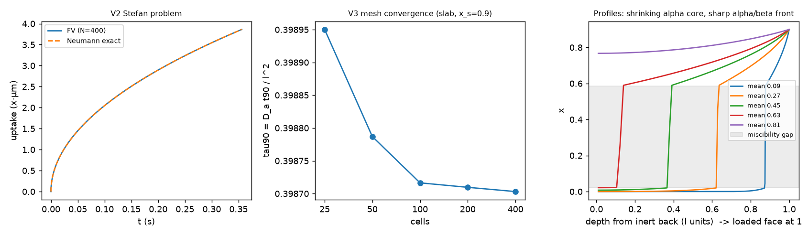

## 5. Results

### 5.1 Loading time vs dimension (Q1)

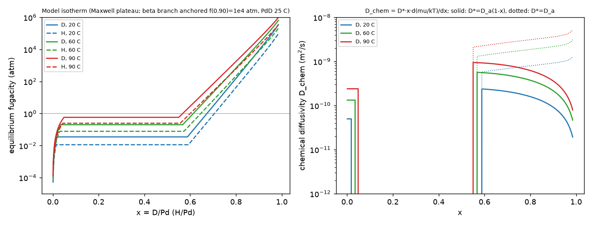

The dimensionless times τ₉₀ = D_α t₉₀/l² for a surface held at x_s from x = 0 are listed below for PdD at 25 °C. Because D_chem in β exceeds D_α, loading through the gap is *faster* than constant-D diffusion (0.40 vs 0.85 for a slab). The α core shrinks behind a sharp front (right panel above).

| x_s | slab | wire | sphere |
|---|---|---|---|
| 0.70 | 0.584 | 0.247 | 0.137 |
| 0.90 | 0.399 | 0.171 | 0.096 |
| 0.95 | 0.432 | 0.183 | 0.104 |

**Table 5.1 — t₉₀ for PdD at 25 °C, x_s = 0.90.** l is the film thickness (one face loaded, inert substrate), the foil half-thickness (both faces), or the radius. The charge-limited column assumes an absorbed current η·i = 10 mA cm⁻².

| l | film / foil | wire | particle | charge-limited (film / wire / particle) |
|---|---|---|---|---|
| 5 nm | 0.17 µs | 0.07 µs | 0.04 µs | 0.49 s / 0.25 s / 0.16 s |
| 100 nm | 70 µs | 30 µs | 17 µs | 9.8 s / 4.9 s / 3.3 s |
| 1 µm | 7.0 ms | 3.0 ms | 1.7 ms | 98 s / 49 s / 33 s |
| 5 µm | 0.17 s | 0.075 s | 0.042 s | 8.2 / 4.1 / 2.7 min |
| 25 µm | 4.4 s | 1.9 s | 1.1 s | 41 / 20 / 14 min |
| 50 µm | 17.5 s | 7.5 s | 4.2 s | 82 / 41 / 27 min |
| 100 µm | 70 s | 30 s | 17 s | 2.7 h / 82 / 55 min |
| 250 µm | 7.3 min | 3.1 min | 1.8 min | 6.8 / 3.4 / 2.3 h |
| 500 µm | 29 min | 12.5 min | 7.0 min | 13.6 / 6.8 / 4.5 h |
| 1 mm | 117 min | 50 min | 28 min | 27 / 14 / 9 h |

- Loading to x_s = 0.95 takes 1.07–1.08× as long as to 0.90.
- At 60 °C and 90 °C, t₉₀ falls to 0.45× and 0.26× of the 25 °C value. However, holding x_s = 0.9 then needs 2.4× and 4.7× the fugacity.
- H takes 1.54× longer than D at 25 °C (inverse isotope effect).

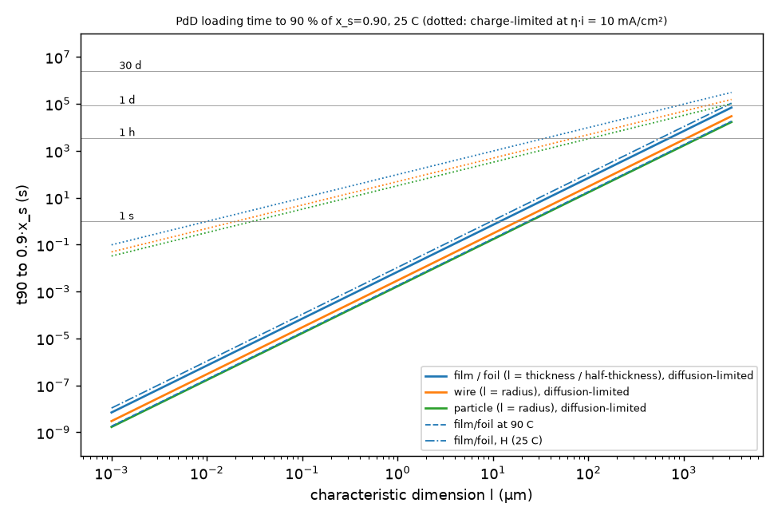

**Reading.**

- Above ~0.3 µm, the charge-limited time exceeds the diffusion time by 10²–10⁴. In a real electrolytic cell, loading time is set by the absorbed fraction of the current and by surface poisoning (M2). The days-to-weeks reported for 1–2 mm Pd rods are not diffusion-limited.
- For nanoparticles below ~10 nm, the bulk isotherm used here is invalid. The gap narrows and closes and the plateau slopes (https://www.nature.com/articles/nmat4480 [web title]), so the "moving phase boundary" does not exist there. Particles load in microseconds and are limited by surface kinetics and heat.

### 5.2 Detector-facing membrane (Q2)

**Flux budget (exact).** For the whole membrane to stay at x ≥ 0.90, J ≤ [Φ(x_in) − Φ(0.90)]/L. The table gives J_max in D m⁻² s⁻¹, with the mA cm⁻² equivalent in brackets (PdD, 25 °C).

| x_in | 5 µm | 10 µm | 25 µm | 50 µm | 100 µm | 200 µm |
|---|---|---|---|---|---|---|
| ≤ 0.90 | 0 | 0 | 0 | 0 | 0 | 0 |
| 0.95 | 5.5e22 (880) | 2.7e22 (440) | 1.1e22 (176) | 5.5e21 (88) | 2.7e21 (44) | 1.4e21 (22) |
| 0.97 | 6.8e22 (1086) | 3.4e22 (543) | 1.4e22 (217) | 6.8e21 (109) | 3.4e21 (54) | 1.7e21 (27) |

For reference, the Iwamura flux (2 sccm through 6.25 cm²) is 2.9×10²¹ D m⁻² s⁻¹ = 46 mA cm⁻².

**Design chart.** Fill shows exit loading, white contours show flux, and red outlines the region where x_exit ≥ 0.90 and J ≥ 10²¹ D m⁻² s⁻¹ (16 mA cm⁻²). Dotted cyan lines mark the equivalent k_r of 2 nm and 20 nm Ni overlayers.

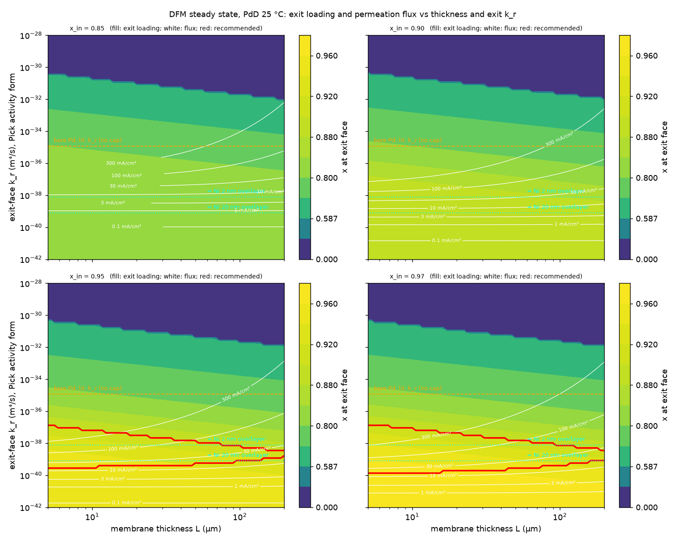

- With x_in = 0.85 or 0.90, no (L, k_r) point meets the target.
- With x_in = 0.95: k_r ∈ [3.3×10⁻⁴⁰, 1.1×10⁻³⁷] m⁴ s⁻¹ for every L ≤ 200 µm. The upper edge falls with L.
- With x_in = 0.97: k_r ∈ [1.6×10⁻⁴⁰, 1.1×10⁻³⁷].
- **Required value:** k_r* = J/c_eff(0.90)² = 2.3×10⁻³⁹ m⁴ s⁻¹ per 10²¹ D m⁻² s⁻¹, scaling linearly with J. This is 2×10⁻⁴ of the real-surface Pd value and 10⁻¹¹ of the ideal clean-surface (Baskes) value.

**What does a bare Pd exit face actually do?** Iwamura passed 2.9×10²¹ D m⁻² s⁻¹ through a bare Pd vacuum face at 70 °C. That is 0.14 of the diffusion capacity in the model (x_in = 0.598 at 1 atm, 70 °C). A saturated-surface cap 2νN_s e^(−E_d/kT) must therefore have E_d ≤ 0.75 eV, which extrapolates to J_sat(25 °C) ≥ 6.2×10¹⁹ D m⁻² s⁻¹ (1 mA cm⁻²). This is only a lower bound. If the cap sits at that bound, bare Pd already keeps the exit at 0.95 but with only ~1 mA cm⁻² of flux. If it is 100× higher, the exit face drops to 0.86–0.92 depending on L. The Pick law without a cap drains the exit to 0.76–0.79. **The literature cannot decide between these outcomes. It has to be measured.**

**Table 5.4 — exit-face finishes, x_in = 0.95, 25 °C (steady state).** Each cell gives x_exit / J in mA cm⁻².

| Finish | L = 25 µm | 50 µm | 100 µm | Verdict |
|---|---|---|---|---|
| Bare Pd, lit. k_r, no cap | 0.787 / 907 | 0.772 / 514 | 0.757 / 289 | exit depleted (if no cap) |
| Bare Pd + cap at lower bound (E_d = 0.75 eV) | 0.950 / 0.99 | 0.949 / 0.99 | 0.948 / 0.99 | loaded, low flux |
| Bare Pd + cap ×100 | 0.918 / 99 | 0.895 / 99 | 0.858 / 99 | only L ≤ ~40 µm |
| PdO (k_r × 10⁻³) | 0.911 / 128 | 0.901 / 85 | 0.890 / 55 | good on paper, **but consumed**: 1–5 nm PdO is reduced by the permeating D in 0.2–100 s (10¹⁹–10²¹ D m⁻² s⁻¹, 10 % reacting) |
| Au 20 nm (continuous) | 0.950 / 2×10⁻⁴ | same | same | loaded, zero flux |
| Cu 20 nm | 0.950 / 2×10⁻⁴ | same | same | loaded, zero flux |
| Ni/Cu 5×(10+10 nm) | 0.950 / 9×10⁻⁵ | same | same | loaded, zero flux (Cu dominates) |
| Ni 2 nm | 0.922 / 86 | 0.910 / 67 | 0.895 / 50 | **meets target** at L ≤ 50 µm |
| Ni 20 nm | 0.945 / 13.7 | 0.941 / 12.5 | 0.934 / 11 | **meets target** (flux ~1e21) |
| Pd/CaO multilayer (Iwamura), treated as a barrier | at best = bare Pd + cap (0.918 / 99 at 25 µm) | 0.895 | 0.858 | no demonstrated barrier: Iwamura's own flux shows it passes ≥ 3×10²¹ at 1 atm, which at the exit fugacity (10⁴ atm) would be ≥ 3×10²³ |
| Patterned Au mask, open fraction φ | J ≈ φ J_bare | – | – | tunable. φ = 2×10⁻⁴ (no cap) or 0.16 (cap ×100) for 10²¹ D m⁻² s⁻¹ at x_exit 0.90 |

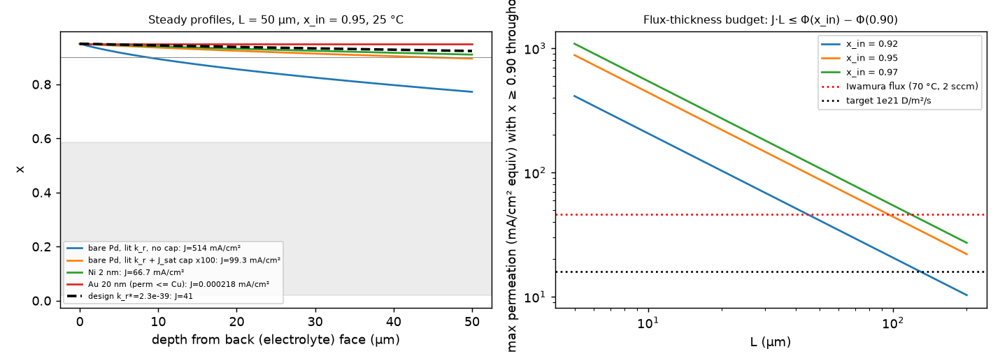

**Transients.** All use the design exit law k_r*, and L = 25 µm unless stated.

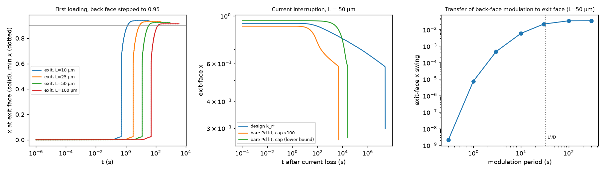

- **First loading** (x_in stepped to 0.95): the exit face turns β after 0.5 / 3.1 / 12 / 49 s, and the whole membrane is ≥ 0.90 after 1.3 / 8.6 / 34 / 143 s, for L = 10 / 25 / 50 / 100 µm.
- **Current interruption** (back face goes open circuit and blocks, exit keeps desorbing):
  - Design exit: x_exit < 0.90 after 44 s (25 µm) or 86 s (50 µm), but the exit reaches the two-phase region only after 1.0×10⁷ / 2.0×10⁷ s (~4–8 months). Loss of current is benign for phase stability.
  - Bare Pd with cap at the lower bound: α forms at the exit after 3.4 h (25 µm) or 6.8 h (50 µm).
  - Bare Pd with cap ×100: α after 35 min (25 µm) or 71 min (50 µm).
- **Modulation** (x_in square wave 0.90↔0.97, L = 50 µm, τ_D = L²/D_chem = 33 s): the peak-to-peak swing in exit loading is 0 / 0.0005 / 0.006 / 0.022 / 0.034 at periods of 1 / 3 / 10 / 30 / ≥100 s. The corresponding exit-flux swing is 0 / 0.5 / 6 / 24 / 38 mA cm⁻². A current modulation reaches the detector face only if its period is ≳ τ_D; for 25 µm, τ_D = 6 s.
- **Masked rim:** lateral loading under a mask proceeds at √(D_chem t) = 0.6 mm per hour, 3 mm per day and 8 mm per week. A 2-D axisymmetric diffusion solver was not needed: through-thickness (seconds) and lateral (hours to days) time scales separate by >10³.

### 5.3 Mechanics (Q3)

**Strain scale.**

- α→β misfit: 3.68 % linear. Full loading to 0.95: 6.2 % linear (Vegard, conservative).
- The biaxial elastic limit corresponds to a constrained composition difference of only **Δx = 0.003 (annealed), 0.012 (H-cycled) or 0.019 (cold-worked)**. Any constrained α/β coexistence is therefore plastic. First loading through the gap produces about 4–5 % plastic strain once, whatever the rate (Protocol A below). Afterwards, gradients within β in a *floating* membrane stay elastic: the steady-state self-equilibrated stress is 5.6 MPa.

**Pressure (1 atm, vacuum-backed, clamped immovable edge; FvK).**

| Unsupported disc | h = 10 µm | 25 µm | 50 µm | 100 µm |
|---|---|---|---|---|
| a = 10 mm: max σ_VM / centre deflection | 1809 MPa / 0.59 mm | 969 / 0.43 | 592 / 0.34 | 343 / 0.26 |
| a = 12.5 mm | 2102 / 0.80 | 1130 / 0.59 | 696 / 0.46 | 413 / 0.36 |

An unsupported membrane of any useful thickness fails (UTS of annealed Pd ≈ 170 MPa). The largest free-span hole radius b keeping σ_VM below 40 MPa is 0.20 / 0.50 / 1.00 / 1.99 mm for h = 10 / 25 / 50 / 100 µm; for 20 MPa, halve the span roughly. Because stress depends only on b/h, the scaling is b_max ≈ 20h.

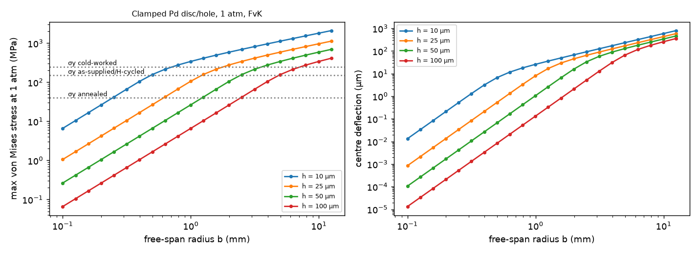

**Support grid on the vacuum side** (hexagonal round holes):

| Membrane | Hole d / web | Stress | Dimple | Open fraction | Transmission (hemisphere / ≤30° cone), grid t = 0.5 mm |
|---|---|---|---|---|---|
| 25 µm | 1.0 / 0.15 mm | 27 MPa | 0.5 µm | 0.69 | 0.16 / 0.53 |
| 50 µm | 1.5 / 0.20 mm | 15 MPa | 0.3 µm | 0.71 | 0.24 / 0.60 |

- **Grid plate spanning 25 mm:** Roark edge stress with ligament efficiency 0.12 is ~400 MPa at t = 0.5 mm and ~100 MPa at 1 mm.
- **Recommendation:** a fine perforated sheet 0.3 mm thick, carried on ribs with ≤ 5 mm cells. For the sheet, σ ≈ 0.75·p(2.5 mm)²/(0.3 mm)²/0.13 ≈ 40 MPa, and it keeps t/d = 0.3 for better transmission.
- **Material:** Mo or 316L. Never Ti, Zr, Nb, Ta or V, which getter D.

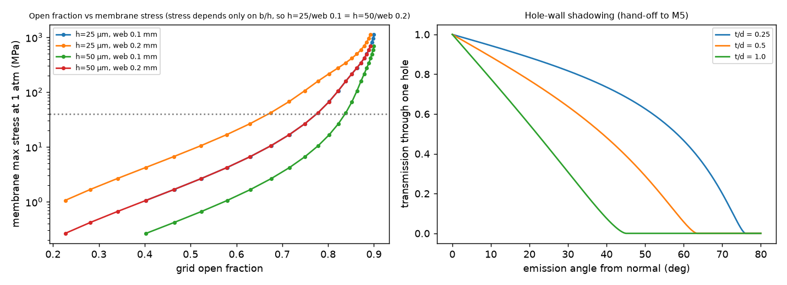

**Clamping.** A rigidly clamped disc buckles at a misfit of ε* = 1.223h²/((1+ν)a²):

- For a = 10 mm and h = 25 µm this is 5.5×10⁻⁶, i.e. Δx = 8×10⁻⁵.
- Full loading exceeds it by **~10⁴** and grows the radius by 0.62 mm.
- The membrane must therefore **float**: sealed by an elastomer ring on the electrolyte side, pressed onto the polished grid by the 1 atm load, and free to slide radially.
- Friction stress μpa/h = 12 MPa (25 µm, μ = 0.3) is below yield, so it slides.
- Welded, brazed or bolted rims are excluded.

**Supported films** (Pd deposited on a rigid substrate, e.g. the C5 style):

- The elastic misfit stress (11.6 GPa at x = 0.9) is capped by flow at −1 to −3 GPa.
- The buckle-delamination critical thickness is h_c = 2EΓ_i/((1−ν²)σ²). For Γ_i = 2 J m⁻² it is 2.3 µm at 0.5 GPa, 0.57 µm at 1 GPa and 0.14 µm at 2 GPa.
- High-loading supported Pd films are therefore limited to ≲ 100–500 nm unless an adhesion layer gives Γ_i ≳ 10 J m⁻².
- A 1 µm film on 300 µm Si bends it to R ≈ 2.7 m (Stoney). This is a usable **in-situ loading monitor** (hand-off to M6/M5).

**Cracking of a deloaded α skin** (surface deloads first, putting the skin in tension on the β core). The critical skin depth is d_c = Γ_c E/(Zσ²):

| K_c (MPa m^½) | σ = 150 MPa | 300 MPa | 600 MPa |
|---|---|---|---|
| 1 | 19 µm | 4.8 µm | 1.2 µm |
| 3 | 170 µm | 43 µm | 11 µm |
| 10 | 1.9 mm | 480 µm | 120 µm |

With brittle-hydride toughness (1–3 MPa m^½), deloading skins of a few µm to tens of µm crack. With ductile Pd (≳ 10 MPa m^½), they do not in a 25 µm membrane: cracking then comes by fatigue (§5.4).

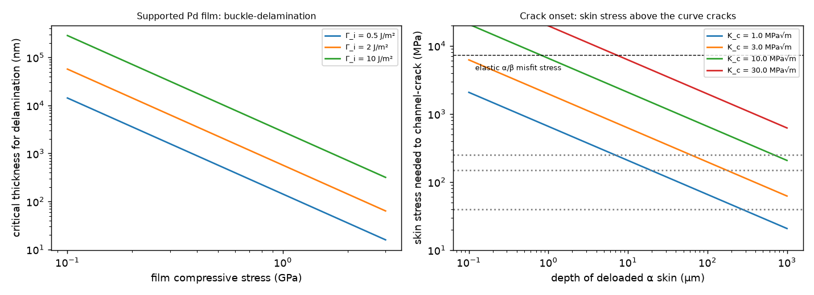

### 5.4 Protocols (Q4)

The back face is modelled as galvanostatic charging with 50 % absorption efficiency and a fugacity ceiling. **This x_c(i) map is a placeholder; replace it with M2's table.** Anodic stripping is 100 % efficient down to x = 0.01. The exit face uses the design law k_r*. L = 25 µm.

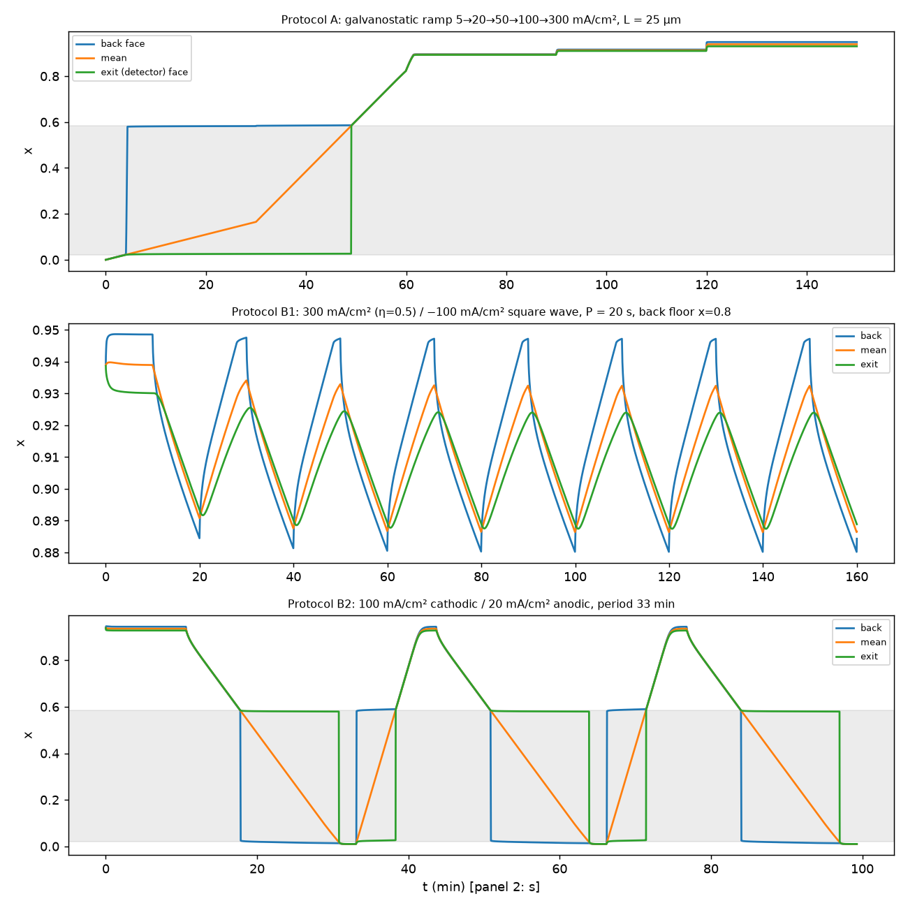

**Protocol A — high-loading steady state, crack-free.**

| Step | Current (cathodic) | Duration | Model result |
|---|---|---|---|
| 0 | anneal, see recommendation 5 | – | – |
| 1 | 5 mA cm⁻² | 60 min | single planar α→β transit, done at 49 min |
| 2 | 20 → 50 → 100 → 300 mA cm⁻² | 30 min each | mean x 0.82 → 0.89 → 0.91 → 0.94; exit 0.93 at 300 mA cm⁻² |
| 3 | hold ≥ keep-alive current | indefinite | steady gradient stress 5.6 MPa (elastic) |

- One-off plastic strain of the transit: 3.6–4.8 %. This is unavoidable and hardens the Pd to "H-cycled" temper.
- Never let any point fall below β_min + 0.05 ≈ 0.64 again. With the barrier exit, an outage leaves months of margin. With bare Pd it leaves 0.5–7 h, so a UPS or automatic keep-alive (≥ 20 mA cm⁻²) is needed.
- The loading history is logged by the back-face potential and, if fitted, the resistance of a co-loaded witness wire.

**Protocol B1 — β-phase flux/gradient pumping (non-equilibrium, no phase change).**

- Waveform: square wave of +300 mA cm⁻² (η = 0.5) and −100 mA cm⁻², with the back face floored at x = 0.80 or 0.70. Periods tested: 20, 60 and 240 s.
- Exit loading swings 0.887–0.924, 0.816–0.929 and 0.700–0.930 for those three cases.
- Plastic strain per cycle is ≤ 2×10⁻⁴ even for annealed Pd, and 0 for hardened Pd.
- **B1 produces flux and loading transients at the detector face but no new cracks, dislocations or vacancies.** It is the right "non-equilibrium drive" if the lead wants flux without damage.

**Protocol B2 — deliberate α/β cycling.**

- Waveform: +100 mA cm⁻² (η = 0.5) for 637 s, then −20 mA cm⁻² for 1348 s. Period 33 min.
- Loading swings 0.94 ↔ 0.01 across the whole thickness. The α/β front sweeps every point twice per cycle.
- Plastic strain range per cycle: max 0.070–0.072, thickness mean 0.049–0.051.

Damage estimates for B2:

- **Crack initiation** (Coffin–Manson): N_i = 3 / 18 / 131 cycles for ε_f′ = 0.1 / 0.3 / 1.0.
- **Growth to a through-thickness crack** from a 1 µm crack (Tomkins, B = 1–5): 9–45 more cycles at 25 µm, 6–32 at 10 µm, 11–55 at 50 µm. The membrane perforates after **~12 (pessimistic) to ~180 (optimistic) cycles**.
- **New crack-face area per cycle** = 4/S · BΔε_p a, per unit membrane area: 0.011–0.14 cm² cm⁻² per cycle for crack depths of 1–5 µm and spacing S = 20–50 µm (grain size). It rises to 0.2–0.6 as cracks deepen to 20 µm. Cumulative crack face: 0.2–1 cm² per cm² when cracks are 1–5 µm deep (S = 20 µm).
- **Deformation vacancies:** 10⁻⁵ to 9×10⁻⁴ per unit strain, i.e. 7×10⁻⁷ to 6.5×10⁻⁵ per cycle (H-cycled). After 30 cycles: 2×10⁻⁵ to 2×10⁻³, if the membrane survived that long.

At 25 °C, vacancies are immobile: 11 jumps per day (E_m = 1.0 eV), or 0.9 nm diffusion per day. They accumulate where they are made and cannot anneal out, but also cannot arrive from surfaces.

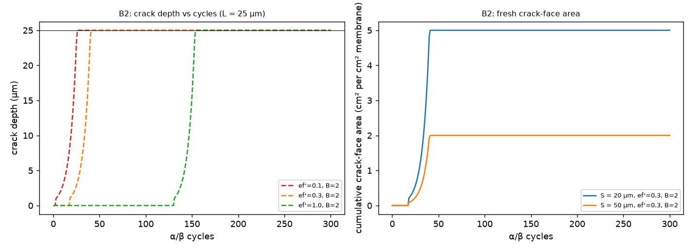

**Superabundant vacancies (Fukai).**

- **Conditions:** ~5 GPa H₂ at 700–800 °C gives the Pd₃VacH₄ phase (25 % vacancies) (Fukai & Ōkuma 1994).
- **Equilibrium at room temperature:** thermodynamics with 6 D bound at 0.23 eV each gives E_f ≈ 0.12 eV and c_v,eq(25 °C) ~ 10⁻², so RT equilibrium would favour SAV. **Kinetics forbid it:** vacancies move < 1 nm per day at 25 °C and ~30 nm per day at 90 °C.
- **RT electrolysis** of an existing solid cannot create bulk SAV. It only gets the deformation vacancies above, which B2 creates at ≤ 10⁻⁴ per cycle.
- **RT electrodeposition** (co-deposition, C2) builds the lattice atom by atom and does trap vacancy–H clusters (Fukai 2011, electrodeposition paper cited in §3). The quantitative concentrations in that paper could not be retrieved this session.
- **If the lead wants SAV-rich material facing the detector**, the route is a co-deposited Pd–D layer on the exit face made before assembly, not in-situ cycling. Evidence grade: low.

### 5.5 Temperature and isotope (Q5)

| iso | T (°C) | α_max | β_min | p_plateau (bar) | x(1 bar) | f(x=0.90) atm | f(0.95) atm | D_α (m² s⁻¹) | D_chem(0.9) |
|---|---|---|---|---|---|---|---|---|---|
| D | 20 | 0.019 | 0.588 | 0.035 | 0.673 | 8.7e3 | 7.0e4 | 5.0e-11 | 9.2e-11 |
| D | 40 | 0.027 | 0.578 | 0.089 | 0.643 | 1.5e4 | 1.1e5 | 8.4e-11 | 1.5e-10 |
| D | 60 | 0.035 | 0.567 | 0.20 | 0.613 | 2.4e4 | 1.5e5 | 1.3e-10 | 2.2e-10 |
| D | 90 | 0.049 | 0.550 | 0.58 | 0.567 | 4.7e4 | 2.6e5 | 2.4e-10 | 3.6e-10 |
| H | 20 | 0.015 | 0.592 | 0.012 | 0.705 | 2.4e3 | 1.9e4 | 3.2e-11 | 5.9e-11 |
| H | 40 | 0.023 | 0.583 | 0.032 | 0.676 | 4.4e3 | 3.1e4 | 5.8e-11 | 1.0e-10 |
| H | 60 | 0.031 | 0.573 | 0.078 | 0.646 | 7.7e3 | 4.9e4 | 9.6e-11 | 1.6e-10 |
| H | 90 | 0.044 | 0.556 | 0.25 | 0.600 | 1.6e4 | 9.1e4 | 1.9e-10 | 2.8e-10 |

- **Isotope at 25 °C:**
  - D diffuses 1.52× faster than H.
  - The D plateau is 3.0× higher.
  - x = 0.90 needs 3.6× more fugacity for D (10⁴ vs 2.8×10³ atm).
  - At equal fugacity, x_H exceeds x_D by 0.03 (e.g. 0.931 vs 0.900 at 10⁴ atm).
  - The DFM flux budget for H is 0.66× that of D (7.2×10²¹ vs 1.1×10²² at 25 µm), and k_r* for H is 1.7× larger.
- **Temperature, 20 → 60 °C:**
  - Diffusion rises 2.6×, and the flux budget rises 2.4×.
  - But x = 0.9 needs 2.8× more fugacity.
  - The exit desorption cap rises ~35× (E_d = 0.75 eV) and the Pick k_r ~10×.
  - Net effect: warmer operation makes the exit face harder to keep loaded. **Operate the DFM at 20–25 °C.** The ratio k_r*/k_r(lit) falls from 3×10⁻⁴ at 20 °C to 1.8×10⁻⁵ at 60 °C.

## 6. Design recommendations for the lead

1. **DFM thickness: 25 ± 5 µm Pd.**
   - It is inside the charged-product escape depth (M5 to confirm for p, T and ³He).
   - Flux budget 1.1×10²² D m⁻² s⁻¹ at x_in = 0.95.
   - Fully loaded in < 10 s after the first transit; response time τ_D = 6 s.
   - Grid free span b ≤ 0.5 mm.
   - Thinner (10 µm) forces 0.4 mm holes, a worse open fraction and handling risk. Thicker (≥ 50 µm) halves the flux budget per the J·L rule and doubles τ_D.
2. **The back-face loading must exceed the target by ≥ 0.05.** To hold x ≥ 0.90 everywhere with ≥ 10²¹ D m⁻² s⁻¹, you need x_in ≥ 0.95 (M2). With x_in ≤ 0.90, choose between "no flux" (Au/Cu barrier) and "exit below 0.90". There is no third option.
3. **Exit-face finish: decide by measurement, from a pre-qualified menu.** Target an effective k_r of 2×10⁻³⁹ m⁴ s⁻¹ (window 3×10⁻⁴⁰ – 1×10⁻³⁷).
   - Step 1 (week 1): measure J(i) and x (resistance) on a bare-Pd witness DFM at 25 °C into vacuum. Use an RGA at m/z 4; calibrate with a D₂ leak.
   - (a) If J_sat ≲ 10²¹ D m⁻² s⁻¹, bare Pd is already the barrier.
   - (b) If it is higher, apply 5–20 nm e-beam Ni. Model: 13 mA cm⁻² with x_exit 0.945 at 20 nm; 86 mA cm⁻² with x_exit 0.92 at 2 nm.
   - (c) Or apply a photolithographic Au mask (20 nm, fully blocking) with open fraction φ set to J_target/J_bare, and hole pitch ≤ 10 µm (≪ L) so the exit loading is uniform.
   - **Reject** PdO (reduced by permeating D in 0.2–100 s) and continuous Au/Cu/Ni-Cu (≤ 10⁻³ mA cm⁻²). Do not rely on Pd/CaO as a barrier.
   - Energy loss of 3 MeV protons in 20 nm Au or Ni is ~2 keV, negligible (M5 to confirm).
4. **Diameter and support.**
   - Active area Ø 20 mm (a = 10 mm), per M2's uniformity range.
   - Vacuum-side support is a two-level Mo (or 316L) grid:
     - fine sheet 0.3 mm thick with hexagonal holes Ø 1.0 mm and 0.15 mm webs (open fraction 0.69; membrane stress 27 MPa at 1 atm);
     - on ribs with ≤ 5 mm cells (~40 MPa in the sheet);
     - hole edges radiused ≥ 50 µm and polished (Ra ≤ 0.2 µm) so the membrane can slide.
   - If M5 allows a He or Ar backfill on the detector side, the pressure difference ΔP drops. Stress scales as ΔP^(2/3) in the membrane regime, so halving ΔP cuts stress by 37 % and allows ~1.7× larger holes.
5. **Clamping and metallurgy.**
   - Float the membrane: elastomer seal (FFKM or EPDM, LiOD-compatible) on the electrolyte side, with radial travel ≥ 1 mm (it grows 0.62 mm at the edge).
   - No rigid rim clamp.
   - Limit any masked or collared annulus (M2's PTFE collar) to ≤ 1 mm of radial overlap. Under a mask, the α/β boundary is pinned for hours (lateral loading 0.6 mm/h, 3 mm/day) and is the most likely crack site.
   - Anneal 25 µm foil in vacuum at 800–850 °C for 1 h: σ_y ≈ 40 MPa, maximum ductility (larger ε_f′ in Coffin–Manson), grain size ~20–50 µm (1–2 grains through the thickness). The first α→β transit then hardens it to ~150 MPa.
   - Do not start from cold-worked foil. The annealed temper has the longest fatigue life, and the difference in yield is erased by hydrogen cycling.
6. **Protocol A (steady state, for the primary H1 run).**
   - One α→β transit at 5 mA cm⁻² (≈ 50 min for 25 µm).
   - Ramp 20 → 50 → 100 → 300 mA cm⁻² in 30 min steps.
   - Hold with a keep-alive of ≥ 20 mA cm⁻² on a UPS.
   - Never let the cell go anodic or open-circuit for longer than the margin from §5.2: months with a barrier exit, 0.5–7 h with bare Pd.
   - Operate at 22 ± 1 °C. A 1 K change moves the fugacity needed for x = 0.9 by ~3 %.
7. **Protocol B (non-equilibrium; run after an A baseline, never before).**
   - **B1, default:** square wave +300 / −100 mA cm⁻², period 20–240 s (≥ 3τ_D), with the back face floored at x ≥ 0.70. It modulates exit loading by 0.04–0.23 and flux by tens of mA cm⁻², with no mechanical damage.
   - **B2, optional and destructive:** +100 / −20 mA cm⁻², period 33 min, **at most 10 cycles per membrane**.
     - Leak interlock: a detector-chamber pressure rise ≥ ×2 or RGA m/z 20 (D₂O) shuts HV and isolates.
     - Expected yield: 0.2–1 cm² of fresh crack face per cm² and ~10⁻⁵–10⁻³ deformation vacancies.
     - Better: run B2 only on a sacrificial second DFM so the primary detector chamber is never exposed to electrolyte.
8. **H₂O control.** Match loading, not current. For x = 0.95 the control needs ~0.28× the fugacity, which means a lower overpotential/current (M2). Verify with isotope-specific resistance-ratio calibration at both faces. The H-control flux budget is 0.66× that of D, so match J by setting the control's x_in 0.01–0.02 higher, or accept the known ratio. Use an identical exit finish and temperature.
9. **Supported-film variants (C5/C6 style):** keep Pd films ≤ 100–500 nm, or use an adhesion layer with Γ_i ≳ 10 J m⁻², else they delaminate on loading. Stoney curvature is a cheap in-situ loading monitor.

## 7. Sensitivities and uncertainties

| Input varied | J_max, 25 µm (mA cm⁻²) | k_r* (m⁴ s⁻¹) | τ₉₀ slab | Flips a recommendation? |
|---|---|---|---|---|
| Baseline | 176 | 2.3e-39 | 0.399 | – |
| β anchor f(0.90) = 10³ atm | 145 | 2.3e-38 | 0.490 | no (k_r* ×10; the finish menu covers it) |
| β anchor f(0.90) = 10⁵ atm | 207 | 2.3e-40 | 0.336 | no |
| No site blocking, D* = D_α | 2360 | 2.3e-39 | 0.090 | thickness could go to ~100 µm; loading times ÷4 |
| T = 20 / 40 / 60 °C | 156 / 247 / 368 | 2.5 / 1.8 / 1.5e-39 | ~0.40 | no; the exit cap rises faster than the budget |
| H control, 25 °C | 116 | 3.9e-39 | 0.404 | no |

- **Decisive, flips recommendation 3: the exit-face law.** The model cannot tell whether the bare-Pd exit is Pick-like (drains the exit) or saturation-capped (keeps it loaded), because Iwamura provides only a lower bound on the cap. Hence the witness measurement.
- **Crack toughness of β-PdD** (K_c 1–30 MPa m^½) changes the deloading-skin cracking depth by 10³. Fatigue parameters (ε_f′, B) change the B2 perforation life from ~12 to ~180 cycles. The ≤ 10-cycle cap is set from the pessimistic end.
- **Linear Vegard** over-predicts high-x strain by ~20 %. This is conservative, and every mechanical conclusion survives a 2× change.
- **1-D mechanics** ignores grain-scale α/β coexistence and hydride-induced shape change (the "Goltsov" ratchet). Real damage per B2 cycle is likely higher, not lower.
- **Overlayer permeabilities** are extrapolated from ≥ 300 K data (Cu) or higher-T data (Ni). The Ni thickness for a given flux is uncertain by ×10, which is why recommendation 3 is measurement-driven. At the exit fugacity (10⁴ atm) a Ni overlayer may itself hydride (NiD forms above ~6 kbar), raising its permeability.
- **Isotherm hysteresis** (×2 in plateau pressure) shifts α/β boundaries slightly. It is irrelevant for x ≥ 0.9, where the model is anchored.

## 8. Open questions / hand-offs

- **M2:** supply x_in(i) for the back face. Is x_in ≥ 0.95 reachable at ≤ 300–500 mA cm⁻² on a 20 mm DFM, including the permeation current (up to 176 mA cm⁻² equivalent at the budget limit)? Also limit the PTFE collar overlap to ≤ 1 mm (§6.5), and add a keep-alive current and UPS to the cell design.
- **M5:** escape depths of p (3.02 MeV), T (1.01 MeV) and ³He (0.82 MeV) in PdD, and in 20 nm Au or Ni, to set the 25 µm choice and the barrier thickness. Grid shadowing: use T(q) and the open fractions from §5.3. Decide whether a gas backfill (pressure balance) is acceptable. Add a leak interlock for B2.
- **M1:** which site class matters: static β-phase sites (Protocol A/B1), fresh crack faces (B2: 0.01–0.6 cm² cm⁻² per cycle), or deformation vacancies (≤ 10⁻⁴ per cycle)? This decides whether B2's destructive cost is worth paying.
- **M6:** a patterned Au mask or Ni overlayer changes the exit-face micro-geometry. Stoney curvature can serve as a loading diagnostic for film variants.
- **Lead / experiment:** commission the witness-membrane exit-law measurement first. It is the single cheapest measurement that removes the largest uncertainty in the DFM design.
- **Not modelled:** surface poisoning on the back face (M2); nanoparticle size-dependent isotherms; 2-D grain-scale fracture; hydride shape-change ratchet; SAV concentrations in co-deposits (reference found, numbers not retrieved).
