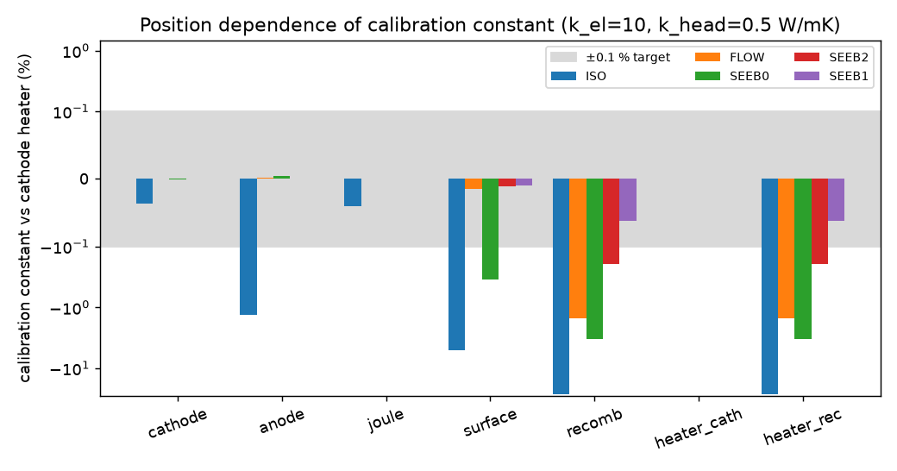
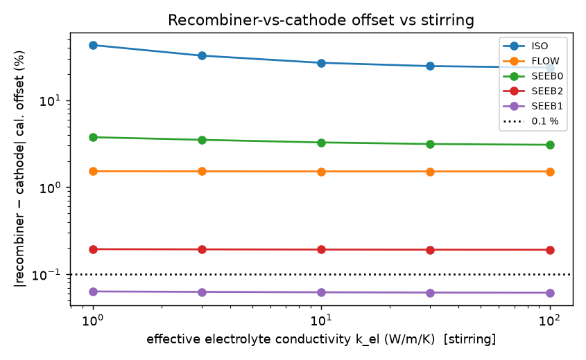
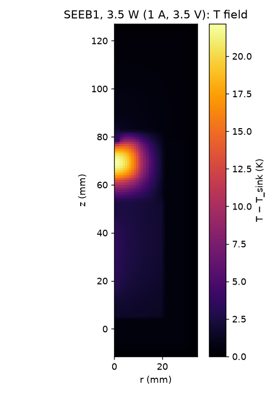
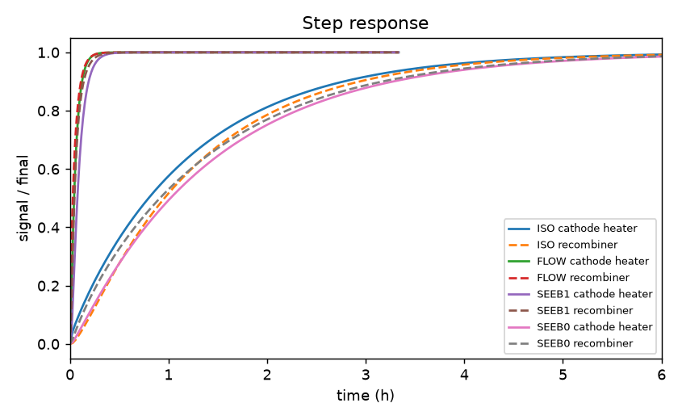
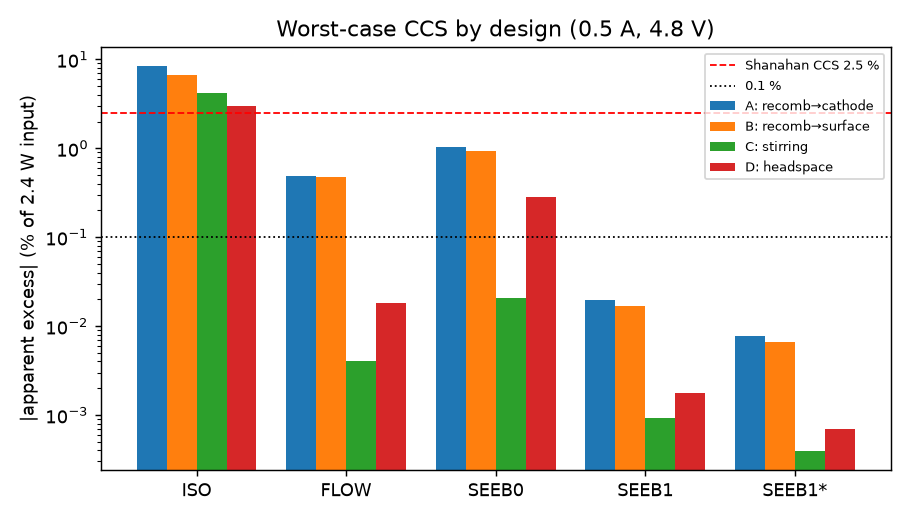
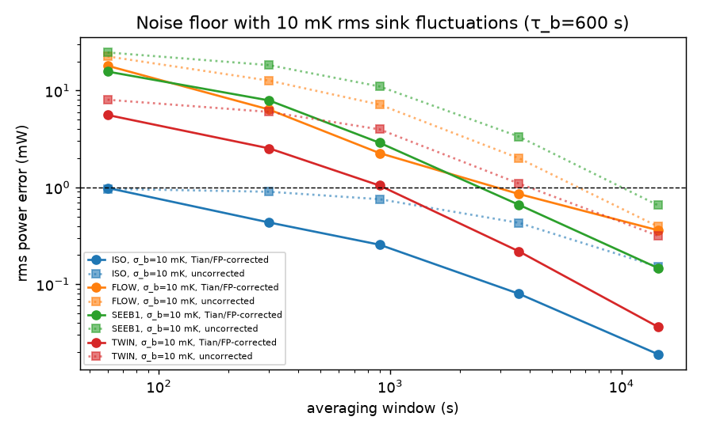
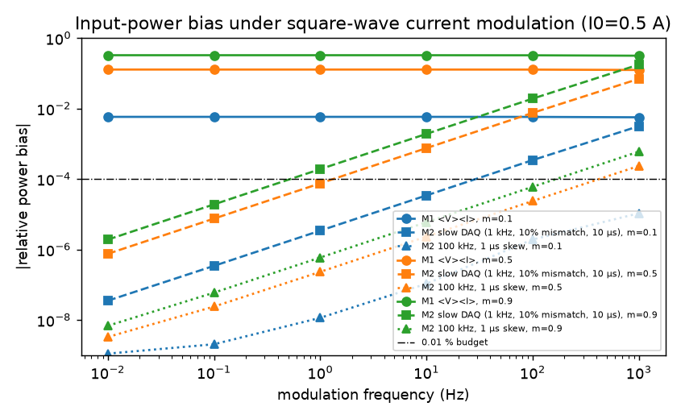
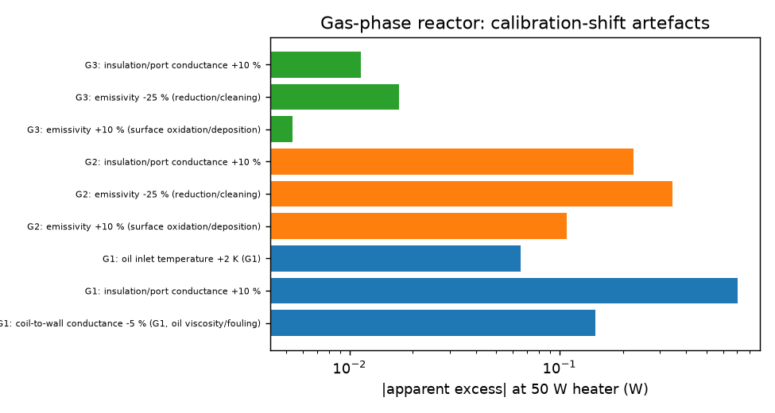
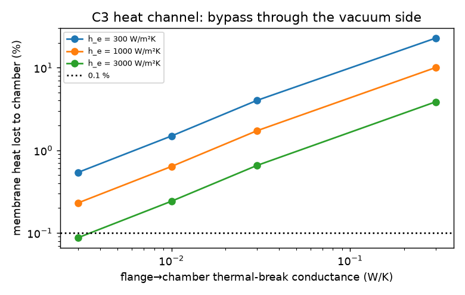
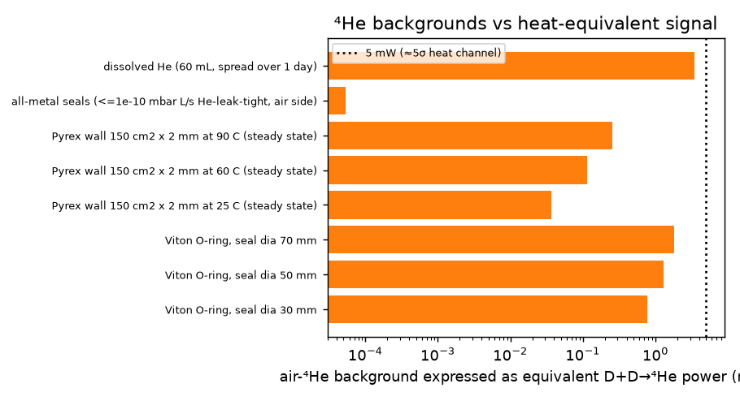

# M4 — Calorimetry and thermal design

Code: `sim/m4_*.py` (`python3 sim/m4_run_all.py` regenerates every number and figure in about 2 minutes). Raw outputs: `docs/models/figs/m4_*.txt`.

## Summary for lead

**Recommendation:** a Seebeck (heat-flow) envelope with a ≥10 mm isothermal Cu shell, built as a D₂O/H₂O **twin** in one bath, around an **all-metal sealed 316L cell** with internal recombiner. It is the only modelled design whose calibration constant is position-independent to <0.1 %: recombiner heat reads **0.025 %** low vs cathode heat. Mass-flow: 1.5 %. Storms-type Seebeck without spreader: 3.3 %. F&P isoperibolic: 27 %.

**Recommended design (SEEB1\*):**
- 0.10 V/W; t₆₃ = 6 min, t₉₉.₉ = 31 min.
- σ_P = 0.66 mW single, 0.22 mW twin (1 h, 10 mK rms bath).
- Systematic 0.056 % of input (0.05 % is an assumed unmodelled-effects allowance): 1.3 mW at 2.4 W, 5.4 mW at 9.6 W. 5σ ≈ 7–27 mW.

**Shanahan CCS:** needs ±2.5 %. In SEEB1\*, relocating all recombination heat shifts results by ≤0.025 % of the heat moved (≤0.5 mW). Isoperibolic allows 37 %, so it is unsuitable for closed cells.

**Bigger traps than calorimeter choice:**
- ⟨V⟩⟨I⟩ averaging under modulation underestimates input by 0.6–33 % (false excess). Sample V and I simultaneously at ≥100 kS/s, ≤1 µs skew.
- Loading/deloading stores 200–830 J per cathode.
- C3 permeation removes 4.6 mW per 10⁻⁸ mol D cm⁻² s⁻¹.
- ⁴He: one Viton O-ring ≈ 1.3 mW-equivalent in-leak; air-saturated electrolyte ≈ 300 J-equivalent; glass 0.04–0.25 mW-equivalent. Metal seals and degassing are mandatory.

**Gas-phase (C4/C5):** oil-flow ±1.4 %, water-jacket ±0.9 %, anchored ports + inert twin ±0.1–0.2 %.

**C3 heat channel:** feasible with a ≤0.01 W/K ceramic thermal break at the membrane flange; 5σ ≈ 4–20 mW (0.3–1.2 W/cm³ Pd).

---

## 1. Questions answered

1. Which calorimeter gives the best σ_P and systematic accuracy for a closed 30–100 mL cell with an internal recombiner at 0.5–10 W? (§5.1–5.5, §6)
2. How much does the calibration constant depend on where the heat is released (cathode, anode, electrolyte Joule heating, surface, recombiner)? Which geometry brings this below 0.1 %? (§5.1, §5.2)
3. How large is Shanahan's calibration-constant shift (CCS) for each design, and which design features bound it? (§5.3)
4. What accuracy is realistic for gas-phase reactors at 200–300 °C with 10–100 W? (§5.8)
5. Can a heat channel be added to the DFM cell (C3) without compromising its detectors? (§5.9)

Also covered: electrical power measurement under current modulation (§5.6), recombination/loading/permeation energy bookkeeping (§5.7), the ⁴He co-measurement (§5.10), and the calibration protocol (§6.3).

## 2. Model and equations

### 2.1 Axisymmetric finite-volume conduction model (`m4_thermal2d.py`)

The model solves steady and transient conduction on a non-uniform (r, z) grid:

  ρc ∂T/∂t = (1/r) ∂/∂r (r k_r ∂T/∂r) + ∂/∂z (k_z ∂T/∂z) + q   [W m⁻³]

- **Radial faces** use the exact cylindrical-shell resistance, ln(r₂/r₁)/(2πkΔz).
- **Axial faces** use harmonic series resistances.
- **Sinks** (bath, coolant, heat-sink block) are held at T = 0, and all temperatures are relative to the sink.
- **Parasitic paths** (leads, gas lines, the Dewar neck) are linear conductances from a chosen set of cells to T = 0.
- **Time stepping** is implicit Euler.

**Effective transport.**
- Electrolyte: convection from gas bubbles is represented by an effective conductivity k_el, baseline 10 W m⁻¹ K⁻¹ (Nu ≈ 17), swept 1–100.
- Headspace: gas conduction, natural convection and evaporation/condensation (vapour from the recombiner condensing on the walls) are lumped into k_head, baseline 0.5, swept 0.1–10 W m⁻¹ K⁻¹.

**Reference cell (C1, and the electrolyte side of C3):**

| part | specification |
|---|---|
| Electrolyte | radius 20 mm, depth 48 mm (60.3 mL) |
| Liner | PTFE, 1.0 mm |
| Wall | 316L, 2.0 mm |
| Bottom | 316L, 4 mm |
| Headspace | 30 mm |
| Lid | 316L, 13 mm |
| Cathode | Pd, 1 mm diameter × 30 mm, on axis |
| Anode | Pt helix at r = 14 mm |
| Recombiner | catalyst basket, 20 mm diameter × 15 mm, on a 4 mm 316L rod from the lid |

**Heat sources (each normalised to 1 W):**
- cathode (Pd volume)
- anode (Pt ring)
- electrolyte Joule heating (∝ 1/r² between the electrodes, because J ∝ 1/r)
- electrolyte surface (top 2 mm)
- recombiner (catalyst volume)
- a sheathed calibration heater 3 mm off-axis alongside the cathode
- a heater inside the recombiner basket

**Designs** (sink = bath / coolant / Cu heat-sink box):

| ID | Description | Read-out |
|---|---|---|
| ISO | Cell in a 10 mm blackened vacuum gap, h_rad = 5 W m⁻² K⁻¹. Lid to bath via neck + leads, 0.042 W/K | Thermistor in electrolyte (r = 10 mm, mid-depth) |
| FLOW | Cell sleeve on a water-cooled Cu jacket (sides and bottom) through a 0.5 mm gap pad. Lid insulated with 30 mm foam; leads 0.012 W/K to ambient | Captured fraction = heat into the coolant |
| SEEB0 | Storms-type: cell in air (12 mm) inside a box whose walls are thermoelectric modules | Thermopile voltage |
| SEEB1 | Cell clamped by a 0.5 mm gap pad (3 W/mK) into a 6 mm Cu shell. Bi₂Te₃ module layer (4 mm) covers sides/bottom at f = 0.85 and top at f = 0.60. Cu sink outside. All leads anchored to the shell (0.012 W/K) | Thermopile voltage |
| SEEB1\* | As SEEB1 but 10 mm Cu shell and f = 0.85 on all faces (**recommended**) | Thermopile voltage |
| SEEB2 | As SEEB1 but leads run from the lid straight through the wall (not anchored) | Thermopile voltage |

**Thermopile representation.** The thermopile layer is anisotropic: k_⊥ = f·k_mod + (1 − f)·k_foam and k_∥ = 0.05 W m⁻¹ K⁻¹, where k_mod = K_m t/A_m = 1.25 W m⁻¹ K⁻¹. The output is

  V = (α/A_m) ∫ f ΔT_across dA = (α/A_m) Σ f q t/k_⊥

**Calibration constant.**
- ISO: K/W at the probe.
- FLOW: captured fraction.
- SEEB: V/W.

Position dependence is δ_i = k_i/k_heater,cath − 1.

### 2.2 Energy bookkeeping (`m4_chem_he.py`)

**Thermoneutral potentials:** E_tn = ΔH_f/(2F), giving E_tn(D₂O) = 1.5267 V and E_tn(H₂O) = 1.4812 V.

**Closed cell with full recombination:** P_heat = V·I. E_tn does not enter.

**Recombination heat:** P_rec = E_tn·I, released at the recombiner.

**Open cell:** P_heat = (V − E_tn)·I.
- Unaccounted recombination of a fraction φ adds φ·E_tn·I.
- Vapour carried off by the vent gas removes 0.75(I/F)·p_v/(p − p_v)·ΔH_vap.

**Recombination inefficiency (1 − η) in a closed cell:**
- heat deficit (1 − η)·E_tn·I
- pressure rise dp/dt = (1 − η)·0.75(I/F)·RT/V_h

**Loading.** Per D stored in Pd with its O₂ partner left unrecombined:

  ΔH = ΔH_f(D₂O)/2 + ΔH_abs(D) = 147.3 − 17.3 = 130.0 kJ/mol D

This equals 1.347 V per electron of loading current. The same energy is released on deloading.

**Permeation to vacuum (C3).** Each D that leaves as D₂ removes ΔH_f(D₂O)/2, i.e. E_tn per electron.

### 2.3 Input-power measurement (`m4_power_meas.py`)

**Cell model:** galvanostat (5 µs rise) driving a Randles cell with a nonlinear Tafel branch:

  V = E₀ + η + I·R_s,  C_dl dη/dt = I − 2i₀ sinh(η/b)

Parameters: R_s = 5 Ω, b = 52 mV (120 mV/decade), i₀ = 1 mA, C_dl = 1 mF. The current is square-wave modulated, I = I₀(1 ± m), at 0.01–1000 Hz.

**Methods compared:**
- M1: product of separately averaged ⟨V⟩⟨I⟩.
- M2: simultaneous sampling through first-order anti-alias filters with bandwidth mismatch and inter-channel skew.
- M3: level-gated averaging.

The time grid is geometric, clustered on both sides of each edge.

### 2.4 Noise model (`m4_noise.py`)

The 2D model is reduced to two nodes: node 1 is the electrolyte and internals, node 2 is the wall, shell or jacket metal. C₁, C₂, G₁₂ and K are extracted from the 2D steady solution.

- **Sink temperature:** an Ornstein–Uhlenbeck process (σ_b, τ_b = 600 s).
- **Run:** 72 h at 1 s sampling with constant P = 5 W.
- **Estimators:** the F&P lumped equation for ISO; flow enthalpy with a transit-time-aligned inlet for FLOW; thermopile flux plus Tian correction (C·dT_shell/dt) for SEEB.
- **Sensor noise:**
  - thermistors: 0.1 mK rms per 1 s reading
  - matched PRT pair: 1 mK rms
  - flow fluctuation: 0.1 % rms
  - thermopile voltmeter: 50 nV rms
- **Twin:** two SEEB1 units with 2 % mismatch in C and K, sink correlation ρ = 0.95.

### 2.5 CCS and budget (`m4_budget.py`)

**Estimator (pre-registered)**, using both calibration heaters:

  P̂ = [S − (k_rec − k_cath)·E_tn·I]/k_cath

**Heat split for the non-recombiner heat (V − E_tn)·I:** 20 % cathode, 20 % anode, 60 % Joule. This split matters only for ISO; in SEEB1 and FLOW these three constants agree within 0.004 %.

**CCS scenarios** (calibration held fixed while the physics changes):

| scenario | change |
|---|---|
| A | all recombination moves to the cathode |
| B | all recombination moves to the electrolyte surface |
| C | k_el changes from 10 to 3 |
| D | k_head changes from 0.5 to 2 |

### 2.6 Gas-phase network (`m4_gasphase.py`) and DFM network (`m4_dfm.py`)

Both are lumped steady-state conductance networks; the equations are in the module docstrings.

**Gas-phase:**
- radiation εσA(T_w⁴ − T_j⁴)
- residual gas conduction in the jacket vacuum
- uncaptured port/support conductance G_loss, either from T_w or anchored at T_j
- G1 only: an oil coil and insulation

**DFM:**
- membrane → electrolyte: h_e·A
- membrane → rim: lateral conduction 8πkt (uniformly heated disc)
- membrane → detectors: radiation
- flange → cell
- flange → vacuum chamber through the thermal break G_fv

## 3. Parameters

| Parameter | Value | Units | Source | Uncertainty |
|---|---|---|---|---|
| ΔH_f D₂O(l) | −294.60 | kJ/mol | NIST WebBook https://webbook.nist.gov/cgi/cbook.cgi?ID=C7789200 ; Miles, JCMNS 33 (2020) 74 https://jcmns.org/article/72550.pdf (E_H = 1.5267 V) | ±0.05 |
| ΔH_f H₂O(l) | −285.83 | kJ/mol | NIST WebBook https://webbook.nist.gov/cgi/cbook.cgi?ID=C7732185 | ±0.04 |
| E_tn D₂O / H₂O | 1.5267 / 1.4812 | V | derived: ΔH_f/2F | ±0.3 mV |
| ΔH_abs, β-PdD plateau | −34.6 kJ/mol D₂ (−17.3 kJ/mol D) | | Flanagan et al., calorimetric enthalpies, https://www.sciencedirect.com/science/article/abs/pii/0022508891904313 | ±1 kJ/mol D₂ |
| D₂O k, ρc_p | 0.595; 1104 × 4210 | W/mK; J/m³K | https://www.engineeringtoolbox.com/heavy-water-thermodynamic-properties-d_2003.html | ±3 % |
| ΔH_vap D₂O | 45.4 | kJ/mol | same | ±2 % |
| 316L, Cu, Al6061, Pd, Pt k | 16.3, 398, 167, 71.8, 71.6 | W/mK | https://www.engineeringtoolbox.com/thermal-conductivity-metals-d_858.html | ±5 % |
| PTFE / foam / air k | 0.25 / 0.030 / 0.026 | W/mK | handbook | ±10–20 % |
| Gap pad k | 3 (swept to 1) | W/mK | vendor datasheet class (not re-fetched) | ±30 % |
| k_el (bubble-stirred electrolyte) | 10 (swept 1–100) | W/mK | **assumption** (Nu ≈ 17); results given over the full sweep | factor 10 |
| k_head | 0.5 (swept 0.1–10) | W/mK | **assumption**: D₂ k = 0.14 plus convection/condensation | factor 10 |
| h_rad (blackened vacuum gap) | 5 | W/m²K | 4σT³ε_eff with ε_eff ≈ 0.8 | ±20 % |
| TEC module α, K_m, R, size | 0.050 V/K, 0.50 W/K, 2 Ω, 40 × 40 × 4 mm | | typical 127-couple Bi₂Te₃ datasheet (TEC1-12706 class; not re-fetched); calibrated in situ | α ±10 %, K ±20 % |
| TEC sensitivity tempco | +0.2 | %/K | Bi₂Te₃ near 300 K (handbook; not re-fetched) | ±0.1 %/K |
| Pyrex He permeability, 25 °C | 1.2 × 10⁻¹¹ | cm³STP·mm/(s·cm²·cmHg) | Norton 1953, quoted in https://tf.nist.gov/general/pdf/2830.pdf ; E_a = 6.4 kcal/mol, https://pubs.aip.org/aip/jap/article/25/7/868/160802 | ±30 % |
| Viton He permeability | 15.1 × 10⁻¹⁵ | m² s⁻¹ hPa⁻¹ | Sturm et al., JGR 2004, https://agupubs.onlinelibrary.wiley.com/doi/full/10.1029/2003JD004073 | ±30 % |
| He in air | 5.24 | ppm(v) | standard atmosphere | ±0.5 % |
| He Henry constant, water, 25 °C | 3.7 × 10⁻⁴ | mol kg⁻¹ bar⁻¹ | Sander 2015 compilation (ACP 15, 4399) | ±10 % |
| Q per ⁴He (D+D→⁴He) | 23.85 | MeV | mass difference | exact |
| Cell R_s, Tafel b, i₀, C_dl | 5 Ω, 52 mV, 1 mA, 1 mF | | 0.1 M LiOD coaxial-gap estimate; order of magnitude | factor 2–10 (does not change conclusions) |
| Published heat-flow calorimeter accuracy | 0.6 % at 2 W, 0.06 % at 50 W; τ = 502 s | | Thermochim. Acta 2009, https://www.sciencedirect.com/science/article/abs/pii/S0040603109004171 | — |
| Storms Seebeck long-term stability | ±60 mW (0.7 %) over 5 months, uncalibrated | | https://www.researchgate.net/publication/232379222 (via search abstract) | — |
| Oil mass-flow (Tohoku/Technova) | recovery 0.88 ± 0.03, τ = 30 min | | https://jcmns.org/article/72496.pdf (search abstract) | — |
| Shanahan CCS needed | ±2.5 % (≤ 3 %) | | Thermochim. Acta 382 (2002) 95, https://www.sciencedirect.com/science/article/abs/pii/S0040603101008322 | — |

**Access note.** Several publisher domains (NIST WebBook, lenr-canr.org, arxiv.org, sti.srs.gov) were blocked by the container's egress proxy. Their values come from search-result abstracts or standard handbook values, and each is marked in `sim/m4_params.py`. None of the recommendations depends on these values more tightly than the stated uncertainties allow (see §7).

## 4. Verification

| Check | Result |
|---|---|
| Line source on axis of a long cylinder, T = q′/(2πk) ln(R/r) | relative error 10⁻¹⁴ (the radial discretisation is exact by construction) |
| **2D analytic:** uniform source in a finite cylinder with T = 0 on all faces (Bessel–Fourier series) | relative error 9.1 × 10⁻⁴ / 3.4 × 10⁻⁴ / 1.1 × 10⁻⁴ at h = 2 / 1 / 0.5 mm (second order) |
| Energy balance (sink + link fluxes = P) | < 10⁻¹³ W |
| Grid convergence of the headline recombiner offset, h = 2 / 1 / 0.5 mm | ISO −27.36 / −26.87 / −26.63 %; FLOW −1.576 / −1.522 / −1.500 %; SEEB1 −0.0622 / −0.0623 / −0.0623 %. Production runs use h = 1 mm. |
| Lumped time-constant check | ISO: C/K = 508 J/K ÷ 0.097 W/K = 5200 s vs 2D t₆₃ = 4300 s (consistent for a distributed system) |
| Power model, DC limit | all methods agree to 10⁻¹⁶ |
| Power model, sine modulation m = 0.5 | ⟨VI⟩ − ⟨V⟩⟨I⟩ = 0.1597 W vs analytic R_s·var(I) = 0.1563 W; the remaining 3.5 mW is the η–I covariance |
| Estimator closure with the correct heat distribution | SEEB1 < 0.002 mW, FLOW < 0.03 mW. ISO shows −5 to −23 mW because its anode and Joule constants differ from the cathode constant by up to 1.3 %; this is real, not numerical. |

## 5. Results

### 5.1 Position dependence (question 2)

Calibration constant relative to the cathode-position heater, at k_el = 10 and k_head = 0.5 (`m4_thermal2d.txt`):

| Design | cathode | anode | Joule | surface | **recombiner** | sensitivity | T_el rise |
|---|---|---|---|---|---|---|---|
| ISO | −0.04 % | −1.32 % | −0.04 % | −5.15 % | **−26.9 %** | 10.3 K/W | 10.3 K/W |
| FLOW | 0.000 % | +0.002 % | 0.000 % | −0.015 % | **−1.52 %** | captured 0.9999 | 0.88 K/W |
| SEEB0 | 0.000 % | +0.004 % | 0.000 % | −0.34 % | **−3.27 %** | 90 mV/W | 11.3 K/W |
| SEEB2 | 0 | 0 | 0 | −0.011 % | **−0.193 %** | 99.4 mV/W | 1.02 K/W |
| SEEB1 | 0 | 0 | 0 | −0.0095 % | **−0.062 %** | 99.4 mV/W | 1.02 K/W |
| **SEEB1\*** | 0 | 0 | 0 | −0.004 % | **−0.025 %** | 99.5 mV/W | 0.99 K/W |

**Findings:**
- **Only heat released in the headspace (the recombiner) or at the surface separates the designs.** Sources inside the electrolyte are equivalent to within 0.004 % in every design except ISO, because the stirred electrolyte and the metal wall spread their heat.
- **ISO is disqualified for closed cells.** The electrolyte thermistor does not see heat that leaves through the lid. Even the anode–cathode difference (1.3 %) exceeds the target.
- **ISO and SEEB0 also cannot reach 10 W.** Both reach an electrolyte rise of ~100 K at 10 W (boiling), so they are limited to ~3–4 W.
- **FLOW loses 1.5 % of recombiner heat** through the insulated lid. Only a jacketed lid (cooling the lid as well) would fix this, and that adds a mixing/position problem of its own.

**SEEB1 design sweeps** (recombiner offset):

| variant | offset |
|---|---|
| Al 6 mm shell | −0.103 % |
| Cu 3 mm shell | −0.099 % |
| Cu 6 mm shell (SEEB1) | −0.062 % |
| Cu 10 mm shell | −0.042 % |
| uniform coverage 0.85 | −0.040 % |
| top coverage 0.40 | −0.082 % |
| uniform coverage + Cu 10 mm (SEEB1\*) | **−0.025 %** |
| lead conductance ×5 (0.06 W/K) | −0.227 % |
| gap pad 1 W/mK | −0.061 % |
| low-K modules (0.25 W/K) | −0.072 % (sensitivity doubles to 198 mV/W) |

**Levers, in order of importance:**
1. Anchor the leads to the shell (SEEB2 → SEEB1 is ×3).
2. Keep total lead conductance ≤ 0.012 W/K.
3. Spread heat with a thick, high-conductivity shell (Cu ≥ 10 mm).
4. Make module coverage uniform, including the lid face.

**Robustness to transport assumptions:**
- Stirring (k_el = 1–100) changes the SEEB1 offset only from −0.064 to −0.061 %; ISO varies from −43 to −24 % (figure below).
- Headspace transport (k_head = 0.1–10) changes SEEB1 from −0.068 to −0.053 %.

### 5.2 Sensitivity and time constants

| Design | Sensitivity | t₆₃ | t₉₉ | t₉₉.₉ | Heat capacity inside sink |
|---|---|---|---|---|---|
| ISO | 10.3 K/W (probe) | 4300 s | 20200 s | 30400 s (8.4 h) | 508 J/K |
| FLOW | captured 0.9999 (cell), 0.985 (recombiner); ΔT_coolant = 0.20 K/W at 1.2 g/s | 210 s + transit | 870 s | 1290 s | 596 J/K |
| SEEB1 | 99.4 mV/W (198 mV/W with 0.25 W/K modules) | 360 s | 1260 s | 1860 s | 1229 J/K |
| SEEB0 | 90 mV/W | 5300 s | 23500 s | 35100 s | 737 J/K |

### 5.3 Shanahan CCS (question 3)

Apparent excess when heat is relocated. The calibration is held at baseline with the two-heater estimator (`m4_budget.txt`); percentages are of input power.

| Design | A: recombination → cathode, 2.4 W / 9.6 W | B: recombination → surface, 2.4 W | C: stirring 10 → 3, 2.4 W | D: headspace, 2.4 W | Max possible CCS (% of heat moved) |
|---|---|---|---|---|---|
| ISO | +200 mW (8.3 %) / +469 mW (4.9 %) | +161 mW (6.7 %) | +100 mW (4.1 %) | −72 mW (3.0 %) | 37 % |
| FLOW | +11.6 mW (0.48 %) / +27.9 mW (0.29 %) | +11.5 mW | −0.1 mW | +0.4 mW | 1.55 % |
| SEEB0 | +25 mW (1.04 %) / +60 mW (0.63 %) | +22 mW | −0.5 mW | −6.8 mW | 3.4 % |
| SEEB1 | +0.47 mW (0.020 %) / +1.14 mW (0.012 %) | +0.40 mW | −0.02 mW | −0.04 mW | 0.062 % |
| **SEEB1\*** | **+0.19 mW (0.008 %) / +0.45 mW (0.005 %)** | +0.16 mW | −0.01 mW | −0.02 mW | **0.025 %** |

**Interpretation.**
- Shanahan's mechanism needs a ~2.5 % shift of the calibration constant driven by where the heat is released.
- **ISO** (F&P-type) with a recombiner: such shifts are not only possible but expected. The critique is quantitatively credible for that design class.
- **FLOW:** at most 1.5 % of the relocated heat.
- **SEEB1\*:** the physical maximum is 0.025 % of the relocated heat. Even if every joule of recombination moved from the recombiner into the electrolyte, the error would be 0.5 mW at 9.6 W, **100× below** the ±2.5 % CCS.

**Design features that bound CCS:**
1. A 4π integrating envelope: all heat crosses the thermopile.
2. A high-conductance isothermal shell between the cell and the thermopile, so where heat enters is forgotten before it is measured.
3. Every bypass (leads, gas line, vacuum nipple) anchored to that shell.
4. Heaters at the cathode position **and** in the recombiner basket.
5. Pressure logging, which bounds recombination completeness (§5.7).
6. The electrolyte thermistor as a **CCS monitor**. Under ISO-like physics it reads 27 % differently for recombiner heat versus cathode heat, so the ratio T_el/V_seebeck shifts detectably whenever the heat distribution moves. Pre-register: flag any interval where T_el/V drifts by more than 3σ from calibration.

### 5.4 Noise floor and environmental stability

The table gives rms error of 1 h averages with a 10 mK rms bath (τ_b = 600 s), with dynamic correction (`m4_noise.txt`):

| Design | σ_P at 1 h (10 mK bath) | at 4 h | Bath stability needed for σ_P ≤ 1 mW at 1 h | Uncorrected σ_P at 1 h |
|---|---|---|---|---|
| ISO | 0.08 mW | 0.02 mW | ≤ 120 mK rms | 0.43 mW |
| FLOW | 0.86 mW | 0.36 mW | ≤ 13 mK rms (inlet) | 2.0 mW |
| SEEB1 | 0.66 mW | 0.15 mW | ≤ 15 mK rms | 3.4 mW |
| TWIN (SEEB1 pair) | 0.22 mW | 0.04 mW | ≤ 46 mK rms (ρ = 0.95; better with a common Cu block) | 1.1 mW |

**Environmental spec (recommended):**
- bath/sink fluctuation ≤ 10 mK rms on 0.1–10 ks timescales
- long-term set-point ±0.02 K; this bounds the Seebeck sensitivity drift (0.2 %/K) at 0.004 %
- enclosure air ±0.5 K around the bath
- Tian correction with a shell thermistor (0.1 mK resolution)

ISO has the lowest random noise but is dominated by systematics (§5.3). Sensor noise is negligible in every design: 50 nV on a 0.1 V/W thermopile is 0.5 µW. The floor is set by environmental temperature fluctuations × heat capacity.

### 5.5 Recommended geometry (question 1)

**Cell (C1, and the C3 electrolyte half-cell):**
- **Body:** 316L, ID 40 mm, wall 2 mm, bottom 4 mm.
- **Liner:** PTFE (or FEP), 1.0 mm.
- **Volumes:** 60 mL electrolyte (48 mm deep); headspace 30 mm (≈33 mL free after the recombiner basket).
- **Lid:** DN40CF-class 316L lid with copper gasket; alumina–metal feedthroughs; ¼″ VCR ports for the pressure gauge and ⁴He sampling.
- **Pressure rating:** design for 3.5 bar abs, with a 4 bar burst disc.
- **Recombiner:** hydrophobic Pt/C or Pd/Al₂O₃ in a 316L mesh basket, 20 mm diameter × 15 mm, hung 5 mm below the lid on a 4 mm rod. A 10 Ω heater is wound inside the basket for calibration.
- **Cathode-position calibration heater:** a 3 mm-off-axis sheathed heater along the cathode length (the model shows 0.0000 % difference from cathode heat). Alternatively, ohmic heating of the Pd cathode by a 4-wire current with electrolysis off.

**Calorimeter (SEEB1\*):**
- **Shell:** OFHC-Cu block 80 × 80 × 160 mm. It has a Ø46.5 mm bore; the cell is clamped into it with a 0.5 mm silicone gap pad (≥1 W/mK) on the sides and bottom. Shell wall is ≥10 mm; there is a 20 mm lead-dressing space above the lid, closed by a 10 mm Cu cap.
- **Modules:** ~40 Bi₂Te₃ modules (40 × 40 mm) at ≥0.85 coverage on every face, including the cap. The feedthrough aperture is ≤ 15 % of the cap area. Modules are wired in series.
- **Sensitivity:** α/K_m ≈ 0.10 V/W, independent of the module count.
- **Sink:** outer water-jacketed Cu box; spring-loaded clamping with thermal grease.
- **Leads:** all leads and the gas capillary pass through the cap aperture after ≥ 3 turns thermally anchored to the Cu cap. Total conductance to the outside is ≤ 0.012 W/K (e.g. current leads 0.5 mm², 150 mm long, Cu, anchored; 1/16″ 316L gas capillary).
- **Sensors:**
  - thermopile → nanovoltmeter or a 24-bit ADC (≤ 50 nV rms)
  - thermistors (0.1 mK class) in the electrolyte, on the Cu shell and on the sink
  - all-metal capacitance/quartz pressure gauge, 0–3.5 bar abs, ≤ 20 Pa resolution
- **Electrical input:**
  - cell voltage sensed 4-wire at the lid feedthrough (the calorimeter boundary)
  - current measured on a 4-terminal low-TCR shunt
  - V and I digitised simultaneously at ≥ 100 kS/s with matched anti-alias filters (≥ 100 kHz, mismatch ≤ 10 %) and skew ≤ 1 µs
- **Twin:** an identical calorimeter with an H₂O cell (and optionally a Pt cathode) in the same bath and on the same Cu base plate. Report the differential channel.

**Why not FLOW:** its 1.5 % recombiner offset and 0.3 % systematic (flow-meter and loss terms) are both about 5–10× worse. It is kept as the **independent cross-check method for iteration 2**; a mass-flow jacket can be retro-fitted around the same cell.

### 5.6 Electrical power under modulation

The table gives bias relative to the true ⟨VI⟩ at I₀ = 0.5 A (`m4_power_meas.txt`):

| Method | m = 0.1 | m = 0.5 | m = 0.9 | Frequency dependence |
|---|---|---|---|---|
| M1 ⟨V⟩⟨I⟩ (separate DMMs) | −0.58 % | −12.8 % | −33 % | none (the covariance term R_s·var I) |
| M2, 100 kS/s, 100 kHz filters, 1 µs skew | ≤ 1.1 × 10⁻⁵ | 2.3 × 10⁻⁵ at 100 Hz; 2.3 × 10⁻⁴ at 1 kHz | 6 × 10⁻⁴ at 1 kHz | ∝ f |
| M2, slow DAQ (1 kHz bandwidth, 10 % mismatch, 10 µs skew) | 3.4 × 10⁻⁵ at 10 Hz | 7.5 × 10⁻⁴ at 10 Hz; 6.9 % at 1 kHz | 1.9 × 10⁻³ at 10 Hz | ∝ f |
| M3 level-gated | 1.3 × 10⁻⁵ at 100 Hz | 2.6 × 10⁻⁴ at 100 Hz | 6.7 × 10⁻⁴ at 100 Hz | ∝ f |

**Sign matters.** M1 always **under**-estimates input power, so it produces **spurious excess heat** equal to R_s·var(I) plus the η–I covariance. At m = 0.5 and 2.5 W input that is 320 mW, larger than most claimed excess powers.

**Rules:**
1. Compute power only from simultaneously sampled V(t)·I(t).
2. Modulation frequency ≤ 100 Hz for the 0.01 % budget. At 1 kHz the requirement tightens to ≥ 1 MS/s with skew ≤ 0.1 µs.
3. Use a linear (not switching) galvanostat, or verify that its ripple lies within the digitiser bandwidth.
4. Sense V at the calorimeter boundary. Lead dissipation between the supply and the lid (e.g. 50 mΩ at 0.5 A is 12.5 mW) is otherwise mis-assigned.

### 5.7 Recombination, loading and permeation energetics

From `m4_chem_he.txt`.

**Recombiner heat** E_tn·I at 0.1 / 0.5 / 1 / 2 A: 0.153 / 0.763 / 1.527 / 3.053 W for D₂O. Using D₂O's E_tn for an H₂O control in an open cell is wrong by 45.4 mV × I (22.7 mW at 0.5 A).

**Open cell:**
- 1 % unaccounted recombination at 1 A gives +15.3 mW.
- Vapour carried off at 1 A: 10 / 25 / 77 / 272 / 1307 mW at 25 / 40 / 60 / 80 / 95 °C.
- Open cells are therefore unacceptable above ~40 °C at the mW level. **Use closed cells.**

**Closed cell:**
- 1 − η = 10⁻³ at 1 A gives a 1.5 mW heat deficit and dp/dt = 2.2 kPa/h in 33 mL.
- A 20 Pa gauge with a 1 h slope fit bounds (1 − η)·E_tn·I at **≈ 50 µW at any current**. Pressure logging turns the recombination question from an assumption into a measurement.
- Correct for headspace temperature: 1 mK corresponds to 0.3 Pa.

**Loading and deloading.** The effective thermoneutral for the loading-current fraction is 1.347 V.

| Cathode | Chemical energy at x = 0.9 | Released over 1 h | Released over 10 h | Excess-O₂ pressure |
|---|---|---|---|---|
| Pd wire 1 mm × 30 mm | 311 J | 86 mW | 8.6 mW | 46 kPa |
| Pd wire 2 mm × 20 mm | 830 J | 231 mW | 23 mW | 124 kPa |
| C3 membrane, 50 µm × 20 mm | 208 J | 58 mW | 5.8 mW | 31 kPa |
| C3 membrane, 100 µm × 25 mm | 649 J | 180 mW | 18 mW | 97 kPa |

During loading at χ = 0.3 of 0.5 A, the heat deficit is 202 mW. **Any excess-power window must exclude loading/deloading transients or subtract ∫χ·I·1.347 V dt, with χ from the pressure/O₂ balance.** An excess released during current-off deloading ("heat after death") is only credible if it exceeds the stored chemical energy.

**C3 permeation:** J = 10⁻⁹ / 10⁻⁸ / 10⁻⁷ mol D cm⁻² s⁻¹ through 3.14 cm² removes 0.46 / 4.6 / 46 mW and raises the O₂ pressure by 0.22 / 2.2 / 22 kPa/h. The flux must be measured to ±10 % (vacuum-side calibrated D₂ flow, or the cell O₂ rise). The half-cell also needs an O₂ vent or D₂ make-up.

### 5.8 Gas-phase reactors (C4/C5, question 4)

Lumped network, reactor 60 mm diameter × 150 mm (`m4_gasphase.txt`).

**Baseline operation:**

| Design | captured at 10 / 50 / 100 W | T_wall at 50 W |
|---|---|---|
| G1 oil-flow coil (oil at 150 °C) | 0.58 / 0.87 / 0.91 | 237 °C (consistent with the published 0.88 ± 0.03) |
| G2 radiating to a black water jacket | 0.92 / 0.96 / 0.97 | 241 °C |
| G3 = G2 with ports anchored to the jacket | 0.996 / 0.998 / 0.998 | 246 °C |

**Single-perturbation artefacts at 50 W:**

| Perturbation | G1 | G2 | G3 |
|---|---|---|---|
| emissivity +10 % (oxidation or deposition) | — | +108 mW | +5 mW |
| emissivity −25 % (reduction or cleaning) | — | −346 mW | −17 mW |
| loss conductance +10 % | −702 mW | −226 mW | −11 mW |
| oil inlet +2 K | −65 mW | — | — |
| coil conductance −5 % | −149 mW | — | — |
| **quadrature** | **±1.4 %** | **±0.85 %** | **±0.04 %** (model floor) |

**Realistic accuracy** at 200–300 °C and 10–100 W:
- **G1 (Kitamura/Takahashi oil flow):** ±1.5–3 %. A 1 W "excess" at 50 W is not distinguishable from calibration drift.
- **G2:** ±0.5–1 %.
- **G3:** ±0.1–0.2 %, i.e. 0.05–0.2 W at 50–100 W. The model floor is 0.04 %; room-temperature heat-flow calorimeters reach 0.06 % at 50 W and a hot reactor will not do better.
- **Bi₂Te₃ modules must sit on the cold jacket, never on the reactor**: they are limited to ≲ 150–200 °C.

**Two artefacts no calorimeter removes:**
1. **The H₂ control does not reproduce the D₂ bed temperature.** Bed-to-wall gas conductance differs by 35 %, so at 50 W the bed runs 100 K above the wall in D₂ and 75 K in H₂. Thermally activated chemistry differs between the two runs.
2. **Absorption/exchange heats.** For 1 g Pd at x = 0.5–0.8 these are 81–130 J (23–36 mW over 1 h). They must be integrated and subtracted.

### 5.9 C3 (DFM) heat channel (question 5)

From `m4_dfm.txt`. Membrane 50 µm × 20 mm diameter. Conductances: membrane → electrolyte 0.31 W/K (h_e = 1000); membrane → rim 0.09 W/K; membrane → detectors 2 × 10⁻⁴ W/K (negligible).

| Flange → chamber thermal break | G_fv (W/K) | Membrane heat lost, h_e = 1000 | Variation over h_e = 300–3000 |
|---|---|---|---|
| Welded 316L, short DN40 nipple | 0.30 | 10 % | ±9.5 % |
| 0.25 mm edge-welded bellows, 50 mm | 0.03 | 1.7 % | ±1.7 % |
| **Al₂O₃ ceramic break + bellows** | **0.010** | **0.64 %** | **±0.6 %** |
| PEEK/ceramic break + long bellows | 0.003 | 0.23 % | ±0.23 % |

**Answer: yes.**
- Put the electrolyte half-cell inside a SEEB1\* envelope. The vacuum nipple exits through the thermopile via a ceramic break (G_fv ≤ 0.01 W/K), anchored to the Cu shell.
- The Si detectors stay in the vacuum chamber, **mounted from the chamber, not from the membrane flange**, so detector cooling or preamp heat never touches the calorimeter boundary.
- The thermopile is a passive DC element outside the vacuum, so it cannot affect the detectors.
- Put a thin-film heater on the membrane flange rim to calibrate membrane-position heat. The residual uncertainty, set by stirring changing h_e, is ±0.6 % of membrane heat, which is negligible at the mW level.

**Detection limit (5σ)** for the 15.7 mm³ membrane:

| Loading current density | Input power | 5σ | per Pd volume |
|---|---|---|---|
| 0.05 A/cm² | 0.6 W | 4.2 mW | 0.27 W/cm³ |
| 0.2 A/cm² | 3.9 W | 20 mW | 1.2 W/cm³ |
| 0.5 A/cm² | 17 W | 85 mW | 5.4 W/cm³ |

Input power grows with current density, so the heat channel is most sensitive at **low** current density. This conflicts with high-flux operation; M3 must set the trade-off.

### 5.10 ⁴He co-measurement (sealed cell)

**Signal size:**
- 1 J of D+D → ⁴He produces 2.62 × 10¹¹ ⁴He; 1 mW for a day produces 2.26 × 10¹³ atoms (8.4 × 10⁻⁷ cm³ STP).
- In 33 mL at 1 bar, 1 mW-day raises He by **0.029 ppm**. Air contains 5.24 ppm.
- 10 mW for 3 days gives 0.87 ppm (33 mL) or 2.9 ppm (10 mL).

**Backgrounds, expressed as equivalent D+D → ⁴He power:**

| Source | Rate | Equivalent |
|---|---|---|
| Viton O-ring, 30 / 50 / 70 mm seal | 2–5 × 10⁸ He/s | **0.8 / 1.3 / 1.8 mW (continuous)** |
| Pyrex wall, 150 cm² × 2 mm, at 25 / 60 / 90 °C (steady state) | 1–7 × 10⁷ He/s | 0.04 / 0.11 / 0.25 mW |
| All-metal seals (He-leak-tight ≤ 10⁻¹⁰ mbar L/s) | 1.4 × 10⁴ /s | 10⁻⁴ mW |
| He dissolved in 60 mL air-saturated D₂O | 7.8 × 10¹³ atoms | 298 J (3.5 mW-day) |
| 1 % residual air in the headspace | 4.1 × 10¹³ atoms | 155 J |

**Why no glass.** Steady permeation is modest: 0.04–0.25 mW-equivalent, comparable to a 1 mW-day signal over a multi-week run. But glass also:
- stores dissolved air-He that outgasses, with a time lag of L²/6D over days;
- permeates ~3× faster at 60–90 °C;
- dissolves in LiOD, contaminating the cathode.

Elastomer seals are worse: **one Viton O-ring is equivalent to a 1.3 mW continuous "⁴He source"**, which is comparable to the heat-channel 5σ. A correlated heat/He artefact becomes possible whenever temperature changes the permeation rate.

**Guidance:**
1. **Materials:** all-metal body; CF copper-gasket and VCR metal-gasket seals; alumina–metal feedthroughs; bellows-sealed all-metal valves. No glass and no elastomers anywhere on the gas side. A PTFE liner inside the steel is acceptable because it has no path to air.
2. **Preparation:**
   - degas the electrolyte by sparging with ⁴He-assayed D₂ (≥ 3 volume exchanges);
   - evacuate/purge the headspace to < 10⁻⁴ air fraction;
   - assay the D₂ gas lot and the D₂O for ⁴He before use.
3. **Headspace volume:** 20–35 mL. Smaller volume raises the concentration but also the loading-O₂ pressure (46 kPa at 33 mL for a 1 mm × 30 mm wire; 153 kPa at 10 mL). 33 mL with a 3.5 bar rating is the balance.
4. **Sampling:**
   - Use a fixed 1–2 mL sampling loop between two all-metal valves, expanded into pre-evacuated electropolished SS cylinders.
   - Analyse by getter removal of hydrogen isotopes followed by static noble-gas mass spectrometry. Alternatively, use high-resolution MS separating ⁴He (4.0026 u) from D₂ (4.0282 u), which needs M/ΔM ≥ 160 (≥ 500 recommended).
   - Correct for dilution by the ~3–6 % of headspace removed per sample.
5. **Schedule (pre-registered):** sample before current-on, every 48 h, at every calorimetric excess-power window, and at the end. Then do **anodic stripping plus heating (or dissolution) of the cathode**: the fraction of ⁴He retained in Pd is unknown and must be measured, not assumed.
6. **Blanks:** the H₂O twin cell, a Pt-cathode cell, cylinder blanks, and lab-air standards, all run in parallel.

## 6. Design recommendations for the lead

1. **Calorimeter type.** Use a Seebeck heat-flow envelope with an isothermal Cu shell (SEEB1\*), built as an H₂O/D₂O twin in one bath.
   - Predicted: σ_P = 0.66 mW single, 0.22 mW differential (1 h, 10 mK bath); systematic 0.056 % of input.
   - This design is ~5× better than mass-flow on systematics and ~100× better than isoperibolic on CCS.
2. **Cell.** All-metal 316L closed cell (not glass), 40 mm ID, 60 ± 10 mL electrolyte, 30 ± 5 mm headspace (≈ 33 mL free).
   - PTFE/FEP liner 1.0 ± 0.3 mm.
   - Internal recombiner basket ≤ 20 mm diameter, ≥ 5 mm below the lid.
   - Rated 3.5 bar abs, with burst disc and pressure gauge (≤ 20 Pa resolution).
3. **Shell.** OFHC Cu, wall ≥ 10 mm, with the cell clamped into a bore by a 0.5 mm gap pad (k ≥ 1 W/mK).
   - Al or a 3 mm Cu shell doubles the recombiner offset to ~0.1 %.
4. **Thermopile coverage.** ≥ 0.85 on all faces, including the lid face (aperture ≤ 15 % of the cap).
   - Top coverage of 0.40 raises the offset to 0.08 % (SEEB1) and spends the margin.
5. **Leads and bypasses.** Anchor every lead and tube to the Cu cap (≥ 3 turns), with total conductance ≤ 0.012 W/K.
   - Unanchored leads triple the recombiner offset (0.19 %).
   - 0.06 W/K of leads raises it to 0.23 %.
6. **Environment.**
   - bath/sink ≤ 10 mK rms (0.1–10 ks)
   - long-term set-point ±0.02 K
   - Tian correction from a 0.1 mK shell thermistor
   - analysis windows ≥ 1 h
   - exclude 30 min (≈ t₉₉.₉) after any step
7. **Electrical input.**
   - Compute power from simultaneously sampled V and I (≥ 100 kS/s, skew ≤ 1 µs, matched ≥ 100 kHz filters).
   - Sense V 4-wire at the lid.
   - Modulation ≤ 100 Hz for a ≤ 0.01 % power error.
   - Never use ⟨V⟩⟨I⟩: at m = 0.5 it produces +13 % false excess.
8. **Energy bookkeeping (pre-registered):**
   - closed-cell estimator P_out = S/k_cath − (k_rec/k_cath − 1)·E_tn·I;
   - recombination completeness from dp/dt (bound ≈ 50 µW);
   - loading/deloading enthalpy at 1.347 V × χI, excluded or subtracted;
   - C3 permeation enthalpy at 1.527 V × I_perm, measured.
9. **C3 heat channel:** feasible.
   - The half-cell sits in a SEEB1\* envelope; the vacuum nipple has a ceramic break (G_fv ≤ 0.01 W/K).
   - Si detectors are mounted from the chamber side; a rim heater calibrates membrane heat.
   - 5σ is 4–20 mW (0.3–1.2 W/cm³ Pd) for 0.05–0.2 A/cm² loading.
10. **Gas-phase (C4/C5):**
    - Do not accept oil-flow calorimetry for claims below ~3 % of input.
    - Minimum acceptable design: a reactor radiating into a black, water-cooled, Seebeck- or flow-read jacket, with every port anchored to the jacket and an inert-bed twin reactor.
    - Expect ±0.1–0.2 % of input. Report bed temperature, and treat an H₂ control at equal heater power as **not** thermally matched.
11. **⁴He:** metal seals only, degassed electrolyte, 20–35 mL headspace, pre-registered sampling plus a final cathode extraction.
12. **Keep mass-flow as the iteration-2 cross-check.** A result must appear in both SEEB1\* and an independent method before any excess-heat claim.

### 6.1 Error budget (SEEB1\*, from `m4_budget.txt`)

| Item | 2.4 W input | 9.6 W input |
|---|---|---|
| Calibration heater power (4-wire DC) | 0.010 % | 0.010 % |
| Input power (simultaneous sampling, ≤ 100 Hz) | 0.005 % | 0.005 % |
| Calibration fit / repeatability | 0.020 % | 0.020 % |
| CCS: recombination relocation φ ≤ 0.2 (φ = 1: 0.008 % / 0.005 %) | 0.0016 % | 0.0009 % |
| CCS: stirring (k_el 10 → 3) | 0.0004 % | 0.0004 % |
| CCS: headspace transport | 0.0007 % | 0.0009 % |
| Sensitivity drift (±0.02 K bath) | 0.004 % | 0.004 % |
| Bypass change | 0.010 % | 0.010 % |
| Unrecombined gas (pressure-bounded) | 0.002 % | 0.0005 % |
| Allowance for unmodelled 3D, contact and ageing effects (**assumption**) | 0.050 % | 0.050 % |
| **Total systematic** | **0.056 % (1.35 mW)** | **0.056 % (5.4 mW)** |
| Random σ_P (1 h, single / twin) | 0.66 / 0.22 mW | 0.66 / 0.22 mW |

**Totals for all designs:**

| Design | 2.4 W | 9.6 W |
|---|---|---|
| ISO | 5.4 % (129 mW) | 6.4 % (616 mW) |
| FLOW | 0.31 % (7.5 mW) | 0.30 % (29 mW) |
| SEEB1 | 0.056 % | 0.056 % |
| SEEB1\* | 0.056 % | 0.056 % |

### 6.2 σ_P and accuracy per option (summary)

| Option | σ_P (1 h) | Systematic | Max CCS | Usable range |
|---|---|---|---|---|
| Isoperibolic (F&P Dewar) | 0.08 mW | 5–6 % | 37 % | ≤ 3–4 W (boils) |
| Mass-flow | 0.9 mW | 0.3 % | 1.5 % | 0.5–10 W |
| Seebeck, no spreader (Storms) | 0.7 mW | ~1 % | 3.4 % | ≤ 3–4 W |
| **Seebeck + Cu shell (SEEB1\*)** | **0.66 mW** | **0.056 %** | **0.025 %** | 0.5–10 W (T_el ≤ 10 K rise) |
| **Twin SEEB1\*** | **0.22 mW** | **0.056 % (differential mismatch calibrated)** | 0.025 % | same |

### 6.3 Pre-registered calibration protocol

**Before loading** (fresh electrolyte; Pt dummy cathode or Pd with electrolysis off):
1. Steps with the cathode-position heater at 0, 0.5, 1, 2, 5, 10 W. Hold each ≥ 3 × t₉₉.₉ (≥ 90 min) and use the last 30 min. Fit S(P) = a·P + b·P²; P² is expected < 10⁻³ relative.
2. Repeat the steps with the recombiner-basket heater. The pre-registered expectation is k_rec/k_cath − 1 = −0.025 % ± 0.03 %. A deviation > 0.1 % means the geometry is wrong (check lead anchoring, pad contact, cap coverage); stop and fix.
3. Mixed steps with both heaters on simultaneously, to test superposition to ≤ 0.01 %.
4. Pulse calibrations of 100 J (10 W × 10 s) to determine the impulse response. Used for the Tian correction and for detecting transient artefacts.
5. Record the electrolyte-thermistor/thermopile ratio for each heater. This is the CCS-monitor baseline.

**During the run:**
6. Add a +0.5 W cathode-heater step for 2 h every 72 h. The calibration constant must stay within ±0.02 %; otherwise flag the interval.
7. Log pressure continuously. Any dp/dt outside the loading and permeation expectation flags recombiner failure.

**After the run:**
8. Repeat steps 1–3 with the used cathode in place; report the pre/post difference.

**Twin:** repeat steps 1–8 on the H₂O twin. The differential channel is analysed with each cell's own constants.

**Stopping rules and blindness:** the excess-power estimator, analysis windows and exclusion rules (loading transients, 30 min after steps, current-modulation segments shorter than 10 periods) are frozen before data. The analysts see the twin-differential channel blinded by a hidden offset until the calibrations are accepted.

## 7. Sensitivities and uncertainties

- **3D effects not in the axisymmetric model:** azimuthal coverage gaps, module-to-module sensitivity scatter (±5 % typical), contact changes after thermal cycling. These are covered by the 0.05 % allowance, supported by the published 0.06 % at 50 W for a decimeter heat-flow calorimeter. If a 3D build shows > 0.1 % recombiner/cathode offset, the SEEB1\* advantage over FLOW shrinks to ~×2 but remains.
- **Recombiner mount.** If the recombiner or lid touches the Cu cap or sink directly (a short-circuit around the pad), the headspace heat path changes. Keep an air gap between lid and cap.
- **Lead conductance** is the dominant controllable term (offset ∝ G_leads, see the SEEB2 sweep). Build to ≤ 0.012 W/K.
- **Stirring and headspace transport** barely affect SEEB1 (≤ 0.006 % across two decades) but dominate ISO. The recommendation of SEEB over ISO is robust to these assumptions.
- **TEC tempco** (0.1–0.3 %/K) affects the bath set-point spec. If it is larger, tighten long-term stability to ±0.01 K or correct S(T) in situ from calibration.
- **Noise model:** the OU bath model (τ_b = 600 s) is an assumption. A bath with slow (≥ 1 h) wander is less harmful to 1 h windows; fast cycling (≤ 100 s) is filtered by the heat capacity. Measure the actual bath PSD before commissioning.
- **Electrical model:** R_s, C_dl and the Tafel parameters are order-of-magnitude values. The M1 bias scales with R_s·m². The M2 requirements come from filter and skew phase errors and hold for any cell.
- **Gas-phase numbers** are lumped estimates. The realistic ±0.1–0.2 % for G3 is an engineering judgement anchored to room-temperature results, not a computed bound.
- **What could flip a recommendation:** a sealed all-metal cell may be incompatible with the electrochemistry M2 requires (e.g. a need for glass for visual inspection). The answer would be sapphire viewports (no He permeation at ≤ 100 °C), not glass.

## 8. Open questions and hand-offs

- **M2 (electrochemistry):** needs the loading-current fraction χ(t), the cathode Faradaic efficiency (for the O₂-reduction relocation φ), the realistic cell voltage and R_s, and the current-density range. These set the loading-enthalpy exclusion windows and the §5.9 detection limit.
- **M3 (transport):** needs the permeation flux J for the C3 membrane: 4.6 mW per 10⁻⁸ mol cm⁻² s⁻¹ must be measured to ±10 %. Also needs deloading timescales (stored 200–830 J) and whether low current density (best for the heat channel) is compatible with high exit-face loading.
- **M5 (detection):** detector mounts must be thermally isolated from the membrane flange (chamber-mounted). The vacuum nipple is ≥ 50 mm of bellows with a ceramic break, so check the detector–membrane distance and solid angle, possibly with the detector inside the nipple on a chamber-side stand-off. Add the calorimetric and ⁴He channels to the pre-registration template: 1 h windows, the 30 min post-step exclusion, and the CCS-monitor flag.
- **R5 (artefact catalogue):** add these quantified artefacts:
  - ⟨V⟩⟨I⟩ bias under modulation (0.6–33 %)
  - loading/deloading chemical energy (≈ 130 kJ/mol D)
  - open-cell vapour loss (10 mW at 25 °C, 1.3 W at 95 °C per ampere)
  - Viton ⁴He in-leak (≈ 1.3 mW-equivalent)
  - dissolved air-He (300 J-equivalent)
  - H₂/D₂ bed-temperature mismatch in gas-phase controls
- **R6 (safety):** the closed cell holds a D₂/O₂ headspace. Excess O₂ from loading reaches 46–124 kPa for the C1 cathodes. The recombiner basket runs ≈ 14 K per watt of recombination heat above the sink (model, bed k = 0.5 W/mK; ≈ 40 K at 2 A), and recombiner failure raises pressure at 2–40 kPa/h. Specify the 3.5 bar rating, burst disc, a pressure interlock that cuts current at 2.5 bar, and a ceiling on flammable gas inventory.
- **Lead / iteration 2:** build a single-cell SEEB1\* mock-up with two heaters and measure k_rec/k_cath before any Pd run. This is the cheapest decisive test of this model.
