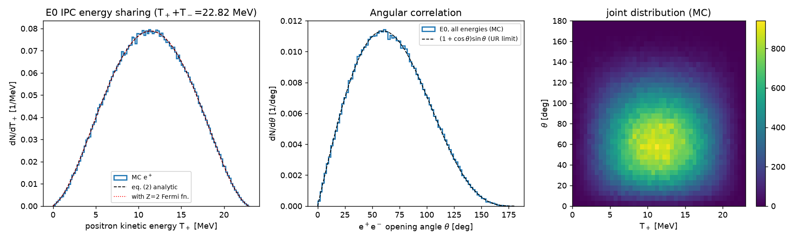
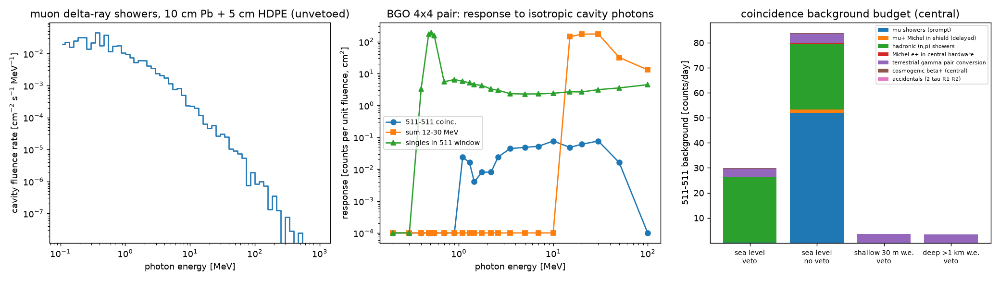
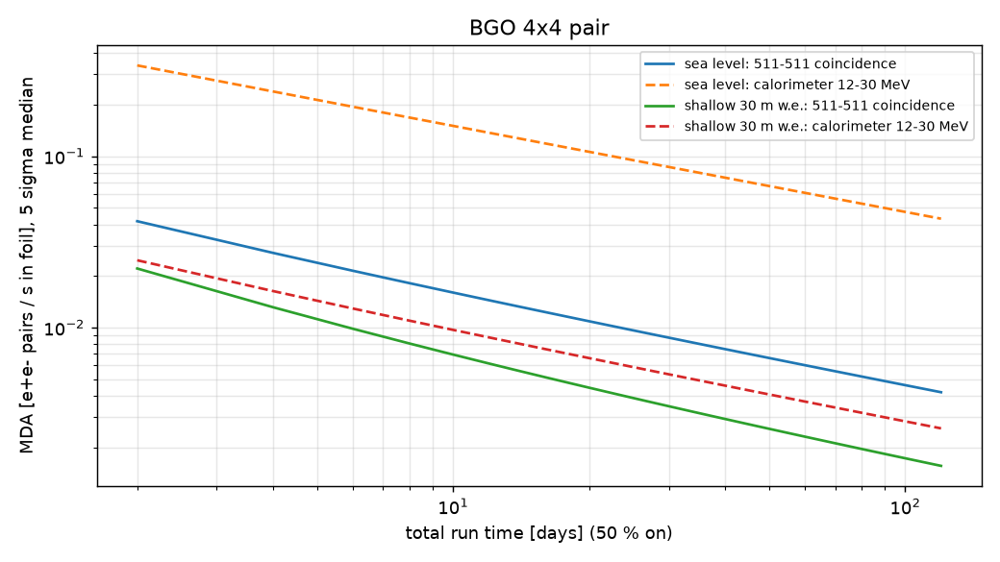
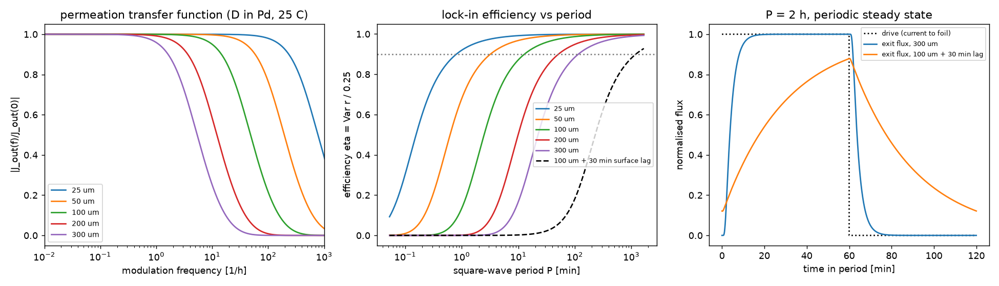
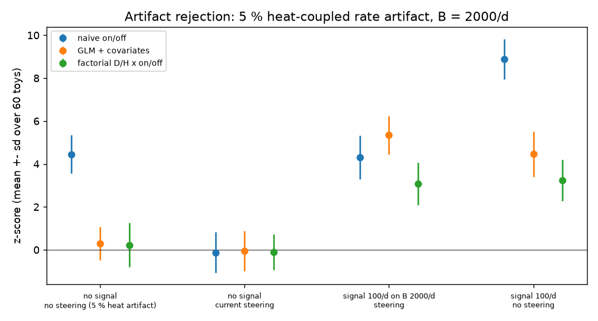

# M7 — γ / e⁺e⁻ detection channel and flux-modulation protocol

Code: `sim/m7_*.py` (`python3 sim/m7_run_all.py` regenerates everything in ~1.5 h on one core) · Raw outputs: `docs/models/figs/m7_*.txt` · Figures: `docs/models/figs/m7_*.png`

## Summary for lead

- **Signal.** If Czerski's 0⁺ resonance exists, each thermal D–D event emits an e⁺e⁻ pair sharing 22.82 MeV (11.4 MeV mean each).
- **Where it annihilates.** The Pd foil is transparent: only 0.2–3.8 % of positrons annihilate in it. The rest annihilate in steel, the cell, the detectors and the moderator; 14 % annihilate in flight. **The 511 keV source is a cloud about 15 cm across, not the foil.**
- **Detector.** Use BGO: per volume it gives 4× NaI and 6× HPGe in 511-511 efficiency.
  - Two Ø102×102 mm BGO on ±x, 37 mm from the foil axis.
  - Shield: 5 cm borated HDPE + 10 cm Pb, hermetic veto with a 20 µs window.
  - Efficiencies: ²²Na at the foil 7.0 %; per pair 1.4 % (511-511) and 2.8 % (12–30 MeV).
- **Sea level.** Background ≈ 30 d⁻¹ (6–165), dominated by hadrons that the veto cannot reject. MDA = **9×10⁻³ pairs/s** (5σ, 30 d on/off). This is comparable to M0's proton channel, but the γ channel sees the whole foil.
- **Underground (30 m w.e.).** With 15 cm Pb the MDA is 1.6×10⁻³.
- **Decisive Czerski test.** Put a mini permeation cell inside an 8″×8″ NaI well: 68 % efficiency in 12–30 MeV. MDA 5×10⁻³ at sea level, **3×10⁻⁴ at 30 m w.e.**
- **Modulation.** Bulk diffusion takes ≤ 8 min at 300 µm, so the electrochemical step response sets the period. Use P = 12τ clipped to 1–6 h (default 2 h).
  - Current steering to a dummy cathode and a D₂O/H₂O factorial are mandatory: a 5 % heat artifact otherwise fakes 4.5σ.
  - Two primary tests, so the local threshold is 5.13σ.
- **Calibration** uses only exempt sources plus cosmic muons.
- **Main uncertainty** is the hadronic background normalisation (×3). Measure it in a 14-day blank run first.

## 1. Questions answered
1. E0 IPC kinematics of the 23.85 MeV 0⁺→0⁺ transition in ⁴He, and where e± born in a 25–300 µm Pd foil (electrolyte / vacuum) deposit energy, radiate and annihilate (§5.1–5.3).
2. Choice and layout of a back-to-back 511 keV coincidence system: efficiency, sea-level and underground backgrounds, and MDA (§5.4–5.5).
3. A 5–25 MeV calorimetric channel: efficiency, background above 5/12 MeV, and MDA, including a dedicated well-calorimeter option (§5.6).
4. The flux-modulation (lock-in / on-off) protocol: period, artifact separation, channel combination and look-elsewhere control (§5.8).
5. Calibration with exempt sources (§5.9). §5.7 gives the recommended layout and bill of materials (BOM).

## 2. Model and equations

### 2.1 E0 internal pair creation in ⁴He (Q1 kinematics)

Transition energy: Q = 2m_d c² − m_α c² = 2(1875.6129) − 3727.3794 = **23.8465 MeV** (CODATA-2018/AME-2020 masses [BK]). A 0⁺→0⁺ transition has no single-photon branch. With no bound electrons to convert on, it decays by internal pair creation (IPC), so the kinetic energy available to the pair is

  T₊ + T₋ = Q − 2mₑc² = **22.824 MeV** (⁴He recoil ≤ 76 keV, neglected).

In first Born approximation (Oppenheimer & Schwinger, Phys. Rev. 56, 1066 (1939); Thomas, Phys. Rev. 58, 714 (1940); Church & Weneser, Phys. Rev. 103, 1035 (1956); review by Schlüter, Soff & Greiner, Phys. Rep. 75, 327 (1981)), with energies in units of mₑc², E± the total energies, p± the momenta, E₊ + E₋ = W₀ = 46.67, and θ the e⁺e⁻ opening angle:

  d²W/(dE₊ d cosθ) ∝ p₊p₋ (E₊E₋ − 1 + p₊p₋ cosθ)        (1)

  dW/dE₊ ∝ p₊p₋ (E₊E₋ − 1)                               (2)

  W(θ | E₊) ∝ 1 + [p₊p₋/(E₊E₋ − 1)] cosθ ≈ 1 + β₊β₋ cosθ    (3)

Derivation check: the E0 amplitude is the nuclear monopole matrix element multiplied by the time component of the lepton current. Summing |ū γ⁰ v|² over spins gives 4(E₊E₋ + **p**₊·**p**₋ − m²). The phase space d³p₊d³p₋/(E₊E₋)·δ(E₊+E₋−W₀) contributes p₊p₋ dE₊ dΩ₊ dΩ₋, which yields eq. (1). The Coulomb (Fermi-function) correction for Z = 2 changes the spectrum shape by < 0.8 % (computed) and is neglected. `sim/m7_ipc.py` samples eq. (1) exactly (rejection in E₊, analytic inverse CDF in cosθ).

### 2.2 Coupled e±/γ transport (Q1 a–c, Q2, Q3)

`sim/m7_mc.py` is a numpy-vectorised condensed-history Monte Carlo written for this workstream.

| Process | Treatment | Source |
|---|---|---|
| e± collision loss | continuous; Bethe formula as in ICRU-37 eqs. 2.4–2.6 (Møller for e⁻, Bhabha for e⁺), Sternheimer–Peierls density effect | ICRU Report 37 (1984); the algorithm of NIST ESTAR; Sternheimer & Peierls, PRB 3, 3681 (1971) |
| bremsstrahlung | discrete photons for k > 20 keV, continuous below; Bethe–Heitler with Thomas–Fermi screening (Butcher–Messel form used in EGS4), Z(Z+ξ) for e–e brems | Butcher & Messel, Nucl. Phys. 20, 15 (1960); EGS4 SLAC-265; Tsai RMP 46, 815 (1974) |
| multiple scattering | Gaussian, Highland θ₀ applied incrementally in cumulative path length x/X₀: Δθ₀² = (13.6 MeV/βcp)²[H(x+Δx) − H(x)], with H(x) = x(1+0.038 ln x)² | PDG eq. 34.15 |
| e⁺ annihilation | in flight (Heitler two-photon cross-section, EGS4 kinematics); at rest into 2×511 keV back-to-back. o-Ps 3γ (≲0.5 % in water, 0 in metals) neglected | Heitler (1954); EGS4 |
| photons | Woodcock (delta) tracking. Photoabsorption (Elam tables ≤ 0.8 MeV, extrapolated above); Klein–Nishina Compton with recoil-electron transport; pair production (screened Bethe–Heitler × empirical Coulomb correction fitted to XCOM Pb) | Elam et al., Rad. Phys. Chem. 63, 121 (2002); XCOM [BK] |
| cuts | e± 20 keV, γ 10 keV (showers in the shield: 100 keV) | — |

Simplifications (they make this a "simplified MC" in the sense of the brief): no δ-ray transport, no collisional energy-loss straggling, Gaussian (not Molière) scattering, no fluorescence, no coherent scattering. §4 quantifies their effect.

### 2.3 Detector response
Resolution FWHM/E at 662 keV [BK, vendor data]: BGO 10.5 %, NaI(Tl) 7.0 %, LaBr₃(Ce) 2.9 %, all scaling as E^−½ with floors of 2 %, 1.5 % and 0.6 %. HPGe: 1.0 keV electronic noise ⊕ 1.9 keV statistical at 1332 keV. The coincidence window is 511 keV ± 1 FWHM, which contains 98 % of a Gaussian peak; HPGe uses ±4 keV to include the ~2.5 keV Doppler width of the line. Calorimeter windows are the summed (smeared) deposit in 5–30 MeV and 12–30 MeV. The 12 MeV lower edge sits above every thermal-neutron-capture γ line present in the setup: ⁷³Ge 10.2, ¹⁴N 10.8, ⁵⁶Fe 7.6, ²⁰⁷Pb 7.4, ¹²⁷I 6.8 MeV.

### 2.4 Background model (Q2, Q3)
1. **Muon δ-ray showers in the shield.** Knock-on production is d²N/dTdx = 0.1535 (Z/A) T⁻² MeV⁻¹(g cm⁻²)⁻¹ (PDG eq. 34.8), with T = 1.2 MeV (the minimum for pair-producing bremsstrahlung) up to 1.1 GeV (T_max for a 4 GeV muon). The track-length density is the omnidirectional muon fluence rate Φ_μ = (2π/3) I_v, and I_v = J₁/(π/2) with J₁ = 1 cm⁻² min⁻¹ (PDG). The δ-rays are transported through a slab of 5 cm HDPE + 10 cm Pb. The photon current entering the cavity, J_in(E), gives the cavity fluence rate φ(E) = 4 J_in(E) (isotropic enclosure).
2. **Detector response to that field.** R(E) = counts per unit fluence, obtained by MC with cosine-law inward emission from a 16 cm sphere (φ = N/πR²). Rate B = ∫φ(E) R(E) dE.
3. **Other terms.** (a) Delayed Michel e⁺ from stopped μ⁺ (τ = 2.197 µs), in the shield and in the central hardware. (b) Direct muons through the crystals (chord MC, dE/dx_min(PDG) × 1.10). (c) The hadronic component (unvetoable), scaled to the muonic one with the literature ratio F_had. (d) Terrestrial ²⁰⁸Tl/²¹⁴Bi/⁴⁰K lines from a concrete room, attenuated by the shield. (e) Cosmogenic β⁺ in the central hardware. (f) Radon. (g) Accidentals, 2τR₁R₂.
4. **Veto.** Prompt inefficiency ε̄_v. An extended window of 20 µs after each veto hit suppresses Michel decays by e^(−20/2.197) = 1.1×10⁻⁴.

### 2.5 Statistics (MDA)
The protocol is on/off modulation with equal on and off exposure, t_on = t_off = 15 d in a 30-day run. The expected Asimov significance is Z_A = √2·{n_on ln[2n_on/(n_on+n_off)] + n_off ln[2n_off/(n_on+n_off)]}^½ (Li & Ma 1983 eq. 17 with α = 1; Cowan et al. EPJC 71, 1554 (2011)), with n_on = s + b and n_off = b. The MDA is the source rate R such that s = ε R t_on gives median Z_A = 5, with at least 5 signal counts required. It is quoted in **e⁺e⁻ pairs produced per second in the foil**.

### 2.6 Permeation dynamics and lock-in efficiency (Q4)
Slab of thickness L, entry-face concentration modulated, exit face at c ≈ 0 (desorption into UHV). The exit-flux transfer function is (Crank 1975, ch. 4)

  H(ω) = q / sinh q,  q = (iωL²/D)^½                      (4)

The step response is J(t)/J_∞ = 1 + 2Σₙ(−1)ⁿ exp(−n²π²Dt/L²). For a 50 %-duty square-wave drive analysed by template regression, the Fisher information on the signal amplitude, relative to an ideal instantaneous response, is η = Var[r(t)]/0.25. Here r(t) is the periodic exit flux normalised to its ON steady state. An optional first-order electrochemical/surface lag τ_s multiplies H by 1/(1+iωτ_s).

## 3. Parameters

| Parameter | Value | Units | Source | Uncertainty |
|---|---|---|---|---|
| Q (d+d → ⁴He g.s.) | 23.8465 | MeV | CODATA 2018 / AME 2020 masses [BK] | < 1 keV |
| mₑc² | 0.51099895 | MeV | CODATA 2018 | exact for purpose |
| Pd density; X₀ | 12.02; 9.20 | g cm⁻³; g cm⁻² | CRC; PDG atomic-nuclear properties [BK] (Tsai formula reproduces X₀ to 0.0 %) | 0.5 % |
| I-values Pd, H₂O/D₂O, PTFE, SS316, Si, BGO, NaI | 470; 75; 99.1; Bragg ≈ 290; 173; 534.1; 452 | eV | ICRU 37 / ESTAR [BK] | 2–5 % |
| D₂O density | 1.105 | g cm⁻³ | CRC [BK] | 0.1 % |
| e± collision stopping power | computed (ICRU 37) | MeV cm² g⁻¹ | reproduces ESTAR water to 0.2 % (1 MeV) and 1.3 % (10 MeV) | ≤ 2 % |
| Radiative stopping | computed (screened BH) | MeV cm² g⁻¹ | ESTAR water +9 % at 1 MeV, +3 % at 10 MeV; PDG E_c within 1–5 % | 5–10 % |
| Photon μ/ρ | computed | cm² g⁻¹ | vs XCOM [BK]: Fe/H₂O within 2.5 %; Pb within 1 % above 3 MeV, −5 % at 0.511 MeV (coherent omitted), −7 % at 2 MeV | 1–7 % |
| Muon horizontal flux J₁ | 1 | cm⁻² min⁻¹ | PDG Cosmic rays review §30.3 [BK] | ±15 % (latitude, altitude, building) |
| Stopped-muon rate | 0.012 | kg⁻¹ s⁻¹ | estimate from the sea-level low-momentum muon spectrum | 0.005–0.02 |
| μ⁺ fraction | 0.56 | — | charge ratio 1.27, PDG [BK] | ±2 % |
| Hadronic/muonic cosmogenic e⁺ ratio F_had (surface) | 0.5 | — | a veto reduces shielded surface Ge background only 2–5×: Heusser, Annu. Rev. Nucl. Part. Sci. 45, 543 (1995); Semkow et al., NIM A 489, 519 (2002) [BK] | 0.25–1.0 |
| Veto prompt inefficiency | 3×10⁻³ | — | typical hermetic 5 cm plastic, 99–99.9 % [BK] | 1×10⁻³–1×10⁻² |
| Sea-level neutrons > 10 MeV | 13 | cm⁻² h⁻¹ | Gordon et al., IEEE TNS 51, 3427 (2004); JEDEC JESD89A [BK] | ±30 %; ×0.6 for one floor above |
| Depth factors (μ, hadrons) at 30 m w.e. | 0.15, 10⁻³ | — | Heusser 1995; Mei & Hime PRD 73, 053004 (2006) [BK] | ±50 % |
| Concrete activity K/U/Th | 400/40/30 | Bq kg⁻¹ | UNSCEAR 2000 Annex B, typical [BK] | factor 2 |
| D in Pd (α phase) | D₀ = 1.7×10⁻³ cm² s⁻¹, E_a = 0.206 eV → 5.6×10⁻⁷ cm² s⁻¹ at 25 °C | — | Völkl & Alefeld, *Hydrogen in Metals I* (1978) [BK] | ×0.3–×3 (β phase, Darken factor, traps: M3) |
| Barometric coefficient, hadronic background | −0.7 | % hPa⁻¹ | neutron-monitor literature [BK] | ±0.1 |
| Temperature coefficient of light yield | BGO −1.2, NaI −0.3, LaBr₃ ≈ 0 | % K⁻¹ | Saint-Gobain data sheets [BK] | ±30 % |
| Exempt quantities | ²²Na 10, ¹³⁷Cs 10, ⁶⁰Co 1, ²⁴¹Am 0.01, ¹³³Ba 10; unlisted β/γ emitters 0.1 | µCi | 10 CFR 30.71 Schedule B [BK] | verify before purchase |

All web pages were unreachable from this session (egress proxy 403, including physics.nist.gov and pdg.lbl.gov). Every [BK] value is quoted from background knowledge with its standard reference, as the brief instructs, and should be spot-checked before publication. The physics that matters most (stopping powers, X₀, attenuation) is computed from first principles and verified against the reference values that are best known (§4).

## 4. Verification (`m7_verify.txt`, `m7_common.py` self-test)

| Check | Model / MC | Reference | Agreement |
|---|---|---|---|
| e⁻ collision stopping power, water 1 / 10 MeV | 1.852 / 1.994 MeV cm² g⁻¹ | ESTAR 1.849 / 1.968 [BK] | +0.2 % / +1.3 % |
| CSDA range, water 1 / 10 MeV | 0.4366 / 4.910 g cm⁻² | ESTAR 0.4367 / 4.975 | 0.0 % / −1.3 % |
| Radiative stopping power, water 10 MeV | 0.189 | ESTAR 0.183 | +3 % |
| X₀ (Tsai) for Pd, H₂O, Pb, Fe, Cu, Si, NaI, BGO, Ge, PTFE, polymers | — | PDG | ≤ 0.1 % |
| Critical energy E_c, 8 materials | — | PDG | −5 % (Pb) to −0.3 % |
| Photon μ/ρ, Fe and H₂O, 0.5–20 MeV | — | XCOM | ≤ 2.5 % |
| Photon μ/ρ, Pb | — | XCOM | ≤ 1 % at 3–20 MeV; −5 % at 511 keV (coherent omitted); −7 % at 2 MeV |
| [V1] 3″×3″ NaI, 662 keV at 10 cm | interaction probability 0.0203; P/T 0.58 | analytic ray-trace 0.0206; Heath catalogue ~0.5–0.55 | −1.5 % |
| [V2] R₅₀ of 10 / 20 MeV electrons in water | 4.12 / 8.38 cm | AAPM TG-25: E₀/2.33 = 4.29 / 8.58 | −4 % / −2 % |
| [V2] practical range R_p | 4.57 / 9.11 cm | 0.52E₀ − 0.3 = 4.90 / 10.1 | −7 % / −10 % (no straggling) |
| [V3] θ₀ for 10 MeV e⁻ through 300 µm Pd | 239 mrad | Highland 225 mrad (±11 %) | +6 % |
| [V4] energy conservation, IPC in an 80 cm BGO cube | 23.8465 MeV/event | T₊+T₋+2mₑ = 23.8465 | 1.00000 |
| [V5] in-flight annihilation, e⁺ from 1 / 10 MeV stopping in water | 0.0345 / 0.1375 | CSDA integral 0.0353 / 0.1360 | ≤ 2 % |
| IPC sampler: ⟨cosθ⟩ | 0.3323 (MC) | analytic 0.3327 | 0.1 % |

**Net effect of the simplifications.** Missing straggling and Gaussian scattering shorten e± penetration by 5–10 %. This makes the calorimeter efficiencies slightly conservative for the side detectors and does not affect the well calorimeter. Efficiency statistical errors: ±0.001 (point sources, 40k events), ±0.0015–0.003 (IPC, 6–8k events). The coincidence responses R_c(E) rest on 1–19 counts per energy point, so the folded muon-shower coincidence rate carries about ±20 % (1σ) of MC statistics, well below the ×3 normalisation uncertainty.

## 5. Results

### 5.1 Q1: E0 IPC energy sharing and angular correlation (`m7_ipc_kinematics.png/txt`)
- **Energy sharing** follows eq. (2), a broad hump over 0–22.8 MeV.
  - ⟨T₊⟩ = ⟨T₋⟩ = 11.41 MeV.
  - P(T₊ < 1 MeV) = 0.19 %, P(T₊ < 2 MeV) = 0.93 %, P(T₊ < 5 MeV) = 8.4 %. Both leptons are above 5 MeV in 83 % of events.
- **Angular correlation** is ≈ 1 + β₊β₋cosθ, broad and forward-favoured.
  - ⟨cosθ⟩ = 0.333 and the median opening angle is 66°.
  - 25 % of pairs have θ > 90°, 0.4 % have θ > 150°, 13 % have θ < 30°.
  - **The pair is not back-to-back.** It must not be confused with the back-to-back annihilation photons.
- **Invariant mass** is a continuum (5–95 %: 3.6–20 MeV) with no peak. An X17-type boson would instead give a peak, so the two are distinguishable only by e± tracking, which is outside iteration-1 scope.
- **In a hermetic calorimeter** the line sits at 23.85 MeV: 22.82 MeV kinetic + 2×0.511 MeV annihilation.



### 5.2 Q1(a): where the positrons annihilate (`m7_transport.txt`, `m7_annihilation.png`)
The foil is 0.0033–0.039 X₀ thick. The CSDA range of an 11.4 MeV e⁺ in Pd is 5.8 mm, versus 0.84 cm in SS, 5.6 cm in D₂O and 3.0 cm in PTFE. Fractions below are per IPC event; they sum to about 1.05 because secondary pair-produced positrons are included.

| Foil L | foil | electrolyte | PTFE cell | SS flange/chamber | Si + PCB | BGO crystals + cans | HDPE enclosure (~16 cm) | escaped | in flight |
|---|---|---|---|---|---|---|---|---|---|
| 25 µm | 0.002 | 0.081 | 0.149 | 0.305 | 0.006 | 0.203 | 0.294 | 0.013 | 0.143 |
| 50 µm | 0.005 | 0.079 | 0.151 | 0.294 | 0.006 | 0.192 | 0.317 | 0.014 | 0.139 |
| 100 µm | 0.009 | 0.086 | 0.147 | 0.292 | 0.008 | 0.202 | 0.304 | 0.012 | 0.143 |
| 300 µm | 0.038 | 0.104 | 0.147 | 0.285 | 0.007 | 0.197 | 0.283 | 0.011 | 0.140 |

Source depth hardly matters. At 100 µm, a front-face source gives SS 0.33 and a back-face source gives PTFE 0.16; everything else changes by < 0.02. Consequences:
1. Annihilation vertices span z = −6 to +8 cm, with peaks at the SS clamp (z ≈ 0) and the top plate (z ≈ 6 cm).
2. The 511-511 system sees an extended source. Its IPC efficiency (1.4 %) is 7× lower than for a point at the foil (10.6 %).
3. Positrons that enter a crystal deposit their kinetic energy there, so those events migrate from the 511 channel to the calorimeter channel. The two channels are complementary.

### 5.3 Q1(b): bremsstrahlung (`m7_brems.png`)
Per IPC event (photons with k > 20 keV):

| L | photons made in the foil | energy radiated in the foil | photons made in all materials | energy radiated, all materials |
|---|---|---|---|---|
| 25 µm | 0.145 | 0.16 MeV | 4.1 | 2.9 MeV |
| 50 µm | 0.25 | 0.26 MeV | 4.1 | 3.0 MeV |
| 100 µm | 0.44 | 0.47 MeV | 4.2 | 3.1 MeV |
| 300 µm | 1.05 | 1.11 MeV | 4.5 | 3.4 MeV |

- The thin-target spectrum in the foil is ≈ 1/k up to ~22 MeV.
- Most radiation comes from the SS hardware and the BGO itself.
- About 13 % of the pair energy is radiated before the leptons stop.
- The photon spectrum leaving the assembly has a hard continuum to 23 MeV plus the 511 keV line.

### 5.4 Q1(c): energy in nearby detectors (`m7_edep.png`, `m7_sum_spectra.png`)
- **Si telescope** on axis at 2 cm (25 µm ΔE + 1000 µm E, 450 mm²):
  - 12.5–14 % of IPC events deposit > 50 keV in the E detector. The median is 0.42 MeV (a minimum-ionising particle, MIP, crossing obliquely).
  - Deposits in the 2.6–3.1 MeV proton window occur for ≤ 1×10⁻⁴ of events. **The pair channel does not contaminate the proton channel**; ΔE–E tags these hits as MIPs.
- **BGO Ø4″×4″ pair**:
  - P(either crystal > 5 MeV) = 0.21, P(sum > 12 MeV) = 0.029, mean summed deposit 2.6 MeV.
  - Most leptons go through, or stop in, material that is not a detector.
- **Neutron detectors on ±y (M5)**: EJ-309 sees these events as γ/e-like and rejects them by pulse-shape discrimination (PSD). ³He does not respond.

### 5.5 Q2: 511 keV coincidence system (`m7_detectors.txt`, `m7_eff_layouts.png`)
Efficiencies are 511-511 coincidences in ±1 FWHM windows, per decay or event, with the geometry of §5.7.

| Layout | Crystal volume | Point e⁺ at foil | ²²Na at foil | IPC pair | IPC sum 12–30 MeV | Relative cost |
|---|---|---|---|---|---|---|
| 2× BGO 3″×3″ (±x) | 695 cm³ | 0.059 | 0.043 | 0.010 | 0.013 | 1 |
| 2× NaI 3″×3″ | 695 | 0.015 | 0.012 | 0.003 | 0.007 | 0.35 |
| 2× LaBr₃ 3″×3″ | 695 | 0.019 | 0.016 | 0.003 | 0.010 | 3 |
| 2× HPGe 100 % | 804 | 0.009 | 0.007 | 0.002 | 0.008 | 6 (+ cooling) |
| **2× BGO 4″×4″ (±x)** | 1647 | **0.106** | **0.071** | **0.015** | **0.028** | 2 |
| 2× NaI 5″×5″ | 3218 | 0.064 | 0.041 | 0.009 | 0.028 | 1 |
| 4× BGO 3″×3″ (±x, ±y) | 1390 | 0.119 | 0.089 | 0.019 | 0.029 | 2 |
| 4× BGO 3″×3″ (±x, ±z) | 1390 | 0.108 | 0.079 | 0.015 | 0.022 | 2 |
| 2× BGO 3″×3″ (±z) | 695 | 0.049 | 0.036 | 0.007 | 0.006 | 1 |

**Choice: BGO.** Accidentals are 2τR₁R₂ ≈ 10⁻⁸ s⁻¹ even for BGO's slow 20 ns window. The background is therefore true 511-511 pairs from positrons that really annihilate between the detectors, and neither LaBr₃'s resolution nor its timing buys anything. HPGe line shape (Doppler S-parameter) could tell metal from water annihilation, but at 1/7 of the efficiency.

**The Ø4″ pair on ±x is preferred over a 3″ quad.** It matches the quad's performance but leaves ±y for the neutron detectors and ±z for pumping and electrolyte services.

Secondary geometry levers (BGO 3″ pair):
- detector-axis height z_c from +1 to −2 cm: ±15 %;
- foil thickness 25–300 µm: ±15 %;
- a 3 mm Al chamber wall instead of 1.5 mm SS: +38 % in the 12–30 MeV channel, no change for 511.

**Background budget** (`m7_background.txt`, `m7_background.png`). Layout: BGO 4″ pair, 5 cm borated HDPE + 10 cm Pb, 20 µs veto. Ranges combine the low and high parameter sets of §3.

| Term (counts/day) | Sea level, veto | Sea level, no veto | 30 m w.e. |
|---|---|---|---|
| μ δ-ray showers in the shield (prompt) | 0.16 | 52 | 0.02 |
| Hadronic (n, p) showers (F_had = 0.5) | 26 | 26 | 0.03 |
| μ⁺ Michel e⁺ (shield + central hardware) | 0.00 | 2.1 | 0.00 |
| Terrestrial ²⁰⁸Tl/²¹⁴Bi/⁴⁰K pair conversion | 3.5 | 3.5 | 3.5 |
| Cosmogenic β⁺ (⁵⁸Co, ⁵⁶Co…) in 471 g of central hardware | 0.25 | 0.25 | 0.02 |
| Radon (N₂-purged) and accidentals | < 0.01 | < 0.01 | < 0.01 |
| **Total** | **30 (6–165)** | **84 (25–324)** | **3.6 (1.8–7.4)** |

- **Direct muon pair production** in Pb is < 1 % of the δ-ray term. At 4 GeV, pair-production energy transfer is ~0.7 % of the δ-ray transfer above 1.2 MeV. It is neglected.
- **Consistency check.** The model predicts ~0.2 s⁻¹ per crystal of vetoed singles in the 511 window. Shielded surface NaI/Ge spectrometers typically show ~0.1–0.3 s⁻¹ there [BK], within the ×3 band.
- **Shield thickness** matters only once cosmic rays are removed. The terrestrial coincidence term is 42 / 3.5 / 0.30 d⁻¹ for 5 / 10 / 15 cm Pb, and 0.6 d⁻¹ for 10 cm Pb + 5 cm Cu. Pb mass for a 30 cm cavity is 0.7 / 1.7 / 3.2 t.

**MDA table**: e⁺e⁻ pairs produced per second in the foil, 5σ median, 30 d with 15 d on / 15 d off (`m7_background.txt`, `m7_wellcal.txt`).

| Channel | Sea level, no veto | Sea level, veto | 30 m w.e. | Deep (> 1 km w.e.) |
|---|---|---|---|---|
| 511-511, BGO 4″ pair, 10 cm Pb | 1.4×10⁻² | **8.7×10⁻³** (4.4×10⁻³–2.0×10⁻²) | 3.5×10⁻³ | 3.4×10⁻³ |
| 511-511, same, 15 cm Pb | — | 8.3×10⁻³ | **1.6×10⁻³** | 1.6×10⁻³ |
| 12–30 MeV sum, same BGO pair | 0.22 | 8.7×10⁻² | 5.3×10⁻³ | 5.0×10⁻⁴ |
| Both channels combined (same R) | — | 8.7×10⁻³ | 2.8×10⁻³ | 4.9×10⁻⁴ |
| **12–30 MeV, 8″×8″ NaI well calorimeter (dedicated cell)** | — | 5.1×10⁻³ (2.6–11×10⁻³) | **3.0×10⁻⁴** (1.6–6.7×10⁻⁴) | 2.1×10⁻⁵ |

The MDA scales as t^−½ while background-limited and as t^−1 once b ≲ 10 (`m7_mda.png`). Moving underground helps the 511 channel only if the Pb is also thickened. It helps the calorimetric channel by 16–250×.




### 5.6 Q3: high-energy calorimeter (5–25 MeV)
- **Side BGO pair.** It sees a pair in the 12–30 MeV sum with only 2.8 % efficiency (5–30 MeV: 21 %), because the leptons dump their energy in steel, electrolyte and moderator.
  - At sea level the 12–30 MeV background is 1.3×10⁴ d⁻¹.
  - The largest terms are hadronic showers (1.0×10⁴) and hadron interactions in the crystals (2.9×10³). Vetoed muons contribute 135 (direct) + 60 (showers) + 10 (Michel).
  - The veto rejects muons: 4.6 s⁻¹ cross the crystals, mean deposit 66 MeV. It cannot reject neutrons.
- **Window below 12 MeV.** 5–12 MeV contains neutron-capture lines (⁷³Ge 10.2, ⁵⁶Fe 7.6, ²⁰⁷Pb 7.4 MeV). These were not modelled, so the 5–30 MeV window is **not recommended**.
- **Dedicated well calorimeter** (`m7_wellcal.png`): a small permeation cell (Pd foil, 2 cm D₂O, a 2 cm evacuated cap) inside an 8″×8″ NaI(Tl) with a 52 mm well.
  - 97 % of pairs deposit > 5 MeV and **68 % fall in 12–30 MeV**. The mean deposit is 13.5 MeV.
  - There is essentially no full-energy peak, because the electrolyte and cell walls absorb part of the energy.
  - Background 12–30 MeV: 2.7×10⁴ d⁻¹ at sea level, 86 d⁻¹ at 30 m w.e., ≈ 0 deep.
  - At 30 m w.e. its MDA (3×10⁻⁴ s⁻¹) is **5× better than the best 511 configuration** and 18× better than the side calorimeter.
  - **This is the decisive test of the Czerski channel.** An energy deposit above 12 MeV that follows the D flux cannot come from any radioactive or β⁺ background.

### 5.7 Recommended layout and bill of materials
```
            +z (vacuum side, Si telescopes inside chamber; top flange, gauge)
                              |
        pump/feedthrough port on +y (DN40CF), dog-leg through shield
   ┌─────────────────── plastic veto 5 cm (5 faces, overlapping) ─────────────────┐
   │ ┌───────────────────────── Pb 10 cm (15 cm underground) ──────────────────┐  │
   │ │ ┌──────────────────── borated HDPE 5 cm (5 % B) ─────────────────────┐  │  │
   │ │ │   EJ-309 / 3He modules on ±y (M5), 5–8 cm from axis              │  │  │
   │ │ │                                                                  │  │  │
   │ │ │ [PMT|BGO Ø102x102]  <37 mm>  CHAMBER Ø63 + foil  <37 mm>  [BGO|PMT] │  │  │
   │ │ │   -x   face x=-37                 (z=0)           face x=+37   +x │  │  │
   │ │ │                        PTFE D2O cell below (−z), services −y      │  │  │
   │ │ └──────────────────────────────────────────────────────────────────┘  │  │
   │ └────────────────────────────────────────────────────────────────────────┘  │
   └─────────────────────────────────────────────────────────────────────────────┘
```
- **Chamber.** Foil: Pd, Ø20 mm active, normal +z, clamped between a 316L flange (vacuum side) and a PTFE clamp.
  - Vacuum side: a Ø60 mm ID chamber 60 mm tall. Use 1.0–1.5 mm 316L, or 3 mm Al (+38 % high-E efficiency).
  - Si telescope(s) at 1–3 cm, per M5.
- **BGO.** Two Ø102×102 mm crystals, axes on ±x at z = −5 mm, front faces at |x| = 37 mm (2 mm from the flange).
  - Readout: 76 mm PMT, or better a SiPM array, so the detector is ≤ 13 cm long and the cavity stays ≈ 40×30×35 cm.
  - Temperature-controlled housing, ±0.1 K. LED pulser.
- **Shield, inside out.**
  1. 5 cm 5 %-borated HDPE. It also serves as the neutron-bank moderator and absorbs Pb-generated neutrons.
  2. 10 cm Pb at sea level, 15 cm (or 10 cm Pb + 5 cm Cu) underground.
  3. 5 cm EJ-200 (or equivalent) veto panels on the top and 4 sides. Veto window 20 µs; dead time ≈ 1 %.
  4. N₂ boil-off purge of the cavity (Rn < 1 Bq m⁻³).
- **Floor loading.** 1.7 t on ≈ 0.5 m² needs a ground-floor slab.
- **Separate test stand, iteration 1b.** An 8″×8″ NaI well calorimeter with a mini permeation cell, its own 10 cm Pb + veto, preferably at a ≥ 30 m w.e. site.

| Item | Spec | Qty | Price (USD) |
|---|---|---|---|
| BGO Ø102×102 mm, canned, with 3″ PMT or SiPM | Epic/Saint-Gobain/Scionix class | 2 | 18–28k [est] |
| Digitiser | 8 ch, 500 MS/s, 14-bit, DPP (e.g. CAEN DT5730) | 1 | 10–15k [est] |
| HV / SiPM bias supply | 4 ch | 1 | 2–5k [est] |
| Plastic veto panels | 70×70×5 cm, 2 readouts each | 5 | 12–18k [est] |
| Lead bricks | 10 cm shell, ~1.7 t | — | 9–15k [est] |
| Borated HDPE 5 % | 5 cm liner, ~0.06 m³ | — | 1–2k [est] |
| N₂ purge, Rn monitor, temperature control, LED pulser | — | — | 3–5k [est] |
| Exempt calibration sources (²²Na, ¹³⁷Cs, ⁶⁰Co, ²⁴¹Am, ¹³³Ba) | 0.1–1 µCi | 5 | 0.5–1k [est] |
| **Subtotal, 511 + side calorimeter** | | | **≈ 55–90k** |
| Budget variant: 2× NaI 5″×5″ instead of BGO | 511 efficiency ×0.6 | 2 | saves ~12–18k |
| Iteration 1b: 8″×8″ NaI well + PMT, mini cell, extra Pb + veto | | 1 | 20–35k [est] |

All prices are [est] (no web access). R6 lists a 2″ NaI + MCA at $6–10k; BGO costs ~2–3× NaI per volume.

### 5.8 Q4: flux-modulation protocol

**Diffusion time.** For D in α-Pd at 25 °C, D = 5.6×10⁻⁷ cm² s⁻¹ (D diffuses 1.5× faster than H: the inverse isotope effect).

| L (µm) | time lag L²/6D (s) | τ₁ = L²/π²D (s) | t₉₀ after a step (s) | f₋₃dB of eq. (4) (mHz) | period for η ≥ 0.9 (min), D ×1 / ×0.3 / ×3 |
|---|---|---|---|---|---|
| 25 | 1.9 | 1.1 | 3.4 | 131 | 0.9 / 2.8 / 0.3 |
| 50 | 7.4 | 4.5 | 13.6 | 33 | 3.4 / 11 / 1.2 |
| 100 | 30 | 18 | 54 | 8.2 | 13 / 47 / 4.6 |
| 200 | 119 | 72 | 217 | 2.0 | 56 / 180 / 18 |
| 300 | 268 | 163 | 489 | 0.9 | 122 / 390 / 42 |

**Bulk diffusion is not the rate-limiting step for any foil in the range.** Even 300 µm responds in ~8 min. The slow element is the electrochemical side: surface coverage, loading/deloading kinetics and recombination at the entry face, where the M2/M3 inputs place relaxation times of minutes to hours. Adding a first-order lag τ_s to 100 µm gives the following.

| τ_s | period needed for η ≥ 0.9 | η at P = 2 h | η at P = 6 h |
|---|---|---|---|
| 1 min | 43 min | 0.96 | 0.99 |
| 10 min | 6.7 h | 0.67 | 0.89 |
| 30 min | 20 h | 0.24 | 0.67 |

**Backgrounds do not constrain the period from below or above in practice** (`m7_modulation.txt`, drift budget).

- The 511-511 and 12–30 MeV channels have B ≲ 10² d⁻¹. The uncorrected barometric drift, at −0.7 % hPa⁻¹ with σ_p = 8 hPa and a 2-day correlation time, contributes < 1 % of the Poisson error at any P ≤ 6 h and 4 % at P = 24 h.
- Only a 10³ d⁻¹ singles-type channel feels drift at P ≥ 6 h. It reaches 18 % of the Poisson error at 24 h.
- The penalty for a long period is therefore not statistical. It is exposure to diurnal systematics (temperature, radon, HVAC) and the loss of cycles for block randomisation.

#### Protocol specification (to be pre-registered)
1. **Step-response calibration (day 0–2).** Drive 3 current steps (on→off→on, 6 h each) with detectors blinded. Fit the measured exit flux J(t) (RGA m/z = 4 and 3, calibrated D₂ leak) to eq. (4) × 1/(1+iωτ_s) and extract τ_eff.
2. **Period.** P = clip(12 τ_eff, 1 h, 6 h). The default, if τ_eff ≤ 10 min, is **P = 2 h** (1 h on / 1 h off). Periods that divide 24 h (3, 4, 6, 8, 12 h) are shifted by +7 min to avoid locking to diurnal harmonics. The period is frozen before unblinding.
3. **Schedule.** Randomised blocks. Each block of 2 periods is ON-OFF or OFF-ON from a pseudo-random sequence generated from a sealed seed. The sequence is logged by the DAQ with a hash and is hidden from analysts until unblinding.
4. **Current steering (mandatory).** Total cell current is constant. ON sends it to the Pd foil cathode; OFF sends it to an auxiliary Pt cathode in the same electrolyte, 2 cm from the foil. Joule heat, gas evolution, cable currents and magnetic field then stay the same to first order. Only the D flux through the foil changes. In the toy study a 5 % heat-coupled rate artifact gives a fake **+4.5σ** in a naive on/off analysis. With steering it gives −0.1σ.
5. **Isotope factorial.** Alternate D₂O and H₂O electrolyte in 5-day blocks: at least 2 D and 2 H blocks per 30 days, same foil, flushed and re-loaded. The primary statistic is the interaction term (D-on − D-off) − (H-on − H-off) in a Poisson GLM. It costs ~40 % in z (toy: 3.1σ vs 5.3σ for a D-only GLM) but is immune to any artifact that tracks the drive without depending on isotope. The GLM with measured covariates is reported alongside it.
6. **Covariates** logged every 10 s: cell current and voltage, cell and detector temperatures (±0.02 K), barometric pressure, radon in the cavity purge line, PMT HVs, LED-pulser peak positions, veto rate, RGA m/z 2/3/4, UHV pressure. They enter the GLM as nuisance regressors: log-rate linear in pressure, detector temperature and live time.
7. **EMI and transients.** Veto ±2 s around each switching edge (<0.1 % live time at P = 2 h). A "dark" witness channel (a PMT on a crystal-less light guide, plus a Si detector with no view of the foil) goes into the same DAQ. Any excess in a witness channel synchronous with the drive invalidates the run segment.
8. **Gain stability.** BGO light output changes −1.2 %/K. A 12–30 MeV threshold on a steeply falling spectrum (index ≈ 2–3) converts a 1 K shift into a 3–4 % rate change, comparable to the toy artifact. Therefore:
   - detector housing held at ±0.1 K;
   - LED pulser at 1 Hz with a monitor photodiode;
   - offline gain tracking on the ⁴⁰K 1461 keV and ²⁰⁸Tl 2614 keV singles lines, recorded per 6 h;
   - no calibration source present during physics runs (a ²²Na source would dominate the coincidence background).
9. **Regressors, pre-registered.**
   - Primary: measured exit flux J_D(t).
   - Secondary: loading x(t) from foil resistance, and |dx/dt|.
   - Lag: fixed to the value from step 1. There is no phase scan, so no look-elsewhere penalty for phase.
10. **Channels and look-elsewhere.** Four physics channels share one flux template:
    - p: Si 2.6–3.1 MeV, from M5;
    - n: ³He or EJ-309, from M5;
    - γ511: 511-511 coincidence;
    - γhi: 12–30 MeV sum.

    There are two primary hypothesis tests.
    - **H1 (conventional D–D):** a joint likelihood of p and n with one rate parameter R and the M5 efficiencies.
    - **H_Cz (E0 pair channel):** a joint likelihood of γ511 and γhi with one R and the fixed efficiency ratio ε₅₁₁/ε_hi from this MC. A consistency check requires the fitted ratio to lie within the MC ±30 %.

    Global 5σ with two primary tests (Bonferroni) requires a local z ≥ 5.13. Secondary tests (3 templates × 4 channels = 12) require z ≥ 5.46 and are labelled exploratory.
11. **Stopping rule.** Fixed 30 days of live time per foil and isotope pair. No optional stopping. The interim look at 15 days is blinded to the on/off labels.
12. **Unblinding checklist.** Witness channels are null; the H₂O arm is null (|z| < 2); the gain-drift residual is < 0.3 % correlated with the drive; the ²²Na coincidence efficiency before and after agrees within 3 %.




### 5.9 Q5: calibration with exempt sources (`m7_calibration.txt`)
All quantities are within 10 CFR 30.71 Schedule B [BK] and sold as exempt check sources, so no user licence is needed. Efficiencies are for the BGO 4″ pair with the source at the foil position.

| Source (activity used) | Measured rate | Time to 10⁴ counts | What it calibrates |
|---|---|---|---|
| ²²Na, 0.1 µCi (limit 10) | 234 coincidences/s (0.070 per decay) | 0.7 min | 511-511 efficiency at the foil, which normalises the MC; coincidence resolving time; the 1275 keV point |
| ¹³⁷Cs, 1 µCi (limit 10) | 5.8×10³ peak/s | < 1 min | energy scale and resolution at 662 keV |
| ⁶⁰Co, 1 µCi (limit 1) | 5.5×10³ peak/s | < 1 min | 1.17/1.33 MeV points; 2.505 MeV sum peak (summing logic) |
| ¹³³Ba, 1 µCi (limit 10) | 4.9×10³ peak/s | < 1 min | 80–400 keV scale and threshold |
| ²⁴¹Am, 0.01 µCi (limit 0.01) | 26 α/s into Si at 2 cm | 6 min | Si ΔE–E energy scale (5.486 MeV α); 59.5 keV threshold |
| ⁹⁰Sr/⁹⁰Y, 0.1 µCi (limit 0.1) | 530 e⁻/s into Si | < 1 min | electron (MIP-like) response of the Si telescope and scintillator windows |
| ⁶⁸Ge/⁶⁸Ga, 0.1 µCi (unlisted default [BK], verify) | ~230 coincidences/s | < 1 min | harder e⁺ (1.9 MeV end-point); checks the modelled annihilation-location spread |
| Natural: 5 thoriated W rods (~850 Bq ²³²Th, exempt under 10 CFR 40.13(c)) | 35 s⁻¹ at 2614 keV | 5 min | 2.6 MeV point; pair-conversion response |
| Natural: 1 kg KCl | 73 s⁻¹ at 1461 keV | 2 min | 1.46 MeV point; in-run gain tracking |
| Cosmic muons (in situ) | 4.6 s⁻¹ crossing the crystals | — | MIP peak ≈ 9 MeV cm⁻¹ in BGO; 10–70 MeV linearity and PMT saturation |
| Stopped μ⁺ in the crystals (in situ) | Michel e⁺ in 1–20 µs delayed coincidence with the veto | days | 52.8 MeV spectrum end-point: calorimeter scale above 12 MeV |

No licensed neutron or high-energy γ source is needed. Remove every source during physics runs: a 0.1 µCi ²²Na source adds 2×10⁷ coincidences/day. Record the ²²Na calibration before and after every 30-day run and require agreement within 3 %.

## 6. Design recommendations for the lead
1. **Treat the 511 keV signal as coming from an extended source.** 0.2–3.8 % of positrons annihilate in the foil; the rest annihilate within ~15 cm. Do not size or collimate the γ detectors for a point source at the foil. Foil thickness (25–300 µm) changes the γ-channel efficiency by < ±20 %, so choose thickness on M3/M5 grounds.
2. **Use BGO, not NaI, LaBr₃ or HPGe**, for 511-511 coincidence. Two Ø102×102 mm crystals on the ±x axis, front faces at 37 ± 3 mm from the foil axis, axes at z = −5 ± 10 mm. This gives ε(²²Na at foil) = 0.070 and ε(IPC) = 0.014 (511-511) and 0.028 (12–30 MeV). Hold the crystals at ±0.1 K (BGO light yield changes −1.2 %/K) and use SiPM or short-PMT readout to keep the cavity ≤ 40×30×35 cm.
3. **Shield from the inside out:** 5 cm borated HDPE, then Pb, then a hermetic 5 cm plastic veto. Set the veto's extended window to **20 µs**; with a 1 µs window, Michel decays raise the 12–30 MeV rate from 1.3×10⁴ to 1.5×10⁴ d⁻¹. Pb thickness: 10 cm at sea level (5 cm costs ×1.5 in MDA). **15 cm underground**, where the ²⁰⁸Tl leak dominates: 3.5 → 0.3 d⁻¹.
4. **Expected sensitivity at sea level:** 511-511 MDA ≈ 9×10⁻³ e⁺e⁻ s⁻¹ (range 4×10⁻³–2×10⁻²) in 30 days. Do not build a side-mounted calorimeter channel for sea level: its MDA is 0.09 s⁻¹. Record its data anyway; it is free.
5. **Test the Czerski channel decisively with iteration 1b:** an 8″×8″ NaI well calorimeter around a mini permeation cell (the same foil and electrochemistry, without the Si or UHV chamber) at ≥ 30 m w.e. It has 68 % efficiency above 12 MeV and an MDA of 3×10⁻⁴ s⁻¹, about 10× better than any surface option. If no shallow site is available, run it at sea level (MDA 5×10⁻³).
6. **Run the modulation protocol of §5.8:**
   - measure the step response first; P = 12τ_eff clipped to 1–6 h (default 2 h);
   - randomised blocks;
   - current steering to an auxiliary Pt cathode (mandatory);
   - D₂O/H₂O factorial in 5-day blocks;
   - the RGA-measured exit flux as the single pre-registered regressor;
   - two primary tests (H1: p + n; H_Cz: 511 + hi-E with the MC-fixed ratio), local threshold 5.13σ.
7. **Measure the background before physics runs.** Run a blank (Au foil, same current) for 14 days to fix the hadronic normalisation, the largest uncertainty (×3). It needs about 400 coincidences to reach ±5 %; at 30 d⁻¹ that is 14 days.
8. **Calibrate only with exempt sources** (§5.9): ²²Na 0.1 µCi for efficiency, cosmic muons and Michel electrons above 12 MeV. No licensed sources.

## 7. Sensitivities and uncertainties
| Assumption | Effect | Could it flip a recommendation? |
|---|---|---|
| Hadronic/muonic ratio F_had (0.25–1) and the overall shower normalisation (×3) | Sea-level 511 background 6–165 d⁻¹; MDA ×0.5–2.2 | No. It strengthens the case for going underground. |
| Veto inefficiency (10⁻³–10⁻²) | Negligible at sea level. Dominates the side calorimeter underground (direct muons 20 d⁻¹ at 3×10⁻³). | No |
| Terrestrial activity of the room (×2) and shield thickness | Controls the underground 511 background linearly | Sets 15 cm Pb underground |
| E0 multipolarity. If the 23.85 MeV state were not 0⁺, or the pairs came from a boson (X17-like), the angular correlation would change but not the energy flow. | Efficiencies depend on energy deposition and are insensitive (< 20 % estimated) | No |
| Czerski branching at thermal energy. The proton channel (M0: 3×10⁻³ s⁻¹ for surface sites) beats the 511 channel (9×10⁻³) for surface sites unless e⁺e⁻/p ≳ 3. | For bulk sites deeper than ~30 µm (the 3 MeV proton range in Pd, Bethe estimate) only the γ channel sees anything | Yes, for the priority between channels. If the PRX 2025 ratio at < 5 keV is < 3, keep the γ system secondary and put money into Si/neutrons. |
| MC simplifications (no straggling, Gaussian scattering) | Efficiencies ±10 %; R_p −7 to −10 % | No |
| Stopped-muon rate (0.005–0.02 kg⁻¹ s⁻¹) | Only Michel terms, negligible with the 20 µs window | No |
| Electrochemical relaxation time τ_s | η at P = 2 h falls from 0.96 (τ_s = 1 min) to 0.24 (τ_s = 30 min) | Yes, for the period: it must be measured (§5.8 step 1) |
| D diffusivity in β-Pd (×0.3–×3) | Diffusion stays ≪ electrochemical lag for all L ≤ 300 µm | No |

## 8. Open questions and hand-offs
- **M5:**
  - The Si telescope sees 13 % of IPC events as MIPs (0.42 MeV median in 1 mm Si), with ≤ 10⁻⁴ in the proton window. ΔE–E must classify MIPs.
  - A **Si-MIP × BGO coincidence** ("e± tag") channel is possible with existing hardware; its background needs M5's Si model.
  - Neutron detectors belong on ±y. Share the veto and DAQ. EJ-309 PSD must reject the e±/brems γ.
- **M3:**
  - γ efficiency is insensitive to foil thickness.
  - The flux regressor needs the exit-face kinetics and an RGA calibration (m/z 3, 4).
  - Please supply τ_s estimates and β-phase D_chem.
- **M2:** design the auxiliary Pt cathode so that current steering keeps cell heat and field constant to < 1 %.
- **R6:**
  - Floor loading of 1.7–3.2 t of Pb.
  - Confirm the Schedule B values and the ⁶⁸Ge "unlisted" default.
  - Confirm that thoriated rods are exempt.
- **Lead:**
  - Surface vs 30 m w.e. site.
  - Whether to fund iteration 1b (well calorimeter).
  - Read the Czerski PRX 2025 data: the e⁺e⁻/p ratio and whether their 511 excess was coincidence-based.
- **Unverified inputs.** All [BK] parameters (§3) should be checked against NIST, PDG and the cited literature. The muon-shower MC and F_had should be replaced by the measured blank-run background as soon as it exists.
