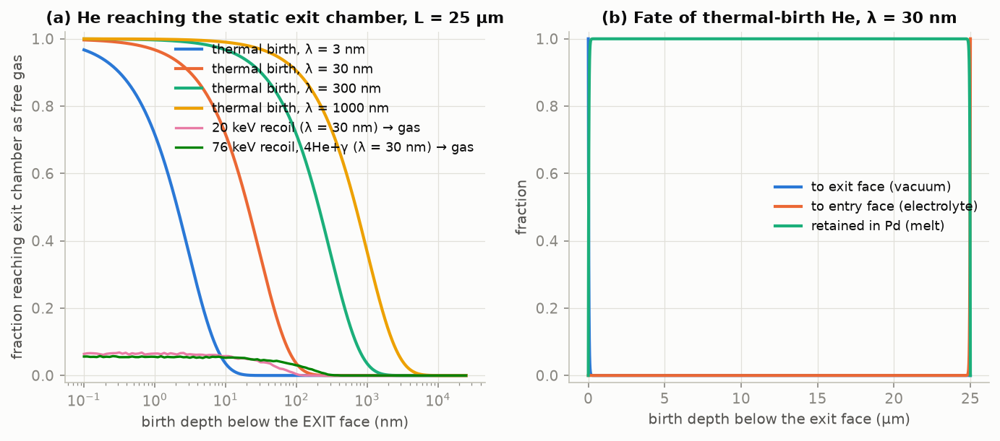
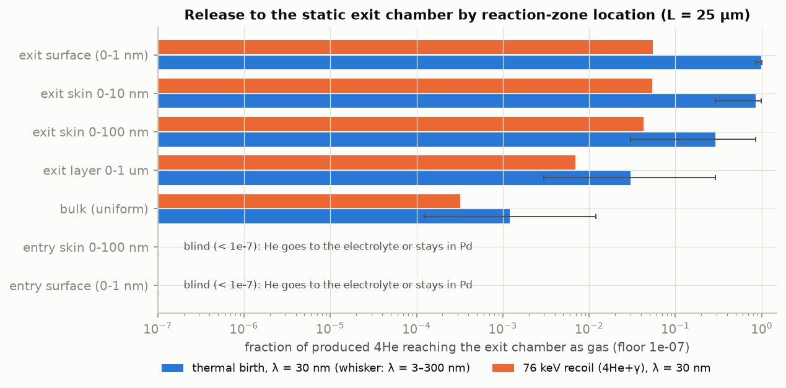
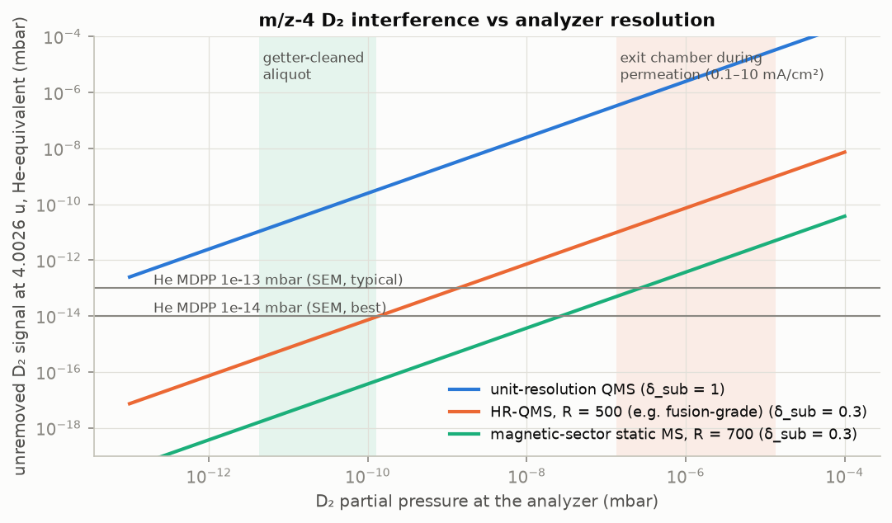
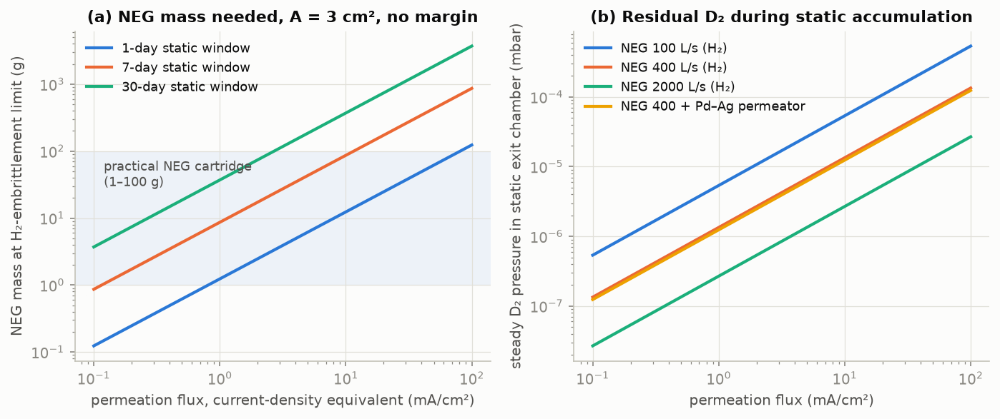
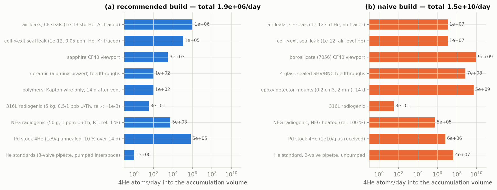
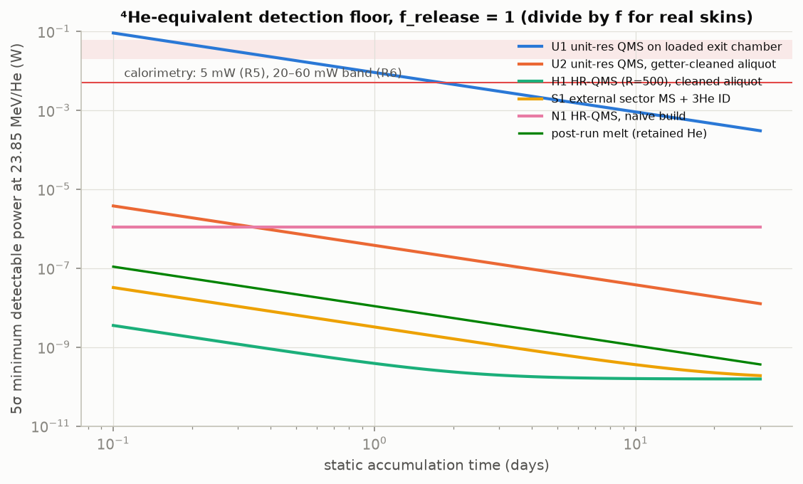

# M8 — The ⁴He channel (H2): release, accumulation, detection and backgrounds for the detector-facing membrane

Code: [`sim/m8_helium_accumulation.py`](../../sim/m8_helium_accumulation.py) · Raw output: [`figs/m8_output.txt`](figs/m8_output.txt) · Figures: `figs/m8_*.png`

Tags: **[C]** computed in the script; **[BK]** literature value from memory (outbound web blocked), with the standard reference, to be checked before a design freeze; **[A]** assumption chosen here.

## Summary for lead

- **Sensitivity is not the problem.** With the recommended chain (all-metal static volume, getter-cleaned aliquot, high-resolution MS), the 5σ floor is **0.39 nW (1 d), 0.16 nW (7 d) and 0.16 nW (30 d)** of 23.85 MeV/He power at full release. This is **about 3×10⁷ below the 5 mW calorimetric floor** (R5) and ~10⁸ below R6's 20–60 mW. The floor is set by background *stability* (σ_B ≈ 7×10⁵ atoms/day), not by the instrument. Rule of thumb: P_floor ≈ 2.2×10⁻¹⁶ W per (atom/day) of σ_B.
- **The release fraction decides everything** (λ = trap-limited escape length, 3–300 nm):
  - exit skin ≤ 10 nm: f_exit = 0.85 (0.29–0.98);
  - exit skin 100 nm: 0.29 (0.03–0.85);
  - uniform bulk: 1.2×10⁻³;
  - **entry-face zone (the SRI regime; the one ADR-002 rev 2 now points the telescopes at): 0.** Its He goes to the electrolyte or stays in the Pd. The exit chamber is blind to it, so the M4 cell-headspace channel and a per-sector melt are mandatory.
- **SRI's ~60 % pre-flush release** is only consistent with a source within ≈1.1 λ (3–340 nm) of the wetted surface.
- **A unit-resolution RGA is unusable for ⁴He.** D₂⁺ at m/z 4 needs P_D₂ ≤ 10⁻¹⁴ mbar. Directly on the D₂-loaded chamber it floors at **1.3 mW (7 d)**, no better than calorimetry. HR-QMS (R ≥ 500) needs P_D₂ ≤ 5×10⁻¹⁰ mbar; a magnetic-sector MS needs ≤ 10⁻⁸ mbar. Both are reachable only in an isolated, getter-cleaned aliquot.
- **The D₂ gas load dominates the hardware.**
  - 1 mA/cm² over 3 cm² saturates ~9 g of NEG per week.
  - 10 mA/cm² needs 87 g per week.
  - For the rev-2 1 atm D₂ front, a hot Pd–Ag element must be the only D₂ path in or out: a He-tight pressure regulator. Cylinder D₂ at 1 ppm He would add a 7×10¹⁴-atom offset.
- **Forbidden on the static volume:** glass (a single borosilicate CF40 viewport adds 9×10⁹ He/day), epoxy, ionising gauges (they pump away He in minutes), 2-valve He pipettes, and He leak testing after the final bake.
- **ADR-002 slip:** "~10¹⁵ atoms per mJ" is wrong. 1 mJ = 2.6×10⁸ He; the calorimetric floor corresponds to ~10¹⁴–10¹⁵ He per day.

---

## 1. Questions answered

1. How many ⁴He per second does a claimed excess power put into a 2–5 cm² membrane?
2. What fraction of He born at depth z escapes through the exit face, escapes through the entry face, or stays in the Pd? How does that depend on birth energy (thermal/lattice-coupled, ≤20 keV, 76 keV ⁴He+γ recoil) and on the depth of the reaction zone?
3. How sensitive is RGA, HR-QMS or static noble-gas MS detection in a 0.5–2 L NEG-pumped chamber? What do the D₂ gas load, NEG capacity and m/z-4 interferences imply, and what residual D₂ is required?
4. What is the background budget (atoms/day), and what is the resulting 5σ minimum detectable ⁴He rate and power over 1, 7 and 30 days, compared with calorimetry?
5. Which controls are needed, and which geometry follows? This covers both the UHV/NEG exit chamber in the brief and the ADR-002 rev-2 pressure-balanced 1 atm D₂ front.

## 2. Model and equations

**Production.** Ṅ_He = P / Q with Q = 23.847 MeV, so 1 W gives 2.617×10¹¹ He/s and 1 W·day gives 2.26×10¹⁶ He (0.84 µL STP).

**Stopping (§2 of the output).**
- Electronic stopping S_e(E) of ⁴He in Pd comes from CATIMA 1.7 (pycatima, SRIM-85 low-energy branch), embedded as a table.
- Nuclear stopping is ZBL universal: S_n = 8.462 Z₁Z₂M₁ s_n(ε) / [(M₁+M₂)(Z₁^0.23+Z₂^0.23)] eV/(10¹⁵ at cm⁻²).
- Path range: R = ∫dE/(S_e+S_n).
- Projected range: R_p ≈ R / [1 + (M₂/3M₁) f_n], where f_n is the nuclear-loss fraction (LSS-type, ±30 %).
- NRT vacancies: 0.8 E_n / (2E_d).

**Trapping (§3).** Rate-theory sink strengths:
- vacancies: k² = 4π r_c C_v N_Pd
- dislocations: k² = ρ_d
- bubbles: k² = 4π r_b N_b

The trap-limited escape length is λ = (Σk²)^(−1/2). λ does not depend on the He diffusivity D as long as trapping is irreversible. At 300 K the detrapping time is 1/[ν exp(−E_diss/kT)].

**Release of thermal (zero-recoil) He (§4).** He is born at distance u below the exit face of a slab of thickness L with absorbing faces and bulk capture. The steady solution of λ² c″ = c gives:

  P_exit(u) = sinh((L−u)/λ) / sinh(L/λ),  P_entry(u) = sinh(u/λ) / sinh(L/λ),  P_ret = 1 − P_exit − P_entry.

The 3-D problem reduces exactly to this, because capture is isotropic and only the normal coordinate matters.

**Release of recoil He.**
- Monte Carlo: isotropic direction and straight path s ~ N(R_p, 0.35 R_p).
- Ballistic escape if the path crosses a face.
- Otherwise the He diffuses from its stopping point with λ_eff = (λ⁻² + λ_self⁻²)^(−½), where λ_self = 2 nm accounts for the traps in its own cascade (~50 vacancies at 76 keV).
- Ballistic He leaving the exit face into **vacuum** implants in the walls or detectors. Only η_refl = 0.1 of it ends up as gas [BK: Eckstein reflection coefficients]. In the **1 atm D₂ front** it thermalises in the gas (range 1.0–3.2 mm), so it counts.

**Detection (§6).**
- N = P·V / kT, i.e. 2.455×10¹⁹ atoms per mbar·L at 295 K.
- D₂ gas load: Q = j A / (2e).
- Static P_D₂ = Q / S_NEG,D₂, with S_D₂ = 0.71 S_H₂.
- NEG mass = Q t / q_max.
- D₂ residue at 4.0026 u, in He-equivalent: δ_sub · r_S · T(R) · P_D₂, where:
  - T(R) = exp[−4 ln2 x²] + a_tail/x² with x = Δm R/m and Δm = 0.0256 u;
  - r_S = S_D₂/S_He at m/z 4;
  - δ_sub is the fractional uncertainty with which the residue is known.
- Required P_D₂ = MDPP / (3 δ_sub r_S T).

**Backgrounds (§7).**
- Air leak: Ṅ_He = L_std · x_He · 2.455×10¹⁹, i.e. partial-pressure driven, molecular flow.
- Ar tracer: Ṅ_Ar = L_std · √(M_He/M_Ar) · x_Ar.
- Glass permeation: Ṅ = K A Δp_He / d.
- Polymer outgassing from an air-saturated slab: Ṅ(t) = N₀ Σ (8D/l²) exp[−(2n+1)²π²Dt/l²].
- Radiogenic: 8.9×10³ He/day per g per ppm U; 2.1×10³ per g per ppm Th.
- Lattice permeation of He through Pd: Henry solubility n_gas λ_th³ exp(−E_sol/kT) per site.

**Minimum detectable (§8).** N_min(t) = 5 √(σ_inst² + σ_D₂² + (σ_B t)²). Then R_min = N_min / (f t) and P_min = R_min / 2.617×10¹¹. Here σ_inst and σ_D₂ are referred to the total accumulated inventory (divided by the aliquot fraction), and σ_B is the day-to-day uncertainty of the background rate.

## 3. Parameters

| Parameter | Value | Units | Source | Uncertainty |
|---|---|---|---|---|
| Q (d+d→⁴He) | 23.847 | MeV | mass difference | exact |
| He, Ar in air | 5.24×10⁻⁶, 9.34×10⁻³ | vol. fraction | standard (R5) | <1 % |
| Membrane (brief / rev 2) | 25 µm × 3 cm² / 10 µm | — | ADR-002 | 10–25 µm; 2–5 cm² |
| He stopping in Pd | CATIMA 1.7 table | MeV cm²/g | [C] pycatima 1.982, https://github.com/hrosiak/catima | ±5–10 % (±20 % below 50 keV) |
| Nuclear stopping | ZBL universal | — | [BK] Ziegler, Biersack & Littmark, *Stopping and Range of Ions in Solids* (1985) | ±20 % |
| Displacement energy E_d(Pd) | 40 | eV | [BK] ASTM E521-class value | ±25 % |
| Capture radius r_c | 0.4 | nm | ≈ lattice parameter 0.389 nm; [BK] Was, *Fundamentals of Radiation Materials Science* (2017) | ×2 |
| Dislocation density, annealed / α-β cycled | 10⁸–10⁹ / 10¹⁰–10¹¹ | cm⁻² | [BK] Flanagan & Oates, Annu. Rev. Mater. Sci. 21 (1991) 269 | ×3 |
| Superabundant vacancies near surface | 10⁻⁴–10⁻³ | site fraction | [BK] Fukai, *The Metal–Hydrogen System* (2005); Fukai & Ōkuma, PRL 73 (1994) 1640 | order of magnitude; RT relevance uncertain |
| He bubbles (aged PdT) | N_b 10¹⁸–10¹⁹ cm⁻³, r_b 0.5–1 nm | — | [BK] Thiébaut et al., J. Nucl. Mater. 277 (2000) 217; Cowgill, Fusion Sci. Technol. 48 (2005) 539 | ×3 |
| → λ (trap-limited escape length) | **30** (3–300; 1000 pristine) | nm | [C] from the rows above | two decades |
| He interstitial migration energy | 0.1–0.4 | eV | [BK] Trinkaus & Singh, J. Nucl. Mater. 323 (2003) 229; Wilson, Bisson & Baskes, PRB 24 (1981) 5616 | — (λ independent of D) |
| He solution energy in Pd | 2.0–2.9 | eV | [BK] DFT/EAM, ibid. | ±0.5 eV (irrelevant: flux ≈ 0) |
| He–vacancy / bubble dissociation | ≥ 2–2.5 | eV | [BK] ibid. | — |
| He–dislocation dissociation | 1.0–1.5 | eV | [BK] ibid. | **flags slow release** |
| Accelerated-release threshold | He/Pd ≈ 0.3 | — | [BK] Abell et al., PRB 41 (1990) 1220; Lässer, *Tritium and Helium-3 in Metals* (1989) | 0.2–0.5 |
| TEM-visible bubbles | He/Pd ≳ 10⁻³ | — | [BK] Thiébaut 2000 | ×3 |
| Recoil-He wall reflection → gas, η_refl | 0.10 | — | [BK] Eckstein, *Computer Simulation of Ion–Solid Interactions* (1991) | 0.03–0.3 |
| QMS He MDPP (SEM) | 10⁻¹³ (10⁻¹⁴ best) | mbar | [BK] SRS RGA, Pfeiffer PrismaPlus, MKS vendor specs | ×3 |
| D₂/He sensitivity at m/z 4, r_S | 2.5 | — | [BK] ion-gauge RSFs (He 0.14–0.18, D₂ 0.35–0.45) | 2–3 |
| HR-QMS resolution / tail coefficient | R = 500 / a_tail = 10⁻³ | — | [BK] Hiden fusion-grade HR-QMS (He/D₂ at m/z 4); tail [A] | tail ×10 |
| Sector MS resolution / tail | R = 700 / 10⁻⁵ | — | [BK] Helix-SFT/MAP-215 class | ×10 |
| Sector MS floor / line blank | 3×10⁵ / (3 ± 1)×10⁶ | atoms | [BK] noble-gas lab practice | ×3 |
| Ion–molecule k, source residence τ | 2×10⁻⁹ cm³/s, 1 µs | — | [BK] Langevin H₂⁺+H₂; τ [A] | ×3 |
| NEG q_max (St 707/St 172, H₂) | 20 | Torr·L/g | [BK] SAES St 707 datasheet, saesgetters.com | ±50 % |
| NEG Sieverts fit | log P[Torr] = 4.8 + 2 log q − 6116/T | — | [BK] SAES St 707 | ±0.5 decade |
| NEG H₂ speed | 100–2000 (400 nominal) | L/s | [BK] CapaciTorr D400–D2000 | — |
| D₂ outgassing after exposure | 10⁻¹² (10⁻¹³ vacuum-fired) | mbar·L s⁻¹ cm⁻² | [BK] baked 316L H₂ outgassing, scaled | ×10 |
| Pd–23Ag permeability, ~350 °C | 2×10⁻⁸ | mol m⁻¹ s⁻¹ Pa⁻½ | [BK] Steward, LLNL UCRL-53441 (1983) | ×2 |
| Glass He permeability, 25 °C | SiO₂ 1e-10; 7740 1e-11; 7056 3e-12; soda-lime 1e-13; 1720 3e-14; sapphire < 1e-18 | cm³STP·mm s⁻¹ cm⁻² cmHg⁻¹ | [BK] Altemose, J. Appl. Phys. 32 (1961) 1309; Norton, J. Am. Ceram. Soc. 36 (1953) 90 (7740 value = R5) | ×3 each |
| Epoxy He solubility / D | 0.02 cm³STP cm⁻³ atm⁻¹ / 10⁻⁸–3×10⁻⁷ cm²/s | — | [BK] polymer permeation handbooks | ×3 / ×10 |
| U/Th in 316L; in Zr-based NEG | 0.5/1 ppb; 1/1 ppm | — | [BK] radiopurity assays (e.g., Leonard et al., NIM A 591 (2008) 490); NEG [A], assay required | ×10 |
| Pd stock ⁴He after 900 °C UHV anneal / as received | 10⁹ / 10¹⁰ | atoms/g | [A] **must be measured** on sibling coupons | ×10 |
| All-metal valve seat conductance (closed) | 10⁻¹⁰ | L/s | [BK] vendor specs | ×10 |
| He Bunsen coefficient in water, 25 °C | 0.0087 | — | [BK] Weiss, J. Chem. Eng. Data 16 (1971) 235 | ±3 % |
| Calorimetric floor | 5 (R5); 20–60 (R6) | mW | R5 §2.4, R6 | — |
| Volumes V_E / V_A / V_S; rev-2 front / aliquot | 0.5 / 0.15 / 0.05 L; 30 / 1 cm³ | — | [A] | see §5.9 |

## 4. Verification

| Check | Result |
|---|---|
| He per J and per W·day vs R1/R5 | 2.617×10¹¹ /J; 2.26×10¹⁶ per W·day = 0.842 µL STP (R5: 0.84) ✓ |
| He ranges in Pd vs R5 (ATIMA) at 3.7 / 5.49 / 7.69 MeV | table integration 6.26 / 10.28 / 16.34 µm; direct CATIMA 6.13 / 10.15 / 16.20; R5 6.1 / 10.1 / 16.2 ✓ (≤3 %) |
| Lindhard–Scharff cross-check at 76 keV | LS gives S_e = 31.5 vs CATIMA 59.9 eV/(10¹⁵ at cm⁻²). LS underestimates by 1.9×, so CATIMA is used and LS is not |
| Thermal escape: analytic vs 1-D lattice random walk (λ = 30 nm, 40 000 walkers per depth) | max \|Δ\| = 0.004, ≈1.5σ statistical ✓ |
| Ballistic escape MC vs (1 − u/R)/2 | agreement to ≤0.001 ✓ |
| Limits | bulk thermal f_exit → λ/L (1.20×10⁻³ at λ = 30 nm, L = 25 µm; 3.0×10⁻³ at L = 10 µm) ✓; surface → 1 ✓; entry/exit symmetric ✓ |
| Glass permeation vs R5 (Pyrex 100 cm², 2 mm) | 5.3×10⁶ /s (R5 ~5×10⁶) ✓ |
| Dissolved He, 100 mL air-saturated electrolyte | 1.22×10¹⁴ (R5 1.2×10¹⁴) ✓ |
| Self-trapping of interstitial He at 1 W in a 100 nm skin | k²_self ≤ 4×10⁸ cm⁻² ≪ 10¹⁰–10¹¹ from pre-existing traps, so neglecting it is justified ✓ |

## 5. Results

### 5.1 Production budget

| Claim (R1/R2) | W/cm² | on 2 cm² (W) | on 5 cm² (W) | ⁴He/s on 3 cm² (geo-mean) |
|---|---|---|---|---|
| SRI Pd wire, ~W from 0.94 cm² | 0.53–2.4 | 1.1–4.9 | 2.7–12 | 9.0×10¹¹ |
| China Lake rods | 0.02–0.20 | 0.04–0.40 | 0.10–1.0 | 5.0×10¹⁰ |
| Letts–Cravens | 0.2–2.0 | 0.4–4.0 | 1–10 | 5.0×10¹¹ |
| Takahashi plate | 0.08–0.8 | 0.16–1.6 | 0.4–4 | 2.0×10¹¹ |
| Tohoku/Iwamura films (gas; H ≈ D) | 0.08–0.48 | 0.16–0.96 | 0.4–2.4 | 1.5×10¹¹ |
| F&P 1993 boil-off (outlier) | 170 | 341 | 853 | 1.3×10¹⁴ |

At full release, 1 mW accumulates 2.3×10¹³ He/day, which is 1.8×10⁻⁶ mbar/day in 0.5 L. 1 nW gives 1.8×10⁻¹² mbar/day. A claimed-level power (≥ 0.1 W) would be detectable even at f ~ 10⁻⁶.

### 5.2 Birth energies and ranges

| Birth | R_path | R_proj | Note |
|---|---|---|---|
| thermal (23.85 MeV into the lattice; Hagelstein-type) | 0 | 0 | the H2 hypothesis proper |
| 20 keV (upper bound on lattice-coupled α, R1 §3.5) | 188 nm | 80 nm | 30 NRT vacancies |
| 76.3 keV (⁴He+γ recoil) | 372 nm | 236 nm | 50 vacancies; the 23.8 MeV γ (1 per He) makes M7 far more sensitive than He for this branch |
| ≤70 keV (e⁺e⁻ pair recoil, Czerski) | — | ≤ 230 nm | behaves like the 76 keV case; the 511 keV channel is far more sensitive |
| 23.8 MeV α (not H2) | 92.6 µm | 91.7 µm | exits the foil; Si telescopes see it; it implants in the walls, so it is not gas |

### 5.3 Trapping: λ

λ = 1 µm (annealed, ρ_d = 10⁸) · 100–32 nm (α/β-cycled, ρ_d = 10¹⁰–10¹¹) · 54–17 nm (C_v = 10⁻⁶–10⁻⁵) · 5–1.7 nm (superabundant vacancies, 10⁻⁴–10⁻³) · 13–3 nm (once bubbles nucleate).

Diffusion is prompt: 0.4 µs to 47 ms to cover 30 nm. **Release, if any, coincides with production.** Traps with E_diss ≥ 1.2 eV are permanent (τ ≥ 170 d). Weaker dislocation traps (1.0 eV, τ ≈ 2 h) would let trapped He leak out over hours to months.

### 5.4 Release fractions (Fig. 1, Fig. 2)

Fraction reaching the **exit chamber as gas**, L = 25 µm (thermal: λ = 30 nm, with the range for 3–300 nm):

| Reaction zone | thermal | 20 keV | 76 keV | retained (thermal, λ = 30) | to entry/electrolyte (thermal) |
|---|---|---|---|---|---|
| exit surface 0–1 nm | **0.98** (0.85–1.0) | 0.066 (+0.45 in walls) | 0.055 (+0.45 in walls) | 0.016 | 0 |
| exit skin 0–10 nm | **0.85** (0.29–0.98) | 0.062 | 0.054 | 0.15 | 0 |
| exit skin 0–100 nm | **0.29** (0.030–0.85) | 0.030 | 0.043 | 0.71 | 0 |
| exit layer 0–1 µm | 0.030 (0.003–0.29) | 0.003 | 0.007 | 0.97 | 0 |
| bulk (uniform) | 1.2×10⁻³ (1.2×10⁻⁴–1.2×10⁻²) | 8×10⁻⁵ | 3×10⁻⁴ | 0.998 | 1.2×10⁻³ |
| entry skin 0–100 nm | **0** | 0 | 0 | 0.71 | 0.29 |
| entry surface 0–1 nm | **0** | 0 | 0 | 0.016 | **0.98** |

- At L = 10 µm (rev 2) only the bulk row changes: it becomes 3×10⁻³ (3×10⁻⁴–3×10⁻²). Surface-zone rows do not depend on thickness, because λ ≪ L.
- **Membrane thickness is not a He lever.**
- In the rev-2 1 atm D₂ front, the ballistic recoil fraction ("walls") also thermalises in the gas and counts. Recoil exit-surface release then rises to ≈0.5.

**SRI M4 comparison.** A release of f = 0.6 requires a uniform source depth δ ≤ 1.13 λ, or an exponential scale of 0.67 λ. That is δ ≤ 3, 34 or 340 nm for λ = 3, 30 or 300 nm. Bulk production in a Ø1 mm wire would give f ~ 10⁻⁴. So if SRI's number is real, its source was **within tens of nm of the wetted surface**. In the DFM that is the entry face, which sends He to the electrolyte and not to the exit chamber.

### 5.5 He accumulation in the skin (retained He)

Time to reach He/Pd = 10⁻³ (TEM-visible bubbles) or 0.3 (accelerated/burst release, blistering) in a skin of thickness δ over 3 cm²:

| P | δ = 10 nm | δ = 100 nm | δ = 1 µm |
|---|---|---|---|
| 1 W | 13 min / 2.7 d | 2.2 h / 27 d | 22 h / 270 d |
| 0.1 W | 2.2 h / 27 d | 22 h / 270 d | 9 d / 7 yr |
| 10 mW | 22 h / 270 d | 9 d / 7 yr | 90 d / 74 yr |

At claimed W-level powers, a thin skin fills with nm bubbles within hours and starts burst-releasing within weeks. Post-run TEM/TDS of each sector is an independent test with spatial resolution.

### 5.6 Detection: D₂ load, NEG, interferences (Fig. 3, Fig. 4)

**Atoms at the MDPP.** 10⁻¹³ mbar corresponds to 3.7×10⁵ atoms in 0.15 L, 1.2×10⁶ in 0.5 L and 4.9×10⁶ in 2 L (10× fewer at 10⁻¹⁴).

**D₂ gas load and NEG capacity.** 1 mA/cm² = 6.24×10¹⁵ D cm⁻² s⁻¹; the M5 range 10¹⁵–10¹⁷ is included. A = 3 cm², NEG q_max = 20 Torr·L/g, D₂ speed = 0.71 × the H₂ speed.

| j (mA/cm²) | Q (mbar·L/s) | P_D₂, 100 / 400 / 2000 L/s NEG (mbar) | NEG g for 1 / 7 / 30 d (no margin) |
|---|---|---|---|
| 0.1 | 3.8×10⁻⁵ | 5.4e-7 / 1.3e-7 / 2.7e-8 | 0.12 / 0.87 / 3.7 |
| 1 | 3.8×10⁻⁴ | 5.4e-6 / 1.3e-6 / 2.7e-7 | 1.2 / 8.7 / 37 |
| 10 | 3.8×10⁻³ | 5.4e-5 / 1.3e-5 / 2.7e-6 | 12 / 87 / 371 |
| 100 | 3.8×10⁻² | 5.4e-4 / 1.3e-4 / 2.7e-5 | 124 / 865 / 3710 |

- **NEG temperature.** The NEG equilibrium D₂ pressure at the capacity limit is 6×10⁻¹⁴ mbar at 295 K but 4×10⁻⁶ mbar at 473 K. Run it at room temperature.
- **Pd–Ag permeator.** 15 cm² at 350 °C gives ≈23 L/s for D₂ with **no capacity limit**, and it is He-tight.
- **Dynamic mode.** At 100 mA/cm² with a 250 L/s turbo, P_D₂ = 1.5×10⁻⁴ mbar.

**m/z-4 species (resolving power needed vs ⁴He).**

| Species | R needed | Relevance |
|---|---|---|
| D₂⁺ | 156 | the dominant interference |
| H₂D⁺ (ion–molecule, "HD–H") | 147 | ratio ≈ k n τ = 5×10⁻⁵ at 10⁻⁶ mbar; matters only in the H₂O control |
| HT⁺ | 188 | T/D = 1.4×10⁻¹⁵ at 10 dpm/mL; negligible |
| ³HeH⁺ | 185 | only with a ³He spike |
| ¹²C³⁺ | 1540 | energetically closed at 70 eV (needs ≥ 83.5 eV); O⁴⁺ needs ≥ 181 eV |

**Required residual D₂ at the analyzer** (so that the residue is below MDPP/3):

| Analyzer | T(Δm) | MDPP 10⁻¹⁴ | MDPP 10⁻¹³ |
|---|---|---|---|
| unit-resolution QMS (δ_sub = 1) | 1.0 | 1.3×10⁻¹⁵ | 1.3×10⁻¹⁴ — **not achievable** |
| HR-QMS, R = 500 (δ_sub = 0.3) | 9.8×10⁻⁵ | 4.6×10⁻¹¹ | **4.6×10⁻¹⁰** |
| magnetic-sector MS, R = 700 | 5×10⁻⁷ | 8.9×10⁻⁹ | 8.9×10⁻⁸ |

Achievable D₂ pressures:
- **Isolated manifold after getter cleanup:** ≈4×10⁻¹¹ mbar (4×10⁻¹² with vacuum-fired 316L). The time constant is V/S = 0.02 s; wall outgassing sets the residue.
- **Exit chamber during permeation (1 mA/cm², 400 L/s NEG):** 1.3×10⁻⁶ mbar. A unit-resolution RGA there reads a "He-equivalent" of 3.4×10⁻⁶ mbar, i.e. 4×10¹³ atoms.

**Cryo-trap.** A 77 K trap removes H₂O/D₂O, CO₂ and hydrocarbons (and is useful before the MS), but it does not touch D₂ (boiling point 23.7 K). Condensing D₂ to UHV levels needs ~4 K, where charcoal also adsorbs He [BK]. The D₂ solution is a getter plus resolution, not a cryo-trap.

**Ion pumping of He in a static volume** (fraction lost):

| Device | 0.5 L, 1 d | 0.5 L, 7 d | 0.15 L, 30 min |
|---|---|---|---|
| QMS source, S ≈ 10⁻⁶ L/s | 16 % | 70 % | 1.2 % |
| QMS source, S ≈ 10⁻⁴ L/s | 100 % | 100 % | 70 % |
| Bayard–Alpert gauge, 3×10⁻³ L/s | 100 % | 100 % | 100 % |
| cold-cathode gauge, 3×10⁻² L/s | 100 % | 100 % | 100 % |

**Nothing ionising may run on the accumulation volume.**

### 5.7 Backgrounds (Fig. 5)

| Item | Recommended build (atoms/day ± σ) | "Naive" build (atoms/day) |
|---|---|---|
| Air leaks, CF seals | 1.1×10⁶ ± 2.8×10⁵ (total 10⁻¹³ std-He, measured by ⁴⁰Ar) | 1.1×10⁷ (10⁻¹², no tracer) |
| Cell→front seal leak | 1.1×10⁵ (0.05 ppm He cell gas, Kr-traced) | 1.1×10⁷ (air-level He) |
| Viewport | 3×10³ (sapphire) | **9.2×10⁹** (7056 borosilicate CF40) |
| Feedthroughs | ~10² (alumina-brazed) | 7.4×10⁸ (4 glass-sealed SHV) |
| Polymers | ~10² (Kapton film only) | **4.9×10⁹** (0.2 cm³ epoxy mounts, 14 d after vent) |
| 316L radiogenic (5 kg) | ≤ 33 (production 3×10⁴/day; He implants, is not released) | 33 |
| NEG radiogenic (50 g) | 5×10³ (RT, 1 % release) | 5×10⁵ (heated NEG) |
| Pd stock ⁴He | 6.4×10⁵ ± 100 % (10⁹/g annealed, 10 % over 14 d) | 6.4×10⁶ (as received) |
| He standards | ≈1 (3-valve pipette, pumped interspace) | 4.3×10⁷ (2-valve, unpumped) |
| He through the Pd lattice from electrolyte | 4×10⁻³⁴–6×10⁻¹⁹ (nil) | nil |
| **Total** | **1.9×10⁶ ± 7.0×10⁵** | **1.5×10¹⁰** |

- One CF40 borosilicate viewport alone equals **0.4 µW** of 24 MeV/He power, and it drifts with temperature by ~3 %/K. Sapphire removes it.
- Leak monitoring: ⁴⁰Ar at 3× MDPP after one day detects leaks down to 6×10⁻¹⁷ mbar·L/s (std He). The He/Ar ratio of the in-leak is 1.8×10⁻³ for molecular flow and 5.6×10⁻⁴ for viscous flow.

### 5.8 Minimum detectable ⁴He production (Fig. 6)

5σ, full release, UHV/NEG variant (V_E = 0.5 L, V_A = 0.15 L):

| Mode | σ_inst (atoms) | σ_D₂ (atoms) | 1 d | 7 d | 30 d |
|---|---|---|---|---|---|
| U1 unit-res QMS on the loaded exit chamber | 1.2×10⁶ | 4.1×10¹³ | 9.1 mW | 1.3 mW | 0.30 mW |
| U2 unit-res QMS, getter-cleaned aliquot | 1.6×10⁶ | 1.7×10⁹ | 380 nW | 54 nW | 13 nW |
| **H1 HR-QMS (R = 500), cleaned aliquot** | 1.6×10⁶ | 5×10⁴ | **0.39 nW** | **0.16 nW** | **0.16 nW** |
| S1 external sector MS + ³He isotope dilution (0.05 L cylinder) | 1.5×10⁷ | ≈0 | 3.2 nW | 0.49 nW | 0.19 nW |
| N1 HR-QMS, naive build | 1.6×10⁶ | 5×10⁴ | 1.1 µW | 1.1 µW | 1.1 µW |
| Post-run melt (90 mg; stock and furnace blanks) | 4.9×10⁷ | — | — | 1.6 nW | 0.36 nW (÷ retained fraction) |

- For H1, 0.16 nW is 43 He/s.
- The ratio of the 5 mW calorimetric floor to the 7-day floor is 3.8 (U1), 9×10⁴ (U2), **3×10⁷ (H1)**, 10⁷ (S1) and 4.5×10³ (naive).

**By reaction zone** (H1, 7 d, thermal birth), in exit-chamber-equivalent power:

| Zone | MD power |
|---|---|
| exit ≤ 1 nm | 0.17 nW (0.16–0.19) |
| exit ≤ 10 nm | 0.19 nW (0.17–0.56) |
| exit ≤ 100 nm | 0.56 nW (0.19–5.4) |
| exit ≤ 1 µm | 5.4 nW (0.56–54) |
| bulk | 140 nW (14–1300) |
| entry face | **blind** (use the cell headspace per M4 §5.10, and the melt) |

### 5.9 ADR-002 rev 2: sealed ~30 cm³ front at 1 atm D₂

- **D₂ inventory.** 30.4 mbar·L (7.5×10²⁰ D₂). A 1 cm³ aliquot takes 3.3 % of it and loads 0.04 g of getter.
- **Pressure rise with nothing removing D₂:** +18, 176, 1760 and 17 600 mbar/day at J = 10¹⁴, 10¹⁵, 10¹⁶ and 10¹⁷ D cm⁻² s⁻¹. The rev-2 M regime is 10¹⁵–10¹⁶. So a D₂ outlet is mandatory.
- **He-tight outlet.** A 100 µm Pd–Ag element at ~350 °C with vacuum behind it passes 1.9×10¹⁸ D₂ cm⁻² s⁻¹. About 0.01 cm² handles J = 10¹⁶, so a ~1 cm² element behind a downstream valve works as a He-tight pressure regulator.
- **Fill and make-up gas.** Each 100 mbar step made with cylinder D₂ at 1 ppm He adds 7×10¹³ He (≈280 J-equivalent). With Pd–Ag-purified D₂ (seal-leak-limited, ~10⁻¹⁵) it adds 7×10⁴. The initial fill at 1 ppm would leave a 7.5×10¹⁴-atom offset (= 1 mW for 33 d) with a 1.5×10¹³ σ.
- **Recoil ranges in 1 atm D₂:** 1.0 mm at 20 keV and 3.2 mm at 76 keV.
- **MD (HR-QMS on a 1 cm³ aliquot):** 2.5 nW (1 d), 0.38 nW (7 d), 0.18 nW (30 d). With an external sector MS: 6.9 / 1.0 / 0.28 nW.
- **Concentration.** 1 µW for 7 d gives He/D₂ = 0.21 ppb in the front.

## 6. Design recommendations for the lead

1. **Accumulation volume.**
   - UHV variant: V_E = 0.5 L (0.3–0.8 L). Above 1 L the in-situ floor worsens ∝ V (1 d floor: 0.29 / 0.39 / 0.64 / 1.2 nW at 0.3 / 0.5 / 1 / 2 L).
   - Rev 2: a sealed front of **30 ± 20 cm³ per cell**, with a 1.0 cm³ aliquot pipette.
   - Materials: vacuum-fired 316L(N) (950 °C, 2 h), which cuts residual D₂ after cleanup 10× (to 4×10⁻¹² mbar). OFHC Cu gaskets. **≤ 10 demountable metal seals** on the static boundary.
2. **Exclude these from the static volume:**
   - glass of any kind (viewports only sapphire, or none);
   - elastomers;
   - bulk polymers (≤ 0.05 cm³ of thin Kapton; **Si detectors on ceramic, epoxy-free mounts**);
   - glass-sealed feedthroughs (use alumina-brazed).
3. **NEG (UHV variant).**
   - 50–100 g St 707/St 172 (CapaciTorr D400–D2000 class), held at **room temperature** during static windows.
   - Side port with ≥ 200 L/s conductance, no line-of-sight to the membrane or detectors, and its own valve.
   - Sizing rule: M ≥ 2 Q t / q_max. A 7-day window needs ≤ 1 mA/cm² (≤ 6×10¹⁵ D cm⁻² s⁻¹; 17 g). At 10 mA/cm², windows must be ≤ 1 day (25 g) or a permeator is needed.
   - Activate only with the turbo valve open (this also flushes the NEG's radiogenic He inventory).
4. **Pd–Ag element** (Pd–23Ag, 300–400 °C, ~1–15 cm², exhausting to a turbo).
   - Optional in the UHV variant, where it gives unlimited D₂ capacity at ≈23 L/s.
   - **Mandatory in rev 2**, as the front's He-tight pressure regulator (removes 5–50 mbar·L/day at J = 10¹⁵–10¹⁶) **and as the only fill/make-up path**. A cylinder at 1 ppm He would give a 7.5×10¹⁴-atom offset.
   - Upward pressure steps: let permeation from the cell refill the front. It is He-free by construction.
5. **Valves (UHV variant).**
   - V1: CF63 all-metal gate to a turbo (dynamic mode).
   - V2: CF16 all-metal valve to the **analysis manifold**.
   - The manifold (0.10–0.20 L, bakeable to 250 °C) carries: its own turbo valve; an RT getter (5–10 L/s) plus an optional hot getter; the HR-QMS; a capacitance gauge; ⁴He and ³He pipettes; a 1 cm³ split pipette for large signals (dilution ≈1/500); and two all-metal sample ports for 50 cm³ electropolished cylinders or Cu pinch-off tubes (external MS).
   - Pipettes: 3-valve with a pumped interspace, 0.2 cm³, reservoir ≤ 10⁻⁶ mbar for ~10⁹-atom shots. A 2-valve unpumped pipette leaks 4×10⁷ He/day.
   - **No ion gauge or cold-cathode gauge on the accumulation volume.** A B-A gauge removes all the He within a day.
   - The front array (rev 2) shares one manifold through a multi-port valve, pumped out between cells.
6. **Operating cycle.**
   - Dynamic mode (V1 open) whenever P_D₂ would exceed ~10⁻⁴ mbar, and for Si calibrations.
   - Static windows: 1 d at ≤ 10 mA/cm², or 7 d at ≤ 1 mA/cm².
   - Aliquots at 1, 2, 4 and 7 d, with ≥ 2 flux on/off cycles per window. Flux-independent backgrounds cancel in the on/off difference.
   - Each aliquot: isolate → getter-clean ≥ 10 min → measure ⁴He, ⁴⁰Ar, Kr, D₂ → optionally expand into a sample cylinder → pump the manifold.
7. **Required residual D₂ at the analyzer:**
   - ≤ 5×10⁻¹⁰ mbar for an HR-QMS (R ≥ 500, MDPP 10⁻¹³), or ≤ 5×10⁻¹¹ at MDPP 10⁻¹⁴;
   - ≤ 10⁻⁸ mbar for a sector MS.

   **Do not use a unit-resolution RGA for ⁴He** (it would need ≤ 10⁻¹⁴ mbar). Keep one for D₂, Ar, Kr and leak work.
8. **Analyzer placement.** On the manifold, never on the accumulation volume. Filament on continuously (the manifold is pumped between aliquots, which avoids warm-up drift). 70 eV (keeps C³⁺ closed). SEM. No line-of-sight to the membrane or detectors. The primary result comes from an external magnetic-sector MS with ³He isotope dilution (R ≥ 600, which also separates ³He from HD).
9. **Bake and hygiene.**
   - Bake the exit chamber at ≥ 120 °C (100 °C if the Si detectors limit it) for ≥ 72 h, and the manifold at 250 °C.
   - UHV-anneal the membrane at 850–900 °C before mounting; this also degasses stock He.
   - Vent only with LN₂ boil-off N₂. Never vent or sputter with Ar, which is the air-leak tracer.
   - **No He leak testing after the final bake.** Use Ar or Kr with the RGA instead; one day gives 6×10⁻¹⁷ mbar·L/s sensitivity.
   - No He cylinders in the lab during runs; log room He.
10. **Tracers.** ⁴⁰Ar in the static volume quantifies air in-leak (He/Ar = 1.8×10⁻³ molecular). Add 1 % Kr to the cell fill gas to trace cell→front leaks.
11. **Exit-face skins intended for H2** should keep their active layer **≤ 10–30 nm** (f_exit ≥ 0.5 for λ ≥ 10 nm). 100 nm–1 µm skins (Pd/CaO, Ni/Cu multilayers) retain 70–97 %, so for those sectors the per-sector melt is the He measurement. Rev-2 L-sector Au caps (20–50 nm) will also retain He born beneath them.
12. **Entry face.** The exit chamber cannot see entry-face He. Rev 2 moves the telescopes' emphasis to the entry face, so the **sealed cell-headspace ⁴He channel of M4 §5.10 becomes the primary H2 channel for entry-face activity**. Sparge it with Pd–Ag-purified D₂.
13. **Post-run.** Laser-cut the sectors and melt each separately (sector-resolved He; MD ≈ 0.4–1.6 nW-equivalent for 30–7 d runs). Melt one unexposed sibling coupon per Pd lot. Do TEM/TDS on skins from any cell claiming ≥ 0.1 W; bubbles become visible within hours.
14. **Si bias interlock on total pressure** (capacitance gauge). In the UHV variant, a genuine 1 W signal fills 0.5 L to 1.3×10⁻² mbar of He in 7 d, i.e. into M5's Paschen band.

**Controls (pre-register):**

| Control | Specification | Acceptance |
|---|---|---|
| H₂O/LiOH twin, same Pd lot and waveform | Catches flux-correlated non-nuclear release (stock He mobilised by α/β cycling) and checks H₂D⁺ | ⁴He rate within 2σ_B of the blank |
| Flux-blocked twin: 25 µm Au membrane (non-hydriding, no permeation) or a Pd membrane capped on both faces | Measures cell→front leakage and electrolysis-correlated artifacts | within 2σ_B |
| Blank static accumulations | ≥ 3 × 1 d and ≥ 2 × 7 d, before current-on and after the run, same valve states | σ_B ≤ 10⁶ /day (0.2 nW); B ≤ 5×10⁶ /day |
| Calibrated ⁴He spikes | 10⁸, 10⁹, 10¹⁰, 10¹¹ atoms into the accumulation volume; one at the start of a 7 d blank | recovery 95 ± 3 %; linear to 2 % |
| D₂-matrix spike | Spike plus D₂ admitted at the operating P_D₂ (or gas-phase permeation, no current) | apparent excess ≤ 1σ_B |
| ³He isotope dilution | 10⁹–10¹⁰ ³He per aliquot for the sector MS (⁴He/³He 0.1–10); ³He from tritium is negligible (T/D 1.4×10⁻¹⁵) | ratio reproducibility ≤ 1 % |
| **Implanted-³He release calibration** (new) | ³He implanted at 3–30 keV (R_p ≈ 20–100 nm; compute for the actual implant) at 10¹³–10¹⁴ cm⁻² into designated sectors of a sibling membrane, run through the identical protocol; ³He counted at exit (sector MS), in the cell headspace and in the melt | measures f_exit(depth) and λ in real loaded, cycled PdDₓ, removing the dominant uncertainty |

## 7. Sensitivities and uncertainties

- **λ (3–300 nm, or 1 µm for pristine foil)** is the largest uncertainty. It moves the 100 nm-skin release 30×, and bulk release from 10⁻⁴ to 10⁻². It does not change any recommendation. The implanted-³He calibration measures it directly.
- **Weak traps (E_diss ≈ 1.0–1.2 eV)** would make release lag production by hours to months. At He/Pd ~0.3, burst release is expected. Pre-register that He/heat is evaluated on integrals that include the melt, not on instantaneous ratios.
- **He in PdDₓ.** D occupancy of the octahedral sites could change He site energies and binding. There is no data [BK gap]. λ is independent of D, so only the trap population matters.
- **Stock-He mobilisation** (assumed 6×10⁵/day) dominates σ_B. If it is 10× larger, the floor becomes ~1.6 nW, still 3×10⁶ below calorimetry. The H₂O twin and sibling coupons measure it.
- **The leak rate (10⁻¹³, Ar-measured)** and He/Ar fractionation (factor 3.2 between flow regimes) contribute ±25–50 % of the leak term.
- **HR-QMS tail and r_S.** The required P_D₂ scales as 1/(a_tail r_S). If the tail is 10× worse, the HR-QMS needs ≤ 5×10⁻¹¹ mbar, which is marginal. The sector-MS path is then primary, which is the recommendation anyway.
- **NEG capacity** (±50 %) scales the NEG mass. The statement "high flux and 7-day static windows are incompatible without a Pd–Ag permeator" survives a factor of 3.
- **η_refl and the recoil cases** only matter for branches that M7 constrains far better (⁴He+γ, e⁺e⁻).
- **What could flip a recommendation:** a finding that Pd–Ag elements cannot be made He-tight at the 10⁻¹² mbar·L/s level. The rev-2 front would then lose its He accumulator role, pushing back toward the UHV/NEG variant or pure melt-based He accounting.

## 8. Open questions / hand-offs

- **M3:** the actual J per sector regime (L/M/F), which sets static-window length and NEG or Pd–Ag sizing. Also the dislocation density after cycling, which sets λ.
- **M4:** the entry-cell headspace ⁴He (§5.10) is now the primary H2 channel for entry-face activity. Sparge and make-up gas should go through Pd–Ag, and the Kr tracer should go into the cell fill gas.
- **M5:** epoxy-free (ceramic) detector mounts. Recoil He range in 1 atm D₂ is 1–3 mm, relevant to the screen and detector gap. Si-bias interlock on total pressure, because He from a W-level signal reaches the Paschen band in days in the UHV variant.
- **M6:** He-sector skins ≤ 10–30 nm. Au caps (L sectors) will trap He born beneath them.
- **M7:** ⁴He+γ gives one 23.8 MeV γ per He, and e⁺e⁻ gives 511 keV pairs. For those branches the γ channels are far more sensitive than He, and He covers only the "no radiation" branch.
- **R6:** hot Pd–Ag at 350 °C in 1 atm D₂ (no O₂ in the front); H₂-safety review of the front array.
- **ADR-002:** correct "~10¹⁵ atoms per mJ". 1 mJ = 2.6×10⁸ He; the calorimetric floor (5–60 mW × 1 d) corresponds to 1.1×10¹⁴–1.4×10¹⁵ He.
- **To measure before freezing:** ⁴He in the Pd lot (melt coupons); U/Th in the NEG alloy (ICP-MS); He content of the D₂ and D₂O lots; the actual HR-QMS tail at m/z 4 with D₂/He = 10³–10⁶ standards.

